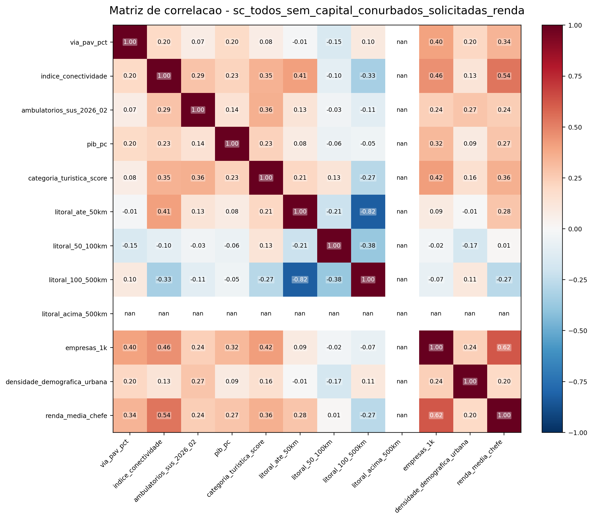
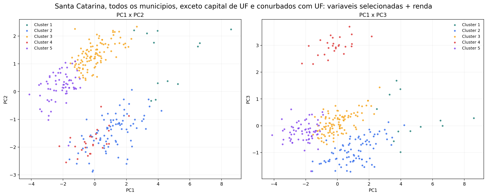
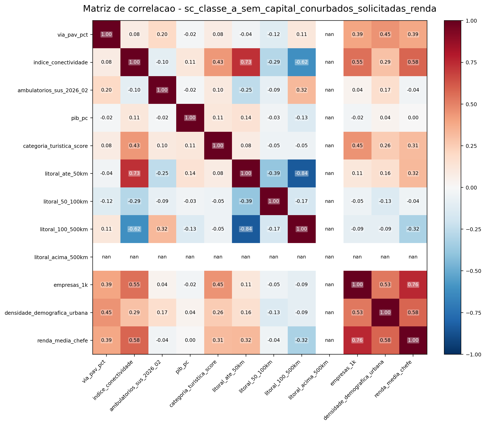
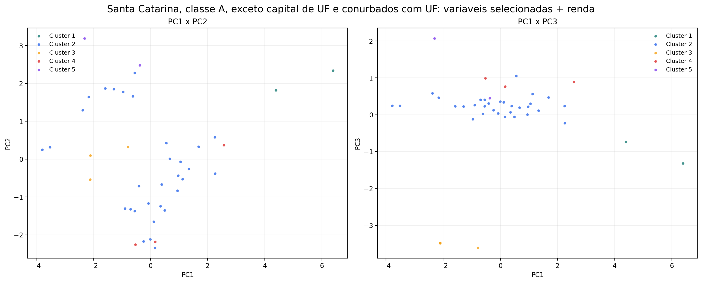
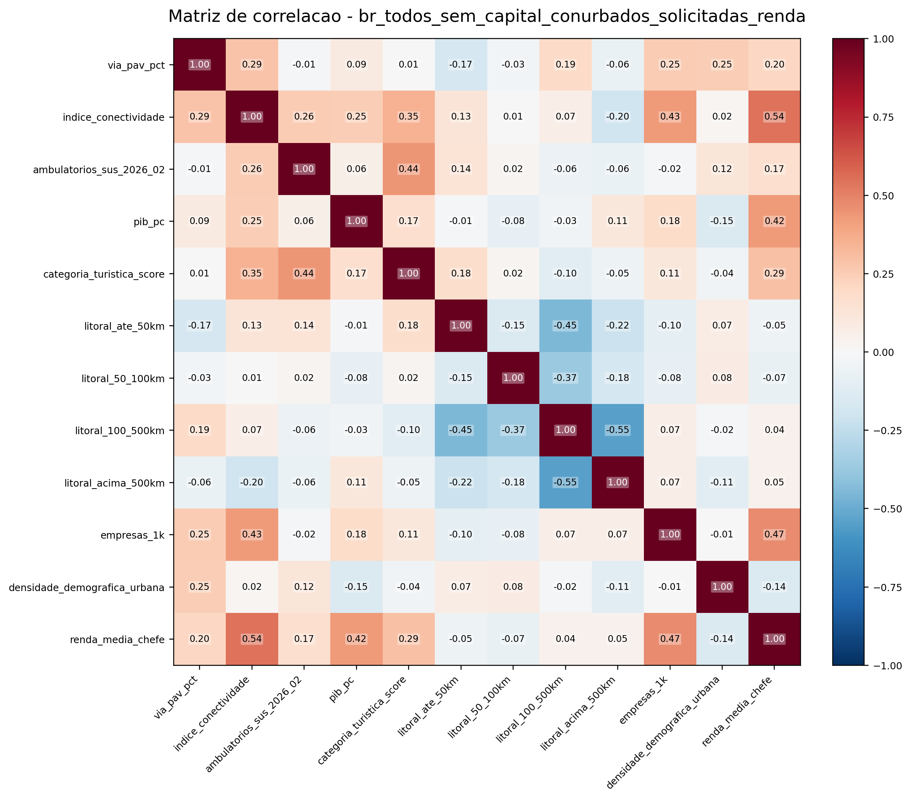
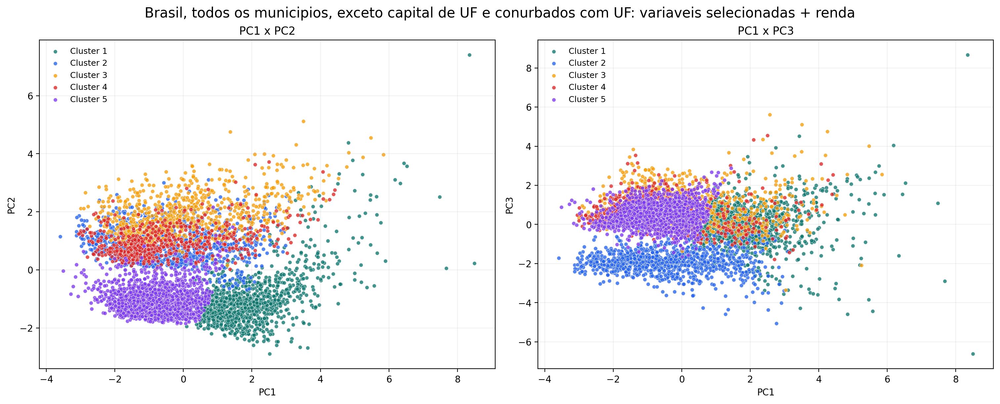
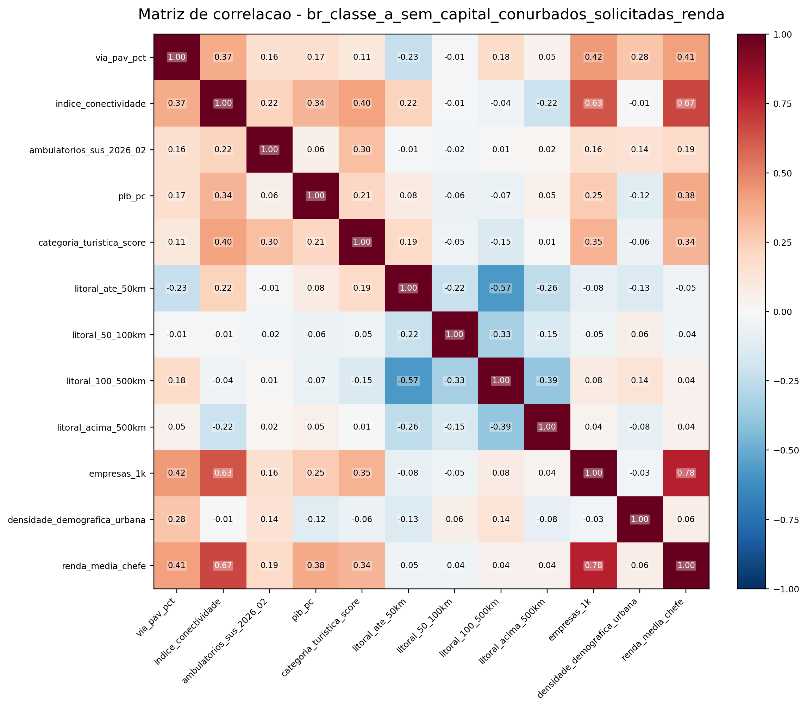
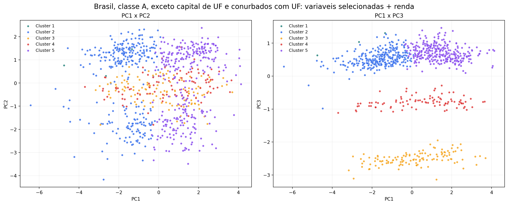

## 1. Objetivo

Este relatorio documenta um novo teste de PCA + k-means, sem alterar os resultados anteriores.
Neste teste, a variavel de centralidade REGIC foi retirada e substituida pela densidade demografica urbana.
O modelo final inclui as variaveis selecionadas + renda media do chefe de familia.

## 2. Universos analisados

- Santa Catarina, todos os municipios, exceto capital de UF e conurbados com UF;
- Santa Catarina, classe A, exceto capital de UF e conurbados com UF;
- Brasil, todos os municipios, exceto capital de UF e conurbados com UF;
- Brasil, classe A, exceto capital de UF e conurbados com UF.

## 3. Variaveis do modelo

| Variavel | Descricao |
|---|---|
| `via_pav_pct` | percentual de domicilios com via pavimentada no entorno |
| `indice_conectividade` | indice brasileiro de conectividade municipal normalizado |
| `ambulatorios_sus_2026_02` | estabelecimentos com atendimento ambulatorial no SUS |
| `pib_pc` | PIB per capita, calculado como `pib_total / pop_total` |
| `categoria_turistica_score` | escore ordinal da categoria turistica |
| `litoral_ate_50km` | indicador de ate 50 km do litoral |
| `litoral_50_100km` | indicador entre 50 e 100 km do litoral |
| `litoral_100_500km` | indicador entre 100 e 500 km do litoral |
| `litoral_acima_500km` | indicador acima de 500 km do litoral |
| `empresas_1k` | empresas por 1.000 habitantes |
| `densidade_demografica_urbana` | densidade demografica urbana municipal |
| `renda_media_chefe` | renda media do chefe de familia, derivada de `V06006` |

## 4. Como o processamento foi feito

1. A base municipal consolidada foi enriquecida com a classificacao ABC/CNEFE, a renda e a densidade urbana.
2. Em cada universo, foram excluidos os municipios com categoria `capital de uf` e `conurbado com uf`.
3. As variaveis do modelo foram padronizadas com media zero e desvio-padrao um.
4. O PCA foi aplicado sobre as variaveis padronizadas.
5. Foram retidos os componentes necessarios para atingir pelo menos 90% da variancia acumulada.
6. O k-means foi rodado sobre os escores dos componentes retidos.
7. A rotulagem final dos clusters foi ordenada pela media de `renda_media_chefe`.

## 5. Densidade dos dados e inspeção exploratoria

A tabela exploratoria de cada universo permite revisar faltantes, estatisticas descritivas, valores nulos e outliers pelo criterio do IQR.
A matriz de correlacao ajuda a verificar colinearidade entre variaveis antes do PCA.

As tabelas das subseções 5.7 a 5.10 estão transcritas abaixo em markdown, sem blocos de código.

## SC TODOS SEM CAPITAL CONURBADOS

Universo com `291` municipios.

- `silhouette`: `0.2860`
- `Davies-Bouldin`: `1.1858`
- `Calinski-Harabasz`: `81.20`
- componentes retidos: `8`

### 5.1 Exploracao das variaveis

| variavel | tipo | n_obs | faltantes | pct_faltantes | media | desvio_padrao | min | mediana | max | outliers_iqr | pct_outliers_iqr |
|---|---|---|---|---|---|---|---|---|---|---|---|
| via_pav_pct | float64 | 291 | 0 | 0.0000 | 78.5669 | 15.0237 | 20.9700 | 81.3800 | 100.0000 | 7 | 2.4055 |
| indice_conectividade | float64 | 291 | 0 | 0.0000 | 63.9758 | 9.8970 | 33.2000 | 64.1000 | 90.3000 | 1 | 0.3436 |
| ambulatorios_sus_2026_02 | float64 | 291 | 0 | 0.0000 | 20.4021 | 43.4355 | 1.0000 | 9.0000 | 569.0000 | 30 | 10.3093 |
| pib_pc | float64 | 291 | 0 | 0.0000 | 46.6078 | 21.9784 | 11.7240 | 42.5625 | 180.8615 | 12 | 4.1237 |
| categoria_turistica_score | float64 | 291 | 0 | 0.0000 | 1.3333 | 1.3064 | 0.0000 | 1.0000 | 5.0000 | 0 | 0.0000 |
| litoral_ate_50km | float64 | 291 | 0 | 0.0000 | 0.3127 | 0.4636 | 0.0000 | 0.0000 | 1.0000 | 0 | 0.0000 |
| litoral_50_100km | float64 | 291 | 0 | 0.0000 | 0.0893 | 0.2852 | 0.0000 | 0.0000 | 1.0000 | 26 | 8.9347 |
| litoral_100_500km | float64 | 291 | 0 | 0.0000 | 0.5979 | 0.4903 | 0.0000 | 1.0000 | 1.0000 | 0 | 0.0000 |
| litoral_acima_500km | float64 | 291 | 0 | 0.0000 | 0.0000 | 0.0000 | 0.0000 | 0.0000 | 0.0000 | 0 | 0.0000 |
| empresas_1k | float64 | 291 | 0 | 0.0000 | 59.1852 | 16.7998 | 24.6914 | 58.8052 | 143.3078 | 7 | 2.4055 |
| densidade_demografica_urbana | float64 | 291 | 0 | 0.0000 | 860.9087 | 465.5827 | 164.4272 | 786.8635 | 3170.7003 | 6 | 2.0619 |
| renda_media_chefe | float64 | 291 | 0 | 0.0000 | 2137.7337 | 353.8937 | 1212.0000 | 2100.0000 | 4000.0000 | 8 | 2.7491 |

Nesta leitura exploratoria, chama atencao o fato de nao haver faltantes em nenhuma variavel, o que indica um merge consistente para o universo catarinense analisado. As variaveis de infraestrutura urbana e articulacao territorial apresentam padrao relativamente concentrado, com `via_pav_pct` e `indice_conectividade` em niveis medios-altos e baixa dispersao. Em contrapartida, `ambulatorios_sus_2026_02`, `pib_pc`, `densidade_demografica_urbana` e `renda_media_chefe` mostram variabilidade mais acentuada e alguns outliers, sugerindo coexistencia entre municipios de perfil mais comum e alguns poucos polos urbanos com maior densidade, renda e oferta de servicos. As variaveis litoraneas tambem revelam concentracao espacial: a maior parte dos municipios esta entre 100 e 500 km do litoral, com uma parcela menor ate 50 km, enquanto o intervalo de 50 a 100 km aparece de forma mais restrita.

### 5.2 Frequencias categoricas

#### categoria

| valor | qtd | percentual |
|---|---|---|
| demais municipios | 268 | 92.0962 |
| capital de imediata | 17 | 5.8419 |
| capital de intermediaria | 6 | 2.0619 |

#### classe_abc

| valor | qtd | percentual |
|---|---|---|
| C | 224 | 76.9759 |
| A | 41 | 14.0893 |
| B | 26 | 8.9347 |

#### categoria_turistica_2019

| valor | qtd | percentual |
|---|---|---|
| SEM CATEGORIA | 116 | 39.8625 |
| D | 96 | 32.9897 |
| E | 33 | 11.3402 |
| C | 25 | 8.5911 |
| B | 17 | 5.8419 |
| A | 4 | 1.3746 |

#### uf

| valor | qtd | percentual |
|---|---|---|
| SC | 291 | 100.0000 |

### 5.3 Matriz de correlacao

{width=92%}

No universo catarinense amplo, a matriz sugere um conjunto de correlacoes moderadas, sem colinearidade extrema entre a maioria das variaveis. A associacao mais visivel aparece entre `indice_conectividade` e `renda_media_chefe`, seguida de relacoes positivas entre conectividade e `empresas_1k`, entre conectividade e `litoral_ate_50km`, e entre `via_pav_pct` e `empresas_1k`. Isso indica que, em Santa Catarina, municipios mais integrados tendem a combinar melhor infraestrutura e maior densidade economica, mas sem que uma unica variavel capture todo o padrao. As variaveis de turismo e de saude tambem se aproximam, embora de modo mais moderado, o que sugere que o perfil de centralidade urbana no estado ainda e multifacetado. Em termos práticos, essa estrutura favorece o PCA porque existe relacao entre algumas variaveis, mas permanece espaco para componentes distintos capturarem dimensoes diferentes do territorio.

### 5.4 Componentes retidos

| componente | variancia_explicada | variancia_acumulada | via_pav_pct | indice_conectividade | ambulatorios_sus_2026_02 | pib_pc | categoria_turistica_score | litoral_ate_50km | litoral_50_100km | litoral_100_500km | litoral_acima_500km | empresas_1k | densidade_demografica_urbana | renda_media_chefe |
|---|---|---|---|---|---|---|---|---|---|---|---|---|---|---|
| PC1 | 0.2992 | 0.2992 | 0.2149 | 0.4128 | 0.2659 | 0.2418 | 0.3458 | 0.2942 | -0.0198 | -0.2666 | 0.0000 | 0.4014 | 0.1750 | 0.4300 |
| PC2 | 0.1713 | 0.4705 | 0.3625 | -0.0525 | 0.0785 | 0.1585 | -0.0471 | -0.4541 | -0.2982 | 0.6029 | 0.0000 | 0.2458 | 0.3275 | 0.0775 |
| PC3 | 0.1114 | 0.5820 | -0.0767 | -0.1425 | 0.0879 | 0.0900 | 0.3210 | -0.4821 | 0.7589 | 0.0144 | -0.0000 | 0.1748 | -0.1072 | 0.0662 |
| PC4 | 0.0977 | 0.6797 | -0.3856 | -0.0574 | 0.6319 | -0.2312 | 0.2647 | 0.0031 | -0.0734 | 0.0398 | 0.0000 | -0.1992 | 0.4812 | -0.2167 |
| PC5 | 0.0772 | 0.7569 | 0.3402 | 0.0305 | -0.1138 | -0.8038 | -0.1664 | -0.0113 | 0.2177 | -0.1160 | 0.0000 | 0.0953 | 0.2997 | 0.1918 |
| PC6 | 0.0647 | 0.8216 | -0.2626 | 0.3701 | 0.1589 | -0.4227 | 0.1623 | -0.1597 | -0.2365 | 0.2885 | 0.0000 | 0.1726 | -0.5910 | 0.1415 |
| PC7 | 0.0567 | 0.8784 | 0.5798 | -0.1094 | 0.6221 | 0.0146 | -0.1838 | 0.0382 | 0.0720 | -0.0781 | -0.0000 | -0.2007 | -0.3925 | -0.1541 |
| PC8 | 0.0519 | 0.9303 | -0.3066 | 0.3535 | 0.2348 | 0.1635 | -0.7366 | -0.1396 | 0.2136 | 0.0078 | -0.0000 | -0.0465 | 0.1105 | 0.2777 |

### 5.5 Resumo dos clusters

| cluster_pca_sc | qtd_municipios | percentual_municipios | domicilios_cnefe_total | pib_pc_medio | renda_media_chefe_media | densidade_demografica_urbana_media | via_pav_media | conectividade_media |
|---|---|---|---|---|---|---|---|---|
| 1 | 12 | 4.1237 | 1226756 | 65.0192 | 2725.0000 | 1840.6300 | 88.8117 | 79.0358 |
| 2 | 82 | 28.1787 | 1126760 | 47.6820 | 2239.2683 | 723.5503 | 77.2855 | 69.0785 |
| 3 | 106 | 36.4261 | 677260 | 50.6853 | 2231.2311 | 950.3812 | 88.1537 | 63.6729 |
| 4 | 26 | 8.9347 | 255860 | 42.6005 | 2147.6923 | 600.9742 | 71.3846 | 60.9250 |
| 5 | 65 | 22.3368 | 287140 | 36.8071 | 1744.7692 | 811.3845 | 65.5314 | 56.4726 |

### 5.6 O que cada cluster uniu

| cluster | top_1 | top_2 | top_3 | resumo |
|---|---|---|---|---|
| 1 | ambulatórios SUS (+3.34 desvios) | densidade demografica urbana (+2.10 desvios) | empresas por mil hab. (+1.89 desvios) | acima da media em ambulatórios SUS (+3.34 desvios), densidade demografica urbana (+2.10 desvios), empresas por mil hab. (+1.89 desvios) |
| 2 | litoral ate 50 km (+1.48 desvios) | conectividade (+0.52 desvios) | renda media do chefe (+0.29 desvios) | acima da media em litoral ate 50 km (+1.48 desvios), conectividade (+0.52 desvios), renda media do chefe (+0.29 desvios) |
| 3 | litoral 100 a 500 km (+0.82 desvios) | via pavimentada (+0.64 desvios) | empresas por mil hab. (+0.39 desvios) | acima da media em litoral 100 a 500 km (+0.82 desvios), via pavimentada (+0.64 desvios), empresas por mil hab. (+0.39 desvios) |
| 4 | litoral 50 a 100 km (+3.19 desvios) | turismo (+0.42 desvios) | renda media do chefe (+0.03 desvios) | acima da media em litoral 50 a 100 km (+3.19 desvios), turismo (+0.42 desvios), renda media do chefe (+0.03 desvios) |
| 5 | litoral 100 a 500 km (+0.79 desvios) | litoral acima de 500 km (+0.00 desvios) | densidade demografica urbana (-0.11 desvios) | acima da media em litoral 100 a 500 km (+0.79 desvios), litoral acima de 500 km (+0.00 desvios), densidade demografica urbana (-0.11 desvios) |

### 5.7 Relação categoria x cluster com domicílios

| Categoria | Cluster 1 | Cluster 2 | Cluster 3 | Cluster 4 | Cluster 5 |
|---|---|---|---|---|---|
| capital de intermediaria | 5 mun / 761778 dom / 21.32% | 0 mun / 0 dom / 0.00% | 1 mun / 35681 dom / 1.00% | 0 mun / 0 dom / 0.00% | 0 mun / 0 dom / 0.00% |
| capital de imediata | 4 mun / 222177 dom / 6.22% | 2 mun / 105617 dom / 2.96% | 7 mun / 181586 dom / 5.08% | 3 mun / 65115 dom / 1.82% | 1 mun / 29736 dom / 0.83% |
| demais municipios | 3 mun / 242801 dom / 6.79% | 80 mun / 1021143 dom / 28.57% | 98 mun / 459993 dom / 12.87% | 23 mun / 190745 dom / 5.34% | 64 mun / 257404 dom / 7.20% |

### 5.8 Relação categoria x cluster detalhada com nome dos municípios

| Categoria | Cluster 1 | Cluster 2 | Cluster 3 | Cluster 4 | Cluster 5 |
|---|---|---|---|---|---|
| capital de intermediaria | Blumenau (SC) Chapecó (SC) Criciúma (SC) Joinville (SC) Lages (SC) | - | Caçador (SC) | - | - |
| capital de imediata | Itajaí (SC) Joaçaba (SC) São Miguel do Oeste (SC) Tubarão (SC) | Araranguá (SC) Brusque (SC) | Concórdia (SC) Curitibanos (SC) Maravilha (SC) Rio do Sul (SC) São Lourenço do Oeste (SC) Videira (SC) Xanxerê (SC) | Ibirama (SC) Ituporanga (SC) São Bento do Sul (SC) | Mafra (SC) |
| demais municipios | Balneário Camboriú (SC) Itapema (SC) Jaraguá do Sul (SC) | Angelina (SC) Anitápolis (SC) Antônio Carlos (SC) Araquari (SC) Armazém (SC) Balneário Arroio do Silva (SC) Balneário Barra do Sul (SC) Balneário Gaivota (SC) Balneário Piçarras (SC) Balneário Rincão (SC) Barra Velha (SC) Bom Jardim da Serra (SC) Bombinhas (SC) Botuverá (SC) Braço do Norte (SC) Camboriú (SC) Campo Alegre (SC) Canelinha (SC) Capivari de Baixo (SC) Cocal do Sul (SC) Ermo (SC) Forquilhinha (SC) Garopaba (SC) Garuva (SC) Gaspar (SC) Governador Celso Ramos (SC) Gravatal (SC) Guabiruba (SC) Guaramirim (SC) Ilhota (SC) Imbituba (SC) Itapoá (SC) Içara (SC) Jacinto Machado (SC) Jaguaruna (SC) Laguna (SC) Lauro Müller (SC) Luiz Alves (SC) Major Gercino (SC) Maracajá (SC) Massaranduba (SC) Meleiro (SC) Morro Grande (SC) Morro da Fumaça (SC) Navegantes (SC) Nova Trento (SC) Nova Veneza (SC) Orleans (SC) Passo de Torres (SC) Paulo Lopes (SC) Pedras Grandes (SC) Penha (SC) Pescaria Brava (SC) Pomerode (SC) Porto Belo (SC) Praia Grande (SC) Rancho Queimado (SC) Rio Fortuna (SC) Sangão (SC) Santa Rosa de Lima (SC) Santa Rosa do Sul (SC) Santo Amaro da Imperatriz (SC) Schroeder (SC) Siderópolis (SC) Sombrio (SC) São Bonifácio (SC) São Francisco do Sul (SC) São João Batista (SC) São João do Itaperiú (SC) São João do Sul (SC) São Ludgero (SC) São Martinho (SC) São Pedro de Alcântara (SC) Tijucas (SC) Timbé do Sul (SC) Treviso (SC) Treze de Maio (SC) Turvo (SC) Urussanga (SC) Águas Mornas (SC) | Abelardo Luz (SC) Agrolândia (SC) Agronômica (SC) Alto Bela Vista (SC) Anchieta (SC) Arabutã (SC) Arroio Trinta (SC) Arvoredo (SC) Atalanta (SC) Barra Bonita (SC) Bom Jesus (SC) Bom Jesus do Oeste (SC) Braço do Trombudo (SC) Caibi (SC) Campos Novos (SC) Capinzal (SC) Catanduvas (SC) Caxambu do Sul (SC) Cordilheira Alta (SC) Coronel Freitas (SC) Cunha Porã (SC) Cunhataí (SC) Descanso (SC) Dionísio Cerqueira (SC) Dona Emma (SC) Erval Velho (SC) Faxinal dos Guedes (SC) Flor do Sertão (SC) Formosa do Sul (SC) Fraiburgo (SC) Galvão (SC) Guaraciaba (SC) Guarujá do Sul (SC) Guatambú (SC) Herval d'Oeste (SC) Ibiam (SC) Ibicaré (SC) Iomerê (SC) Ipira (SC) Iporã do Oeste (SC) Ipumirim (SC) Iraceminha (SC) Itapiranga (SC) Itá (SC) Jaborá (SC) Jardinópolis (SC) Lacerdópolis (SC) Lajeado Grande (SC) Laurentino (SC) Lindóia do Sul (SC) Luzerna (SC) Marema (SC) Modelo (SC) Mondaí (SC) Nova Erechim (SC) Nova Itaberaba (SC) Otacílio Costa (SC) Ouro (SC) Paial (SC) Palma Sola (SC) Palmeira (SC) Palmitos (SC) Passos Maia (SC) Peritiba (SC) Pinhalzinho (SC) Pinheiro Preto (SC) Piratuba (SC) Planalto Alegre (SC) Ponte Serrada (SC) Porto União (SC) Pouso Redondo (SC) Presidente Castello Branco (SC) Presidente Getúlio (SC) Princesa (SC) Quilombo (SC) Riqueza (SC) Salete (SC) Salto Veloso (SC) Santiago do Sul (SC) Saudades (SC) Seara (SC) Serra Alta (SC) São Carlos (SC) São Domingos (SC) São José do Cedro (SC) São João do Oeste (SC) Taió (SC) Tangará (SC) Treze Tílias (SC) Trombudo Central (SC) Tunápolis (SC) Vargem Bonita (SC) Vargeão (SC) Xavantina (SC) Xaxim (SC) Água Doce (SC) Águas Frias (SC) Águas de Chapecó (SC) | Alfredo Wagner (SC) Apiúna (SC) Ascurra (SC) Aurora (SC) Benedito Novo (SC) Bom Retiro (SC) Chapadão do Lageado (SC) Corupá (SC) Doutor Pedrinho (SC) Grão-Pará (SC) Imbuia (SC) Indaial (SC) José Boiteux (SC) Leoberto Leal (SC) Lontras (SC) Presidente Nereu (SC) Rio Negrinho (SC) Rio dos Cedros (SC) Rodeio (SC) São Joaquim (SC) Timbó (SC) Urubici (SC) Vidal Ramos (SC) | Abdon Batista (SC) Anita Garibaldi (SC) Bandeirante (SC) Bela Vista do Toldo (SC) Belmonte (SC) Bocaina do Sul (SC) Brunópolis (SC) Calmon (SC) Campo Belo do Sul (SC) Campo Erê (SC) Canoinhas (SC) Capão Alto (SC) Celso Ramos (SC) Cerro Negro (SC) Coronel Martins (SC) Correia Pinto (SC) Entre Rios (SC) Frei Rogério (SC) Imaruí (SC) Ipuaçu (SC) Irani (SC) Irati (SC) Irineópolis (SC) Itaiópolis (SC) Jupiá (SC) Lebon Régis (SC) Macieira (SC) Major Vieira (SC) Matos Costa (SC) Mirim Doce (SC) Monte Carlo (SC) Monte Castelo (SC) Novo Horizonte (SC) Ouro Verde (SC) Painel (SC) Papanduva (SC) Paraíso (SC) Petrolândia (SC) Ponte Alta (SC) Ponte Alta do Norte (SC) Rio Rufino (SC) Rio das Antas (SC) Rio do Campo (SC) Rio do Oeste (SC) Romelândia (SC) Saltinho (SC) Santa Cecília (SC) Santa Helena (SC) Santa Terezinha (SC) Santa Terezinha do Progresso (SC) Sul Brasil (SC) São Bernardino (SC) São Cristóvão do Sul (SC) São José do Cerrito (SC) São Miguel da Boa Vista (SC) Tigrinhos (SC) Timbó Grande (SC) Três Barras (SC) União do Oeste (SC) Urupema (SC) Vargem (SC) Vitor Meireles (SC) Witmarsum (SC) Zortéa (SC) |

### 5.9 Cluster x categoria x classe ABC x UF

| Cluster | Categoria | Classe ABC | UF | Quantidade de municípios | Domicilios (n) | % de domicilios |
|---|---|---|---:|---:|---:|---:|
| 1 | capital de imediata | A | SC | 3 | 204723 | 5.73 |
| 1 | capital de imediata | B | SC | 1 | 17454 | 0.49 |
| 1 | capital de intermediaria | A | SC | 5 | 761778 | 21.32 |
| 1 | demais municipios | A | SC | 3 | 242801 | 6.79 |
| 2 | capital de imediata | A | SC | 2 | 105617 | 2.96 |
| 2 | demais municipios | A | SC | 17 | 527160 | 14.75 |
| 2 | demais municipios | B | SC | 14 | 212277 | 5.94 |
| 2 | demais municipios | C | SC | 49 | 281706 | 7.88 |
| 3 | capital de imediata | A | SC | 5 | 153559 | 4.30 |
| 3 | capital de imediata | B | SC | 2 | 28027 | 0.78 |
| 3 | capital de intermediaria | A | SC | 1 | 35681 | 1.00 |
| 3 | demais municipios | B | SC | 5 | 81425 | 2.28 |
| 3 | demais municipios | C | SC | 93 | 378568 | 10.59 |
| 4 | capital de imediata | A | SC | 1 | 39803 | 1.11 |
| 4 | capital de imediata | B | SC | 1 | 15010 | 0.42 |
| 4 | capital de imediata | C | SC | 1 | 10302 | 0.29 |
| 4 | demais municipios | A | SC | 2 | 56655 | 1.59 |
| 4 | demais municipios | B | SC | 2 | 34866 | 0.98 |
| 4 | demais municipios | C | SC | 19 | 99224 | 2.78 |
| 5 | capital de imediata | A | SC | 1 | 29736 | 0.83 |
| 5 | demais municipios | A | SC | 1 | 28559 | 0.80 |
| 5 | demais municipios | B | SC | 1 | 13018 | 0.36 |
| 5 | demais municipios | C | SC | 62 | 215827 | 6.04 |

### 5.10 Resumo de domicílios por cluster

| Cluster | Quantidade de municípios | Domicilios (n) | % de domicilios | % de domicílios no Brasil |
|---|---:|---:|---:|---:|
| 1 | 12 | 1226756 | 34.33 | 1.10 |
| 2 | 82 | 1126760 | 31.53 | 1.01 |
| 3 | 106 | 677260 | 18.95 | 0.61 |
| 4 | 26 | 255860 | 7.16 | 0.23 |
| 5 | 65 | 287140 | 8.03 | 0.26 |
### 5.10 Eixos do PCA

{width=92%}

## SC CLASSE A SEM CAPITAL CONURBADOS

Universo com `41` municipios.

- `silhouette`: `0.2749`
- `Davies-Bouldin`: `0.9507`
- `Calinski-Harabasz`: `8.22`
- componentes retidos: `7`

### 5.1 Exploracao das variaveis

| variavel | tipo | n_obs | faltantes | pct_faltantes | media | desvio_padrao | min | mediana | max | outliers_iqr | pct_outliers_iqr |
|---|---|---|---|---|---|---|---|---|---|---|---|
| via_pav_pct | float64 | 41 | 0 | 0.0000 | 77.8359 | 17.7274 | 20.9700 | 82.5700 | 99.3400 | 1 | 2.4390 |
| indice_conectividade | float64 | 41 | 0 | 0.0000 | 75.6305 | 6.7828 | 60.1600 | 75.8300 | 90.3000 | 0 | 0.0000 |
| ambulatorios_sus_2026_02 | float64 | 41 | 0 | 0.0000 | 78.8293 | 93.0329 | 19.0000 | 53.0000 | 569.0000 | 4 | 9.7561 |
| pib_pc | float64 | 41 | 0 | 0.0000 | 58.1062 | 33.3828 | 21.7579 | 52.2922 | 180.8615 | 4 | 9.7561 |
| categoria_turistica_score | float64 | 41 | 0 | 0.0000 | 2.9512 | 1.4808 | 0.0000 | 3.0000 | 5.0000 | 0 | 0.0000 |
| litoral_ate_50km | float64 | 41 | 0 | 0.0000 | 0.6585 | 0.4742 | 0.0000 | 1.0000 | 1.0000 | 0 | 0.0000 |
| litoral_50_100km | float64 | 41 | 0 | 0.0000 | 0.0732 | 0.2604 | 0.0000 | 0.0000 | 1.0000 | 3 | 7.3171 |
| litoral_100_500km | float64 | 41 | 0 | 0.0000 | 0.2683 | 0.4431 | 0.0000 | 0.0000 | 1.0000 | 0 | 0.0000 |
| litoral_acima_500km | float64 | 41 | 0 | 0.0000 | 0.0000 | 0.0000 | 0.0000 | 0.0000 | 0.0000 | 0 | 0.0000 |
| empresas_1k | float64 | 41 | 0 | 0.0000 | 72.3528 | 19.6547 | 52.3410 | 66.1175 | 143.3078 | 2 | 4.8780 |
| densidade_demografica_urbana | float64 | 41 | 0 | 0.0000 | 1230.0922 | 687.7840 | 187.9427 | 1053.3648 | 3170.7003 | 4 | 9.7561 |
| renda_media_chefe | float64 | 41 | 0 | 0.0000 | 2450.0488 | 328.9091 | 1980.0000 | 2424.0000 | 4000.0000 | 13 | 31.7073 |

No recorte da classe A em Santa Catarina, tambem nao ha registros faltantes, e isso reforca a integridade da base para o modelo. Em comparacao ao universo catarinense total, as medias sobem em quase todas as dimensoes: aumentam `indice_conectividade`, `ambulatorios_sus_2026_02`, `pib_pc`, `empresas_1k`, `densidade_demografica_urbana` e `renda_media_chefe`, o que sugere um subconjunto mais intenso em centralidade, renda e oferta de servicos. A variavel turistica tem mediana mais elevada e a participacao de municipios ate 50 km do litoral e maior do que no universo total, sinalizando uma maior concentracao de municipios mais costeiros ou influenciados pela faixa litoranea. Os outliers aparecem sobretudo em `ambulatorios_sus_2026_02`, `pib_pc`, `densidade_demografica_urbana` e `renda_media_chefe`, indicando que mesmo dentro da classe A ha forte heterogeneidade entre poucos municipios muito destacados e um bloco maior mais compacto.

### 5.2 Frequencias categoricas

#### categoria

| valor | qtd | percentual |
|---|---|---|
| demais municipios | 23 | 56.0976 |
| capital de imediata | 12 | 29.2683 |
| capital de intermediaria | 6 | 14.6341 |

#### classe_abc

| valor | qtd | percentual |
|---|---|---|
| A | 41 | 100.0000 |

#### categoria_turistica_2019

| valor | qtd | percentual |
|---|---|---|
| B | 14 | 34.1463 |
| C | 11 | 26.8293 |
| D | 6 | 14.6341 |
| SEM CATEGORIA | 6 | 14.6341 |
| A | 4 | 9.7561 |

#### uf

| valor | qtd | percentual |
|---|---|---|
| SC | 41 | 100.0000 |

### 5.3 Matriz de correlacao

{width=92%}

Na classe A catarinense, as correlacoes ficam mais intensas e mais interpretaveis do que no universo amplo. A relacao entre `indice_conectividade` e `litoral_ate_50km` e forte, assim como a associacao entre conectividade e `renda_media_chefe`, `empresas_1k` e `categoria_turistica_score`. Ao mesmo tempo, a relacao negativa entre `indice_conectividade` e `litoral_100_500km` mostra que a proximidade da faixa litoranea e um elemento relevante para diferenciar os municipios desse recorte. Tambem vale notar a conexao entre `via_pav_pct` e `densidade_demografica_urbana`, o que sugere que, dentro da classe A, municipios mais densos tendem a exibir melhor infraestrutura no entorno. Em resumo, a matriz aponta uma estrutura territorial mais coesa, com maior proximidade entre dimensoes urbanas, economicas e litoraneas.

### 5.4 Componentes retidos

| componente | variancia_explicada | variancia_acumulada | via_pav_pct | indice_conectividade | ambulatorios_sus_2026_02 | pib_pc | categoria_turistica_score | litoral_ate_50km | litoral_50_100km | litoral_100_500km | litoral_acima_500km | empresas_1k | densidade_demografica_urbana | renda_media_chefe |
|---|---|---|---|---|---|---|---|---|---|---|---|---|---|---|
| PC1 | 0.3257 | 0.3257 | 0.1904 | 0.4587 | -0.0401 | 0.0674 | 0.2586 | 0.3518 | -0.1306 | -0.2998 | 0.0000 | 0.3927 | 0.3260 | 0.4349 |
| PC2 | 0.1964 | 0.5221 | 0.3980 | -0.1847 | 0.3753 | -0.1194 | 0.1560 | -0.4402 | -0.0051 | 0.4741 | 0.0000 | 0.2939 | 0.3099 | 0.1646 |
| PC3 | 0.1110 | 0.6330 | 0.0653 | 0.0951 | 0.3193 | 0.1659 | -0.0449 | 0.2502 | -0.8117 | 0.2093 | 0.0000 | -0.2044 | 0.0048 | -0.2193 |
| PC4 | 0.0954 | 0.7285 | 0.2777 | -0.0741 | -0.1954 | -0.6911 | -0.5679 | 0.1453 | -0.1681 | -0.0566 | 0.0000 | -0.0261 | 0.1063 | 0.1203 |
| PC5 | 0.0842 | 0.8127 | 0.4223 | -0.2078 | 0.0009 | 0.6275 | -0.4807 | 0.0588 | 0.1670 | -0.1611 | -0.0000 | -0.1524 | 0.2653 | 0.0532 |
| PC6 | 0.0693 | 0.8820 | -0.0693 | 0.0861 | 0.8089 | -0.2245 | -0.0595 | 0.1540 | 0.3047 | -0.3439 | -0.0000 | -0.1888 | 0.0682 | -0.0665 |
| PC7 | 0.0463 | 0.9283 | 0.7174 | 0.1040 | -0.0170 | -0.0552 | 0.2670 | 0.0573 | 0.0865 | -0.1121 | -0.0000 | -0.0662 | -0.5843 | -0.1754 |

### 5.5 Resumo dos clusters

| cluster_pca_sc | qtd_municipios | percentual_municipios | domicilios_cnefe_total | pib_pc_medio | renda_media_chefe_media | densidade_demografica_urbana_media | via_pav_media | conectividade_media |
|---|---|---|---|---|---|---|---|---|
| 1 | 2 | 4.8780 | 155596 | 45.4652 | 3500.0000 | 3124.2040 | 97.2950 | 87.1400 |
| 2 | 31 | 75.6098 | 1541915 | 49.2622 | 2404.9032 | 1145.8411 | 77.6868 | 75.4455 |
| 3 | 3 | 7.3171 | 96458 | 54.2568 | 2400.0000 | 899.8235 | 70.0900 | 68.7233 |
| 4 | 3 | 7.3171 | 190988 | 169.3023 | 2366.6667 | 1191.2386 | 71.4567 | 78.9767 |
| 5 | 2 | 4.8780 | 201115 | 46.8090 | 2300.0000 | 1195.5556 | 81.8750 | 72.3300 |

### 5.6 O que cada cluster uniu

| cluster | top_1 | top_2 | top_3 | resumo |
|---|---|---|---|---|
| 1 | empresas por mil hab. (+3.33 desvios) | renda media do chefe (+3.19 desvios) | densidade demografica urbana (+2.75 desvios) | acima da media em empresas por mil hab. (+3.33 desvios), renda media do chefe (+3.19 desvios), densidade demografica urbana (+2.75 desvios) |
| 2 | litoral ate 50 km (+0.11 desvios) | litoral 100 a 500 km (+0.05 desvios) | litoral acima de 500 km (+0.00 desvios) | acima da media em litoral ate 50 km (+0.11 desvios), litoral 100 a 500 km (+0.05 desvios), litoral acima de 500 km (+0.00 desvios) |
| 3 | litoral 50 a 100 km (+3.56 desvios) | litoral acima de 500 km (+0.00 desvios) | PIB per capita (-0.12 desvios) | acima da media em litoral 50 a 100 km (+3.56 desvios), litoral acima de 500 km (+0.00 desvios), PIB per capita (-0.12 desvios) |
| 4 | PIB per capita (+3.33 desvios) | litoral ate 50 km (+0.72 desvios) | conectividade (+0.49 desvios) | acima da media em PIB per capita (+3.33 desvios), litoral ate 50 km (+0.72 desvios), conectividade (+0.49 desvios) |
| 5 | ambulatórios SUS (+3.25 desvios) | litoral 100 a 500 km (+1.65 desvios) | turismo (+0.71 desvios) | acima da media em ambulatórios SUS (+3.25 desvios), litoral 100 a 500 km (+1.65 desvios), turismo (+0.71 desvios) |

### 5.7 Relação categoria x cluster com domicílios

| Categoria | Cluster 1 | Cluster 2 | Cluster 3 | Cluster 4 | Cluster 5 |
|---|---|---|---|---|---|
| capital de intermediaria | 0 mun / 0 dom / 0.00% | 4 mun / 596344 dom / 27.28% | 0 mun / 0 dom / 0.00% | 0 mun / 0 dom / 0.00% | 2 mun / 201115 dom / 9.20% |
| capital de imediata | 0 mun / 0 dom / 0.00% | 10 mun / 369965 dom / 16.92% | 1 mun / 39803 dom / 1.82% | 1 mun / 123670 dom / 5.66% | 0 mun / 0 dom / 0.00% |
| demais municipios | 2 mun / 155596 dom / 7.12% | 17 mun / 575606 dom / 26.33% | 2 mun / 56655 dom / 2.59% | 2 mun / 67318 dom / 3.08% | 0 mun / 0 dom / 0.00% |

### 5.8 Relação categoria x cluster detalhada com nome dos municípios

| Categoria | Cluster 1 | Cluster 2 | Cluster 3 | Cluster 4 | Cluster 5 |
|---|---|---|---|---|---|
| capital de intermediaria | - | Blumenau (SC) Caçador (SC) Criciúma (SC) Joinville (SC) | - | - | Chapecó (SC) Lages (SC) |
| capital de imediata | - | Araranguá (SC) Brusque (SC) Concórdia (SC) Curitibanos (SC) Mafra (SC) Rio do Sul (SC) São Miguel do Oeste (SC) Tubarão (SC) Videira (SC) Xanxerê (SC) | São Bento do Sul (SC) | Itajaí (SC) | - |
| demais municipios | Balneário Camboriú (SC) Itapema (SC) | Balneário Piçarras (SC) Barra Velha (SC) Bombinhas (SC) Camboriú (SC) Canoinhas (SC) Garopaba (SC) Gaspar (SC) Guaramirim (SC) Imbituba (SC) Itapoá (SC) Içara (SC) Jaguaruna (SC) Jaraguá do Sul (SC) Laguna (SC) Navegantes (SC) Penha (SC) Tijucas (SC) | Indaial (SC) Timbó (SC) | Araquari (SC) São Francisco do Sul (SC) | - |

### 5.9 Cluster x categoria x classe ABC x UF

| Cluster | Categoria | Classe ABC | UF | Quantidade de municípios | Domicilios (n) | % de domicilios |
|---|---|---|---:|---:|---:|---:|
| 1 | demais municipios | A | SC | 2 | 155596 | 7.12 |
| 2 | capital de imediata | A | SC | 10 | 369965 | 16.92 |
| 2 | capital de intermediaria | A | SC | 4 | 596344 | 27.28 |
| 2 | demais municipios | A | SC | 17 | 575606 | 26.33 |
| 3 | capital de imediata | A | SC | 1 | 39803 | 1.82 |
| 3 | demais municipios | A | SC | 2 | 56655 | 2.59 |
| 4 | capital de imediata | A | SC | 1 | 123670 | 5.66 |
| 4 | demais municipios | A | SC | 2 | 67318 | 3.08 |
| 5 | capital de intermediaria | A | SC | 2 | 201115 | 9.20 |

### 5.10 Resumo de domicílios por cluster

| Cluster | Quantidade de municípios | Domicilios (n) | % de domicilios | % de domicílios no Brasil |
|---|---:|---:|---:|---:|
| 1 | 2 | 155596 | 7.12 | 0.14 |
| 2 | 31 | 1541915 | 70.53 | 1.39 |
| 3 | 3 | 96458 | 4.41 | 0.09 |
| 4 | 3 | 190988 | 8.74 | 0.17 |
| 5 | 2 | 201115 | 9.20 | 0.18 |
### 5.10 Eixos do PCA

{width=92%}

## BR TODOS SEM CAPITAL CONURBADOS

Universo com `5423` municipios.

- `silhouette`: `0.2897`
- `Davies-Bouldin`: `1.2957`
- `Calinski-Harabasz`: `1165.77`
- componentes retidos: `9`

### 5.1 Exploracao das variaveis

| variavel | tipo | n_obs | faltantes | pct_faltantes | media | desvio_padrao | min | mediana | max | outliers_iqr | pct_outliers_iqr |
|---|---|---|---|---|---|---|---|---|---|---|---|
| via_pav_pct | float64 | 5423 | 0 | 0.0000 | 83.8185 | 15.7997 | 12.1600 | 88.7100 | 100.0000 | 193 | 3.5589 |
| indice_conectividade | float64 | 5423 | 0 | 0.0000 | 51.9324 | 14.7504 | 9.8100 | 52.4000 | 94.5700 | 0 | 0.0000 |
| ambulatorios_sus_2026_02 | float64 | 5423 | 0 | 0.0000 | 16.1296 | 21.3683 | 1.0000 | 10.0000 | 569.0000 | 396 | 7.3022 |
| pib_pc | float64 | 5423 | 0 | 0.0000 | 34.2663 | 39.6766 | 5.6973 | 24.2656 | 919.4824 | 297 | 5.4767 |
| categoria_turistica_score | float64 | 5423 | 0 | 0.0000 | 1.0715 | 1.2716 | 0.0000 | 0.0000 | 5.0000 | 0 | 0.0000 |
| litoral_ate_50km | float64 | 5423 | 0 | 0.0000 | 0.1519 | 0.3590 | 0.0000 | 0.0000 | 1.0000 | 824 | 15.1945 |
| litoral_50_100km | float64 | 5423 | 0 | 0.0000 | 0.1081 | 0.3105 | 0.0000 | 0.0000 | 1.0000 | 586 | 10.8058 |
| litoral_100_500km | float64 | 5423 | 0 | 0.0000 | 0.5325 | 0.4989 | 0.0000 | 1.0000 | 1.0000 | 0 | 0.0000 |
| litoral_acima_500km | float64 | 5423 | 0 | 0.0000 | 0.2074 | 0.4055 | 0.0000 | 0.0000 | 1.0000 | 1125 | 20.7450 |
| empresas_1k | float64 | 5423 | 0 | 0.0000 | 41.8177 | 37.6876 | 4.8126 | 31.8544 | 398.4422 | 340 | 6.2696 |
| densidade_demografica_urbana | float64 | 5423 | 0 | 0.0000 | 1727.1872 | 1032.4079 | 103.2713 | 1535.9047 | 11017.5447 | 161 | 2.9688 |
| renda_media_chefe | float64 | 5423 | 0 | 0.0000 | 1483.1999 | 403.0394 | 600.0000 | 1212.0000 | 4000.0000 | 31 | 0.5716 |

No universo nacional sem capitais de UF e sem conurbados com UF, a base permanece completa, sem faltantes, mas a heterogeneidade e muito maior do que em Santa Catarina. A mediana de `via_pav_pct` e alta, embora o desvio-padrao mostre que ainda existe um conjunto expressivo de municipios com infraestrutura viaria bem inferior. `indice_conectividade` apresenta amplitude ampla, mas sem muitos outliers, sugerindo variacao mais distribuida. As variaveis `ambulatorios_sus_2026_02`, `pib_pc`, `empresas_1k`, `densidade_demografica_urbana` e `renda_media_chefe` concentram a maior parte da dispersao e dos pontos extremos, o que e compatível com a existencia de municipios muito pequenos e perifericos ao lado de centros intermediarios mais estruturados. As dummies de distancia ao litoral mostram uma distribuicao espacial nitidamente assimetrica, com muitos casos em faixas mais afastadas e um volume relevante de outliers pelo criterio do IQR, o que evidencia forte contrastante territorial no pais.

### 5.2 Frequencias categoricas

#### categoria

| valor | qtd | percentual |
|---|---|---|
| demais municipios | 4940 | 91.0935 |
| capital de imediata | 377 | 6.9519 |
| capital de intermediaria | 106 | 1.9546 |

#### classe_abc

| valor | qtd | percentual |
|---|---|---|
| C | 3812 | 70.2932 |
| A | 825 | 15.2130 |
| B | 786 | 14.4938 |

#### categoria_turistica_2019

| valor | qtd | percentual |
|---|---|---|
| SEM CATEGORIA | 2841 | 52.3880 |
| D | 1488 | 27.4387 |
| C | 448 | 8.2611 |
| E | 376 | 6.9334 |
| B | 235 | 4.3334 |
| A | 35 | 0.6454 |

#### uf

| valor | qtd | percentual |
|---|---|---|
| MG | 843 | 15.5449 |
| SP | 617 | 11.3775 |
| RS | 488 | 8.9987 |
| BA | 414 | 7.6342 |
| PR | 389 | 7.1732 |
| SC | 291 | 5.3660 |
| GO | 237 | 4.3703 |
| PI | 219 | 4.0384 |
| PB | 219 | 4.0384 |
| MA | 214 | 3.9462 |
| CE | 178 | 3.2823 |
| PE | 178 | 3.2823 |
| RN | 162 | 2.9873 |
| PA | 141 | 2.6000 |
| MT | 138 | 2.5447 |
| TO | 138 | 2.5447 |
| AL | 98 | 1.8071 |
| RJ | 81 | 1.4936 |
| MS | 77 | 1.4199 |
| ES | 73 | 1.3461 |
| SE | 72 | 1.3277 |
| AM | 60 | 1.1064 |
| RO | 50 | 0.9220 |
| AC | 19 | 0.3504 |
| RR | 14 | 0.2582 |
| AP | 13 | 0.2397 |

### 5.3 Matriz de correlacao

{width=92%}

No universo brasileiro amplo, a matriz evidencia correlacoes moderadas entre as dimensoes economicas e urbanas, mas tambem uma separacao clara entre algumas variaveis de localizacao. `indice_conectividade` se associa de forma visivel com `renda_media_chefe`, `empresas_1k` e `pib_pc`, sugerindo que conectividade e atividade economica caminham juntas no pais. `ambulatorios_sus_2026_02` tambem aparece positivamente ligado a `categoria_turistica_score`, o que pode refletir maior estrutura de servicos em municipios mais visitados ou mais especializados. Ja as variaveis litoraneas apresentam relacoes negativas entre si em algumas faixas, especialmente entre `litoral_100_500km` e `litoral_acima_500km`, o que e esperado porque elas representam distancias alternativas. Em conjunto, a matriz mostra que o PCA esta lidando com variacao real e diversa, sem redundancia total entre as variaveis.

### 5.4 Componentes retidos

| componente | variancia_explicada | variancia_acumulada | via_pav_pct | indice_conectividade | ambulatorios_sus_2026_02 | pib_pc | categoria_turistica_score | litoral_ate_50km | litoral_50_100km | litoral_100_500km | litoral_acima_500km | empresas_1k | densidade_demografica_urbana | renda_media_chefe |
|---|---|---|---|---|---|---|---|---|---|---|---|---|---|---|
| PC1 | 0.2136 | 0.2136 | 0.2453 | 0.5024 | 0.2347 | 0.3189 | 0.3342 | 0.0199 | -0.0670 | 0.0765 | -0.0604 | 0.3891 | -0.0211 | 0.5026 |
| PC2 | 0.1520 | 0.3656 | -0.3081 | 0.0152 | 0.2879 | 0.0612 | 0.3170 | 0.4453 | 0.1889 | -0.6348 | 0.2423 | -0.1447 | -0.0331 | -0.0049 |
| PC3 | 0.1321 | 0.4977 | 0.0761 | 0.1448 | 0.3240 | -0.2947 | 0.1910 | 0.2742 | 0.1500 | 0.2106 | -0.6167 | -0.2048 | 0.3772 | -0.1959 |
| PC4 | 0.1056 | 0.6033 | -0.4425 | -0.0490 | 0.0799 | 0.1258 | 0.1540 | 0.2158 | -0.5116 | 0.3301 | -0.2056 | -0.1945 | -0.5079 | 0.0228 |
| PC5 | 0.0899 | 0.6931 | 0.2475 | -0.0172 | -0.0451 | -0.0702 | -0.1315 | 0.4307 | -0.6912 | -0.0726 | 0.2372 | 0.1112 | 0.4112 | -0.0890 |
| PC6 | 0.0819 | 0.7750 | -0.0512 | 0.2096 | -0.5733 | 0.0559 | -0.3183 | 0.4894 | 0.1890 | -0.1668 | -0.3728 | 0.2123 | -0.1663 | 0.0744 |
| PC7 | 0.0651 | 0.8401 | 0.2021 | -0.1315 | -0.0312 | 0.7960 | -0.1164 | 0.0541 | 0.0556 | 0.0158 | -0.1099 | -0.4847 | 0.2007 | -0.0070 |
| PC8 | 0.0509 | 0.8910 | -0.6821 | -0.0669 | 0.1425 | 0.2087 | -0.2656 | -0.0911 | 0.0237 | 0.0979 | -0.0579 | 0.3423 | 0.4930 | 0.1180 |
| PC9 | 0.0430 | 0.9340 | 0.0889 | 0.2307 | 0.5289 | -0.1156 | -0.7226 | 0.0497 | 0.0036 | -0.0683 | 0.0372 | -0.1783 | -0.2300 | 0.1745 |

### 5.5 Resumo dos clusters

| cluster_pca_sc | qtd_municipios | percentual_municipios | domicilios_cnefe_total | pib_pc_medio | renda_media_chefe_media | densidade_demografica_urbana_media | via_pav_media | conectividade_media |
|---|---|---|---|---|---|---|---|---|
| 1 | 1146 | 21.1322 | 21827712 | 56.7043 | 1934.8037 | 1736.9223 | 92.6535 | 65.3098 |
| 2 | 1070 | 19.7308 | 10128125 | 41.3318 | 1492.9472 | 1476.6082 | 81.0177 | 45.1345 |
| 3 | 814 | 15.0101 | 18050396 | 31.3938 | 1419.2445 | 1893.2091 | 77.3989 | 56.0455 |
| 4 | 582 | 10.7321 | 8958858 | 24.5924 | 1392.1289 | 1973.2988 | 82.3901 | 52.0416 |
| 5 | 1811 | 33.3948 | 16104324 | 20.2929 | 1249.6800 | 1715.3619 | 83.2270 | 45.5996 |

### 5.6 O que cada cluster uniu

| cluster | top_1 | top_2 | top_3 | resumo |
|---|---|---|---|---|
| 1 | renda media do chefe (+1.12 desvios) | empresas por mil hab. (+1.02 desvios) | conectividade (+0.91 desvios) | acima da media em renda media do chefe (+1.12 desvios), empresas por mil hab. (+1.02 desvios), conectividade (+0.91 desvios) |
| 2 | litoral acima de 500 km (+1.95 desvios) | PIB per capita (+0.18 desvios) | renda media do chefe (+0.02 desvios) | acima da media em litoral acima de 500 km (+1.95 desvios), PIB per capita (+0.18 desvios), renda media do chefe (+0.02 desvios) |
| 3 | litoral ate 50 km (+2.36 desvios) | turismo (+0.39 desvios) | ambulatórios SUS (+0.30 desvios) | acima da media em litoral ate 50 km (+2.36 desvios), turismo (+0.39 desvios), ambulatórios SUS (+0.30 desvios) |
| 4 | litoral 50 a 100 km (+2.87 desvios) | densidade demografica urbana (+0.24 desvios) | ambulatórios SUS (+0.06 desvios) | acima da media em litoral 50 a 100 km (+2.87 desvios), densidade demografica urbana (+0.24 desvios), ambulatórios SUS (+0.06 desvios) |
| 5 | litoral 100 a 500 km (+0.94 desvios) | densidade demografica urbana (-0.01 desvios) | via pavimentada (-0.04 desvios) | acima da media em litoral 100 a 500 km (+0.94 desvios), densidade demografica urbana (-0.01 desvios), via pavimentada (-0.04 desvios) |

### 5.7 Relação categoria x cluster com domicílios

| Categoria | Cluster 1 | Cluster 2 | Cluster 3 | Cluster 4 | Cluster 5 |
|---|---|---|---|---|---|
| capital de intermediaria | 43 mun / 6246278 dom / 8.32% | 20 mun / 1059038 dom / 1.41% | 19 mun / 2649454 dom / 3.53% | 9 mun / 1929993 dom / 2.57% | 15 mun / 974971 dom / 1.30% |
| capital de imediata | 128 mun / 6254248 dom / 8.33% | 76 mun / 2283346 dom / 3.04% | 61 mun / 2921407 dom / 3.89% | 38 mun / 1327847 dom / 1.77% | 74 mun / 2143650 dom / 2.86% |
| demais municipios | 975 mun / 9327186 dom / 12.42% | 974 mun / 6785741 dom / 9.04% | 734 mun / 12479535 dom / 16.62% | 535 mun / 5701018 dom / 7.59% | 1722 mun / 12985703 dom / 17.30% |

### 5.8 Relação categoria x cluster detalhada com nome dos municípios

| Categoria | Cluster 1 | Cluster 2 | Cluster 3 | Cluster 4 | Cluster 5 |
|---|---|---|---|---|---|
| capital de intermediaria | Araraquara (SP) Araçatuba (SP) Barbacena (MG) Bauru (SP) Campinas (SP) Cascavel (PR) Caçador (SC) Chapecó (SC) Divinópolis (MG) Governador Valadares (MG) Guarapuava (PR) Iguatu (CE) Ijuí (RS) Imperatriz (MA) Ipatinga (MG) Irecê (BA) Itumbiara (GO) Juazeiro do Norte (CE) Lages (SC) Londrina (PR) Maringá (PR) Marília (SP) Montes Claros (MG) Passo Fundo (RS) Patos de Minas (MG) Paulo Afonso (BA) Petrolina (PE) Picos (PI) Ponta Grossa (PR) Pouso Alegre (MG) Presidente Prudente (SP) Ribeirão Preto (SP) Rio Verde (GO) Santa Cruz do Sul (RS) Santa Maria (RS) Sinop (MT) São José do Rio Preto (SP) Teófilo Otoni (MG) Uberaba (MG) Uberlândia (MG) Uruguaiana (RS) Varginha (MG) Vitória da Conquista (BA) | Araguaína (TO) Barra do Garças (MT) Barreiras (BA) Corrente (PI) Corumbá (MS) Cruzeiro do Sul (AC) Cáceres (MT) Dourados (MS) Gurupi (TO) Ji-Paraná (RO) Luziânia (GO) Lábrea (AM) Parintins (AM) Porangatu (GO) Redenção (PA) Rondonópolis (MT) Rorainópolis (RR) São Luís de Montes Belos (GO) São Raimundo Nonato (PI) Tefé (AM) | Blumenau (SC) Cachoeiro de Itapemirim (ES) Campos dos Goytacazes (RJ) Castanhal (PA) Colatina (ES) Criciúma (SC) Feira de Santana (BA) Ilhéus (BA) Itabaiana (SE) Joinville (SC) Macaé (RJ) Mossoró (RN) Oiapoque (AP) Parnaíba (PI) Pelotas (RS) Petrópolis (RJ) Santo Antônio de Jesus (BA) São Mateus (ES) Volta Redonda (RJ) | Arapiraca (AL) Breves (PA) Campina Grande (PB) Caruaru (PE) Caxias do Sul (RS) Juiz de Fora (MG) Sobral (CE) Sorocaba (SP) São José dos Campos (SP) | Altamira (PA) Caicó (RN) Caxias (MA) Crateús (CE) Floriano (PI) Guanambi (BA) Juazeiro (BA) Marabá (PA) Patos (PB) Presidente Dutra (MA) Quixadá (CE) Santa Inês (MA) Santarém (PA) Serra Talhada (PE) Sousa (PB) |
| capital de imediata | Adamantina (SP) Alfenas (MG) Amparo (SP) Anápolis (GO) Apucarana (PR) Araras (SP) Araxá (MG) Assis (SP) Avaré (SP) Bagé (RS) Barretos (SP) Birigui (SP) Botucatu (SP) Cachoeira do Sul (RS) Campo Belo (MG) Campo Mourão (PR) Carazinho (RS) Cataguases (MG) Catalão (GO) Catanduva (SP) Caxambu (MG) Cerro Largo (RS) Cianorte (PR) Concórdia (SC) Conselheiro Lafaiete (MG) Cornélio Procópio (PR) Cruz Alta (RS) Curitibanos (SC) Curvelo (MG) Diamantina (MG) Diamantino (MT) Dois Vizinhos (PR) Encantado (RS) Erechim (RS) Fernandópolis (SP) Formiga (MG) Foz do Iguaçu (PR) Franca (SP) Francisco Beltrão (PR) Frederico Westphalen (RS) Frutal (MG) Guanhães (MG) Guaxupé (MG) Ibaiti (PR) Irati (PR) Itabira (MG) Itajaí (SC) Itapetininga (SP) Itapeva (SP) Ituverava (SP) Ivaiporã (PR) Jales (SP) Jaú (SP) Joaçaba (SC) João Monlevade (MG) Jundiaí (SP) Lagoa Vermelha (RS) Laranjeiras do Sul (PR) Lavras (MG) Limeira (SP) Lins (SP) Mafra (SC) Manhuaçu (MG) Marau (RS) Maravilha (SC) Marechal Cândido Rondon (PR) Mogi Guaçu (SP) Muriaé (MG) Nonoai (RS) Nova Prata (RS) Oliveira (MG) Ourinhos (SP) Palmeira das Missões (RS) Paranavaí (PR) Pará de Minas (MG) Passos (MG) Pato Branco (PR) Patrocínio (MG) Piracicaba (SP) Piraju (SP) Pitanga (PR) Piumhi (MG) Ponte Nova (MG) Poços de Caldas (MG) Primavera do Leste (MT) Rio Claro (SP) Rio do Sul (SC) Sant'Ana do Livramento (RS) Santa Bárbara (MG) Santa Fé do Sul (SP) Santa Rosa (RS) Santiago (RS) Santo Antônio da Platina (PR) Santo Ângelo (RS) Santos (SP) Sete Lagoas (MG) Sobradinho (RS) Soledade (RS) Sorriso (MT) São Borja (RS) São Carlos (SP) São Gabriel (RS) São Joaquim da Barra (SP) São José do Rio Pardo (SP) São João Nepomuceno (MG) São João da Boa Vista (SP) São João del Rei (MG) São Lourenço (MG) São Lourenço do Oeste (SC) São Luiz Gonzaga (RS) São Miguel do Oeste (SC) São Sebastião do Paraíso (MG) Tapejara (RS) Tatuí (SP) Telêmaco Borba (PR) Toledo (PR) Três Corações (MG) Três Passos (RS) Três Pontas (MG) Três de Maio (RS) Tupã (SP) Ubá (MG) Umuarama (PR) União da Vitória (PR) Vacaria (RS) Videira (SC) Viçosa (MG) Xanxerê (SC) | Alta Floresta (MT) Amambai (MS) Andradina (SP) Aquidauana (MS) Ariquemes (RO) Balsas (MA) Bom Jesus (PI) Brasiléia (AC) Cacoal (RO) Caldas Novas (GO) Campos Belos (GO) Canto do Buriti (PI) Ceres (GO) Coari (AM) Colinas do Tocantins (TO) Confresa (MT) Coxim (MS) Dianópolis (TO) Dracena (SP) Eirunepé (AM) Flores de Goiás (GO) Goiás (GO) Guaraí (TO) Inhumas (GO) Iporá (GO) Itacoatiara (AM) Itaituba (PA) Ituiutaba (MG) Iturama (MG) Jaciara (MT) Januária (MG) Jardim (MS) Jaru (RO) Juara (MT) Juína (MT) Loanda (PR) Manacapuru (AM) Manicoré (AM) Mineiros (GO) Miracema do Tocantins (TO) Mirassol d'Oeste (MT) Monte Carmelo (MG) Naviraí (MS) Nova Andradina (MS) Palmeiras de Goiás (GO) Paranaíba (MS) Parauapebas (PA) Paraíso do Tocantins (TO) Paulistana (PI) Peixoto de Azevedo (MT) Piracanjuba (GO) Pirapora (MG) Pires do Rio (GO) Ponta Porã (MS) Pontes e Lacerda (MT) Porto Nacional (TO) Presidente Venceslau (SP) Quirinópolis (GO) Santa Maria da Vitória (BA) Sena Madureira (AC) Simplício Mendes (PI) São Francisco (MG) São Gabriel da Cachoeira (AM) São João do Piauí (PI) Tabatinga (AM) Tangará da Serra (MT) Tarauacá (AC) Três Lagoas (MS) Tucumã (PA) Unaí (MG) Uruaçu (GO) Vilhena (RO) Votuporanga (SP) Xinguara (PA) Água Boa (MT) Águas Lindas de Goiás (GO) | Acaraú (CE) Alagoinhas (BA) Angra dos Reis (RJ) Aracati (CE) Araranguá (SC) Atalaia (AL) Açu (RN) Barreirinhas (MA) Barreiros (PE) Bragança (PA) Brusque (SC) Cabo Frio (RJ) Camacan (BA) Camaquã (RS) Camocim (CE) Canguaretama (RN) Capanema (PA) Caraguatatuba (SP) Carpina (PE) Charqueadas (RS) Cruz das Almas (BA) Cururupu (MA) Escada (PE) Estância (SE) Eunápolis (BA) Goiana (PE) Guaratinguetá (SP) Itapecuru Mirim (MA) Itapipoca (CE) João Câmara (RN) Lagarto (SE) Linhares (ES) Mamanguape (PB) Montenegro (RS) Nazaré (BA) Nova Friburgo (RJ) Novo Hamburgo (RS) Palmares (PE) Paranaguá (PR) Penedo (AL) Pinheiro (MA) Porto Calvo (AL) Porto Grande (AP) Propriá (SE) Registro (SP) Resende (RJ) Rio Bonito (RJ) Russas (CE) Salvaterra (PA) Santo Antônio (RN) São Miguel dos Campos (AL) Taquara (RS) Taubaté (SP) Teixeira de Freitas (BA) Torres (RS) Tramandaí (RS) Tubarão (SC) Tutóia (MA) Valença (BA) Viana (MA) Vitória de Santo Antão (PE) | Afonso Cláudio (ES) Alegre (ES) Além Paraíba (MG) Bento Gonçalves (RS) Bragança Paulista (SP) Canindé (CE) Capitão Poço (PA) Chapadinha (MA) Cruzeiro (SP) Cuité (PB) Esperantina (PI) Garanhuns (PE) Governador Nunes Freire (MA) Guarabira (PB) Ibirama (SC) Ipiaú (BA) Itabaiana (PB) Itajubá (MG) Itapajé (CE) Itaperuna (RJ) Itapetinga (BA) Ituporanga (SC) Jequié (BA) Lajeado (RS) Limoeiro (PE) Nossa Senhora da Glória (SE) Nova Venécia (ES) Palmeira dos Índios (AL) Redenção (CE) Santa Cruz (RN) Santo Antônio de Pádua (RJ) Serrinha (BA) Surubim (PE) São Bento do Sul (SC) São Paulo do Potengi (RN) Três Rios (RJ) União dos Palmares (AL) Valença (RJ) | Abaetetuba (PA) Abaeté (MG) Afogados da Ingazeira (PE) Aimorés (MG) Almeirim (PA) Almenara (MG) Amarante (PI) Araguatins (TO) Araripina (PE) Araçuaí (MG) Arcoverde (PE) Açailândia (MA) Bacabal (MA) Barra do Corda (MA) Barras (PI) Belo Jardim (PE) Bom Jesus da Lapa (BA) Brejo Santo (CE) Brumado (BA) Cajazeiras (PB) Cametá (PA) Campo Maior (PI) Capelinha (MG) Caracaraí (RR) Carangola (MG) Caratinga (MG) Catolé do Rocha (PB) Codó (MA) Colinas (MA) Conceição do Coité (BA) Currais Novos (RN) Cícero Dantas (BA) Delmiro Gouveia (AL) Dores do Indaiá (MG) Espinosa (MG) Euclides da Cunha (BA) Icó (CE) Itaberaba (BA) Itaporanga (PB) Jacobina (BA) Janaúba (MG) Jeremoabo (BA) Laranjal do Jari (AP) Mantena (MG) Monteiro (PB) Oeiras (PI) Oriximiná (PA) Pacaraima (RR) Paragominas (PA) Paranacity (PR) Pau dos Ferros (RN) Pedra Azul (MG) Pedreiras (MA) Piripiri (PI) Pombal (PB) Princesa Isabel (PB) Pão de Açúcar (AL) Ribeira do Pombal (BA) Salgueiro (PE) Salinas (MG) Santana do Ipanema (AL) Seabra (BA) Senhor do Bonfim (BA) Sumé (PB) São Benedito (CE) São João dos Patos (MA) Tauá (CE) Timon (MA) Tocantinópolis (TO) Tucuruí (PA) Uruçuí (PI) Valença do Piauí (PI) Xique-Xique (BA) Águas Formosas (MG) |
| demais municipios | Abdon Batista (SC) Abelardo Luz (SC) Adolfo (SP) Agrolândia (SC) Agronômica (SC) Aguaí (SP) Agudos (SP) Ajuricaba (RS) Alambari (SP) Alegrete (RS) Alfredo Marcondes (SP) Almirante Tamandaré do Sul (RS) Alpestre (RS) Altair (SP) Altamira do Paraná (PR) Altinópolis (SP) Alto Alegre (RS) Alto Alegre (SP) Alto Bela Vista (SC) Alvinlândia (SP) Alvorada do Sul (PR) Americana (SP) Ampére (PR) Américo Brasiliense (SP) Américo de Campos (SP) Analândia (SP) Anchieta (SC) Andirá (PR) Andradas (MG) André da Rocha (RS) Angatuba (SP) Anhembi (SP) Anhumas (SP) Anta Gorda (RS) Antônio Dias (MG) Antônio Prado (RS) Arabutã (SC) Aramina (SP) Arandu (SP) Arapongas (PR) Arapoti (PR) Arapuá (MG) Araruna (PR) Aratiba (RS) Araçoiaba da Serra (SP) Araújos (MG) Arco-Íris (SP) Arcos (MG) Arealva (SP) Areiópolis (SP) Ariranha (SP) Arroio Trinta (SC) Artur Nogueira (SP) Arvoredo (SC) Aspásia (SP) Assaí (PR) Astorga (PR) Atalaia (PR) Atalanta (SC) Augusto Pestana (RS) Avanhandava (SP) Avaí (SP) Bady Bassitt (SP) Balneário Camboriú (SC) Bandeirantes (PR) Barbosa (SP) Bariri (SP) Barra Bonita (SC) Barra Bonita (SP) Barra Funda (RS) Barra do Chapéu (SP) Barracão (PR) Barrinha (SP) Barão de Antonina (SP) Barão de Cocais (MG) Barão de Cotegipe (RS) Bastos (SP) Batatais (SP) Bebedouro (SP) Belmonte (SC) Belo Oriente (MG) Bernardino de Campos (SP) Bilac (SP) Bituruna (PR) Boa Esperança (MG) Boa Esperança (PR) Boa Esperança do Iguaçu (PR) Boa Esperança do Sul (SP) Boa Vista das Missões (RS) Boa Vista do Buricá (RS) Boa Vista do Cadeado (RS) Boa Vista do Incra (RS) Bocaina (SP) Bofete (SP) Boituva (SP) Bom Despacho (MG) Bom Jesus (SC) Bom Jesus do Oeste (SC) Bom Sucesso do Sul (PR) Boracéia (SP) Borborema (SP) Borebi (SP) Borrazópolis (PR) Borá (SP) Bozano (RS) Braganey (PR) Braço do Trombudo (SC) Braúna (SP) Brejo Alegre (SP) Brodowski (SP) Brotas (SP) Brumadinho (MG) Brunópolis (SC) Buri (SP) Buritama (SP) Buritizal (SP) Bálsamo (SP) Cabrália Paulista (SP) Caconde (SP) Caeté (MG) Cafeara (PR) Cafelândia (SP) Caiabu (SP) Caibaté (RS) Caibi (SC) Caiçara (RS) Cajobi (SP) Cajuru (SP) Califórnia (PR) Camargo (RS) Cambará (PR) Cambira (PR) Cambuí (MG) Cambé (PR) Campestre da Serra (RS) Campina da Lagoa (PR) Campina das Missões (RS) Campina do Monte Alegre (SP) Campinas do Sul (RS) Campo Bonito (PR) Campo Erê (SC) Campo Novo (RS) Campo Novo do Parecis (MT) Campo Verde (MT) Campos Altos (MG) Campos Borges (RS) Campos Novos (SC) Campos Novos Paulista (SP) Campos de Júlio (MT) Canaã dos Carajás (PA) Candiota (RS) Candói (PR) Canitar (SP) Canoinhas (SC) Capela do Alto (SP) Capinzal (SC) Capitão (RS) Capitólio (MG) Capivari (SP) Capão Bonito do Sul (RS) Capão do Cipó (RS) Carambeí (PR) Cardoso (SP) Carlos Barbosa (RS) Carlópolis (PR) Carmo do Cajuru (MG) Carmo do Paranaíba (MG) Casa Branca (SP) Casca (RS) Caseiros (RS) Castro (PR) Catanduvas (SC) Catas Altas (MG) Catiguá (SP) Catuípe (RS) Caxambu do Sul (SC) Cedral (SP) Celso Ramos (SC) Centenário (RS) Centenário do Sul (PR) Cerqueira César (SP) Cerquilho (SP) Cesário Lange (SP) Chapada (RS) Charqueada (SP) Chavantes (SP) Chiapetta (RS) Chopinzinho (PR) Ciríaco (RS) Clementina (SP) Clevelândia (PR) Cláudio (MG) Colina (SP) Colorado (PR) Colorado (RS) Colômbia (SP) Conceição das Alagoas (MG) Conceição do Mato Dentro (MG) Conceição do Pará (MG) Conchal (SP) Conchas (SP) Condor (RS) Confins (MG) Congonhas (MG) Conquista (MG) Conselheiro Mairinck (PR) Constantina (RS) Coqueiros do Sul (RS) Corbélia (PR) Cordeirópolis (SP) Cordilheira Alta (SC) Coroados (SP) Coronel Barros (RS) Coronel Fabriciano (MG) Coronel Freitas (SC) Coronel Macedo (SP) Coronel Martins (SC) Coronel Vivida (PR) Corumbataí (SP) Cosmorama (SP) Cosmópolis (SP) Cotiporã (RS) Coxilha (RS) Cravinhos (SP) Crissiumal (RS) Cristais Paulista (SP) Cruzaltense (RS) Cruzeiro da Fortaleza (MG) Cruzeiro do Iguaçu (PR) Cruzeiro do Oeste (PR) Cruzália (SP) Cunha Porã (SC) Cunhataí (SC) Cássia (MG) Cássia dos Coqueiros (SP) Cândido Godói (RS) Cândido Mota (SP) Cândido Rodrigues (SP) Córrego Danta (MG) Córrego Fundo (MG) David Canabarro (RS) Delta (MG) Descalvado (SP) Descanso (SC) Dionísio Cerqueira (SC) Dirce Reis (SP) Divinolândia (SP) Dobrada (SP) Dois Córregos (SP) Dois Lajeados (RS) Dona Emma (SC) Dourado (SP) Doutor Camargo (PR) Doutor Maurício Cardoso (RS) Doutor Ricardo (RS) Duartina (SP) Dumont (SP) Echaporã (SP) Elias Fausto (SP) Elisiário (SP) Elói Mendes (MG) Embaúba (SP) Emilianópolis (SP) Engenheiro Beltrão (PR) Engenheiro Coelho (SP) Entre Rios do Sul (RS) Entre-Ijuís (RS) Enéas Marques (PR) Erebango (RS) Ernestina (RS) Erval Velho (SC) Esmeralda (RS) Espumoso (RS) Espírito Santo do Pinhal (SP) Espírito Santo do Turvo (SP) Estação (RS) Estiva Gerbi (SP) Estrela d'Oeste (SP) Estrela do Norte (SP) Extrema (MG) Fagundes Varela (RS) Fama (MG) Fartura (SP) Faxinal do Soturno (RS) Faxinal dos Guedes (SC) Fernando Prestes (SP) Fernando de Noronha (PE) Fernão (SP) Flor do Sertão (SC) Flora Rica (SP) Floraí (PR) Floreal (SP) Floresta (PR) Florestal (MG) Floriano Peixoto (RS) Florínea (SP) Flórida (PR) Flórida Paulista (SP) Formosa do Sul (SC) Fortaleza dos Valos (RS) Fraiburgo (SC) Fênix (PR) Gabriel Monteiro (SP) Galvão (SC) Garibaldi (RS) Garça (SP) Gaurama (RS) Gavião Peixoto (SP) Gentil (RS) Getulina (SP) Getúlio Vargas (RS) Giruá (RS) Glicério (SP) Goioerê (PR) Gramado (RS) Guaimbê (SP) Guaiçara (SP) Guapiaçu (SP) Guaporé (RS) Guaraci (PR) Guaraci (SP) Guaraciaba (SC) Guarani das Missões (RS) Guaraniaçu (PR) Guarantã (SP) Guaranésia (MG) Guararapes (SP) Guareí (SP) Guariba (SP) Guarujá do Sul (SC) Guará (SP) Guatambú (SC) Guatapará (SP) Guaíra (SP) Gália (SP) Herculândia (SP) Herval d'Oeste (SC) Holambra (SP) Horizontina (RS) Hortolândia (SP) Iacanga (SP) Iacri (SP) Iaras (SP) Ibaté (SP) Ibiam (SC) Ibiaçá (RS) Ibicaré (SC) Ibiporã (PR) Ibiraiaras (RS) Ibirarema (SP) Ibirubá (RS) Ibirá (SP) Ibitinga (SP) Ibiá (MG) Icém (SP) Iepê (SP) Igarapava (SP) Igarapé (MG) Igaratinga (MG) Igaraçu do Tietê (SP) Iguaraçu (PR) Iguatama (MG) Ijaci (MG) Ilha Solteira (SP) Ilhabela (SP) Ilópolis (RS) Imbituva (PR) Indaiatuba (SP) Independência (RS) Indiana (SP) Indianópolis (PR) Inúbia Paulista (SP) Iomerê (SC) Ipaussu (SP) Iperó (SP) Ipeúna (SP) Ipiguá (SP) Ipira (SC) Ipiranga do Sul (RS) Iporã do Oeste (SC) Ipumirim (SC) Ipuã (SP) Ipê (RS) Iraceminha (SC) Iracemápolis (SP) Irani (SC) Irapuã (SP) Irati (SC) Itaara (RS) Itaberá (SP) Itabirito (MG) Itaguajé (PR) Itaguara (MG) Itaiópolis (SC) Itajobi (SP) Itaju (SP) Itambaracá (PR) Itambé (PR) Itapejara d'Oeste (PR) Itapema (SC) Itapeva (MG) Itapira (SP) Itapiranga (SC) Itaporanga (SP) Itapuí (SP) Itararé (SP) Itatiaiuçu (MG) Itatinga (SP) Itaí (SP) Itaú de Minas (MG) Itaúna (MG) Itirapina (SP) Itirapuã (SP) Itobi (SP) Itupeva (SP) Itá (SC) Itápolis (SP) Ivatuba (PR) Jaborandi (SP) Jaborá (SC) Jaboticabal (SP) Jacarezinho (PR) Jaci (SP) Jacutinga (MG) Jacutinga (RS) Jaguapitã (PR) Jaguaraçu (MG) Jaguari (RS) Jaguariaíva (PR) Jaguariúna (SP) Jandaia do Sul (PR) Japurá (PR) Jardim Alegre (PR) Jardinópolis (SC) Jardinópolis (SP) Jataizinho (PR) Jeceaba (MG) Jeriquara (SP) Joaquim Távora (PR) José Bonifácio (SP) João Ramalho (SP) Juatuba (MG) Jumirim (SP) Jupiá (SC) Juranda (PR) Jussara (PR) Júlio de Castilhos (RS) Lacerdópolis (SC) Lagoa Formosa (MG) Lagoa Santa (MG) Lagoa da Prata (MG) Lagoa dos Três Cantos (RS) Lajeado Grande (SC) Laranjal Paulista (SP) Laurentino (SC) Leme (SP) Lençóis Paulista (SP) Leopoldina (MG) Leópolis (PR) Lindóia (SP) Lindóia do Sul (SC) Lobato (PR) Louveira (SP) Lucas do Rio Verde (MT) Lucianópolis (SP) Lucélia (SP) Luiziânia (SP) Lupércio (SP) Lutécia (SP) Luz (MG) Luzerna (SC) Luís Antônio (SP) Macatuba (SP) Macaubal (SP) Macedônia (SP) Machado (MG) Mallet (PR) Mamborê (PR) Mandaguari (PR) Mandaguaçu (PR) Manduri (SP) Mangueirinha (PR) Manoel Ribas (PR) Maracaí (SP) Marapoama (SP) Marcelino Ramos (RS) Marema (SC) Marialva (PR) Mariana (MG) Mariano Moro (RS) Maricá (RJ) Marilândia do Sul (PR) Marinópolis (SP) Mariápolis (SP) Mariópolis (PR) Marmeleiro (PR) Marques de Souza (RS) Martinho Campos (MG) Martinópolis (SP) Mato Castelhano (RS) Mato Leitão (RS) Matutina (MG) Matão (SP) Mauá da Serra (PR) Maximiliano de Almeida (RS) Maçambará (RS) Medianeira (PR) Mendonça (SP) Meridiano (SP) Miguelópolis (SP) Mineiros do Tietê (SP) Miraguaí (RS) Mirante do Paranapanema (SP) Mirassol (SP) Mirassolândia (SP) Mococa (SP) Modelo (SC) Moeda (MG) Mogi Mirim (SP) Mombuca (SP) Mondaí (SC) Montauri (RS) Monte Alegre do Sul (SP) Monte Alto (SP) Monte Aprazível (SP) Monte Azul Paulista (SP) Monte Mor (SP) Monte Sião (MG) Monções (SP) Morada Nova de Minas (MG) Mormaço (RS) Morro Agudo (SP) Morungaba (SP) Motuca (SP) Muitos Capões (RS) Muliterno (RS) Munhoz de Melo (PR) Murutinga do Sul (SP) Muzambinho (MG) Muçum (RS) Nantes (SP) Narandiba (SP) Neves Paulista (SP) Nhandeara (SP) Nicolau Vergueiro (RS) Nipoã (SP) Niterói (RJ) Nossa Senhora das Graças (PR) Nova Aliança (SP) Nova Aliança do Ivaí (PR) Nova Alvorada (RS) Nova Araçá (RS) Nova Bassano (RS) Nova Boa Vista (RS) Nova Bréscia (RS) Nova Canaã Paulista (SP) Nova Candelária (RS) Nova Castilho (SP) Nova Erechim (SC) Nova Esperança (PR) Nova Esperança do Sudoeste (PR) Nova Europa (SP) Nova Granada (SP) Nova Itaberaba (SC) Nova Mutum (MT) Nova Odessa (SP) Nova Palma (RS) Nova Ponte (MG) Nova Pádua (RS) Nova Ramada (RS) Nova Roma do Sul (RS) Nova Serrana (MG) Nova União (MG) Novais (SP) Novo Cabrais (RS) Novo Horizonte (SC) Novo Horizonte (SP) Novo Xingu (RS) Nuporanga (SP) Não-Me-Toque (RS) Ocauçu (SP) Olímpia (SP) Onda Verde (SP) Oriente (SP) Orlândia (SP) Ortigueira (PR) Oscar Bressane (SP) Osvaldo Cruz (SP) Otacílio Costa (SC) Ourizona (PR) Ouro (SC) Ouro Branco (MG) Ouro Preto (MG) Paial (SC) Paim Filho (RS) Pains (MG) Paiçandu (PR) Palma Sola (SC) Palmares Paulista (SP) Palmas (PR) Palmeira (PR) Palmeira (SC) Palmeira d'Oeste (SP) Palmital (SP) Palmitinho (RS) Palmitos (SC) Panambi (RS) Paraguaçu (MG) Paraguaçu Paulista (SP) Paranapanema (SP) Parapuã (SP) Paraí (RS) Paraíso (SC) Paraíso (SP) Paraíso do Norte (PR) Pardinho (SP) Parisi (SP) Patrocínio Paulista (SP) Paula Freitas (PR) Paulistânia (SP) Paulo Bento (RS) Paulo Frontin (PR) Paulínia (SP) Peabiru (PR) Pederneiras (SP) Pedra Bela (SP) Pedranópolis (SP) Pedregulho (SP) Pedreira (SP) Pedrinhas Paulista (SP) Pejuçara (RS) Penápolis (SP) Pequi (MG) Perdigão (MG) Perdizes (MG) Perdões (MG) Pereiras (SP) Peritiba (SC) Piacatu (SP) Pindorama (SP) Pinhal (RS) Pinhal Grande (RS) Pinhalzinho (SC) Pinhalzinho (SP) Pinheiro Preto (SC) Piquerobi (SP) Pirajuba (MG) Pirajuí (SP) Pirangi (SP) Pirapozinho (SP) Pirassununga (SP) Piratininga (SP) Piratuba (SC) Pitangueiras (PR) Pitangueiras (SP) Pitangui (MG) Planalto (SP) Planalto Alegre (SC) Planura (MG) Platina (SP) Poloni (SP) Pompéia (SP) Pongaí (SP) Pontal (SP) Ponte Preta (RS) Ponte Serrada (SC) Pontes Gestal (SP) Pontão (RS) Porangaba (SP) Porecatu (PR) Porto Amazonas (PR) Porto Barreiro (PR) Porto Feliz (SP) Porto Ferreira (SP) Porto União (SC) Potirendaba (SP) Pouso Novo (RS) Pouso Redondo (SC) Pracinha (SP) Pradópolis (SP) Pratânia (SP) Presidente Alves (SP) Presidente Bernardes (SP) Presidente Castello Branco (SC) Presidente Castelo Branco (PR) Presidente Getúlio (SC) Primeiro de Maio (PR) Princesa (SC) Promissão (SP) Protásio Alves (RS) Quadra (SP) Quarto Centenário (PR) Quatiguá (PR) Quatro Irmãos (RS) Quatro Pontes (PR) Quatá (SP) Quedas do Iguaçu (PR) Queiroz (SP) Quilombo (SC) Quintana (SP) Quinze de Novembro (RS) Rafard (SP) Rancharia (SP) Rancho Alegre (PR) Raposos (MG) Regente Feijó (SP) Reginópolis (SP) Relvado (RS) Renascença (PR) Ressaquinha (MG) Restinga (SP) Restinga Sêca (RS) Ribeirão Bonito (SP) Ribeirão Claro (PR) Ribeirão Corrente (SP) Ribeirão do Sul (SP) Rifaina (SP) Rincão (SP) Rinópolis (SP) Rio Acima (MG) Rio Paranaíba (MG) Rio Piracicaba (MG) Rio das Antas (SC) Rio das Pedras (SP) Rio do Campo (SC) Rio do Oeste (SC) Riqueza (SC) Riversul (SP) Rodeio Bonito (RS) Rodeiro (MG) Rolândia (PR) Ronda Alta (RS) Rondinha (RS) Rondon (PR) Roque Gonzales (RS) Rosário do Sul (RS) Rubinéia (SP) Rubiácea (SP) Sabino (SP) Sabáudia (PR) Sacramento (MG) Sagres (SP) Saldanha Marinho (RS) Sales (SP) Sales Oliveira (SP) Salete (SC) Salgado Filho (PR) Salmourão (SP) Saltinho (SP) Salto (SP) Salto Grande (SP) Salto Veloso (SC) Salto do Jacuí (RS) Salto do Lontra (PR) Salvador das Missões (RS) Sananduva (RS) Sandovalina (SP) Santa Adélia (SP) Santa Bárbara d'Oeste (SP) Santa Bárbara do Sul (RS) Santa Cecília (SC) Santa Cecília do Sul (RS) Santa Clara do Sul (RS) Santa Cruz da Conceição (SP) Santa Cruz da Esperança (SP) Santa Cruz das Palmeiras (SP) Santa Cruz de Minas (MG) Santa Cruz do Rio Pardo (SP) Santa Ernestina (SP) Santa Fé (PR) Santa Gertrudes (SP) Santa Helena (SC) Santa Inês (PR) Santa Juliana (MG) Santa Lúcia (SP) Santa Maria da Serra (SP) Santa Mariana (PR) Santa Rita d'Oeste (SP) Santa Rita do Passa Quatro (SP) Santa Rita do Sapucaí (MG) Santa Rosa de Viterbo (SP) Santa Salete (SP) Santana da Ponte Pensa (SP) Santana do Paraíso (MG) Santiago do Sul (SC) Santo Anastácio (SP) Santo Antônio da Alegria (SP) Santo Antônio de Posse (SP) Santo Antônio do Jardim (SP) Santo Antônio do Monte (MG) Santo Antônio do Palma (RS) Santo Antônio do Paraíso (PR) Santo Antônio do Planalto (RS) Santo Antônio do Sudoeste (PR) Santo Antônio dos Lopes (MA) Santo Augusto (RS) Santo Cristo (RS) Santo Expedito (SP) Santo Expedito do Sul (RS) Santo Inácio (PR) Santos Dumont (MG) Santópolis do Aguapeí (SP) Sapezal (MT) Sarandi (PR) Sarandi (RS) Sarutaiá (SP) Sarzedo (MG) Saudade do Iguaçu (PR) Saudades (SC) Seara (SC) Sebastianópolis do Sul (SP) Seberi (RS) Sede Nova (RS) Selbach (RS) Serafina Corrêa (RS) Serra Alta (SC) Serra Negra (SP) Serra do Salitre (MG) Serrana (SP) Sertaneja (PR) Sertanópolis (PR) Sertão (RS) Sertãozinho (SP) Severiano de Almeida (RS) Severínia (SP) Silveira Martins (RS) Siqueira Campos (PR) Socorro (SP) Sul Brasil (SC) Sulina (PR) Sumaré (SP) São Brás do Suaçuí (MG) São Carlos (SC) São Carlos do Ivaí (PR) São Domingos (SC) São Domingos do Sul (RS) São Francisco (SP) São Gonçalo do Rio Abaixo (MG) São Gotardo (MG) São Jorge (RS) São Jorge d'Oeste (PR) São Jorge do Ivaí (PR) São José da Barra (MG) São José da Bela Vista (SP) São José da Lapa (MG) São José do Cedro (SC) São José do Inhacorá (RS) São José do Ouro (RS) São João (PR) São João da Urtiga (RS) São João do Oeste (SC) São João do Polêsine (RS) São Luiz do Paraitinga (SP) São Manuel (SP) São Marcos (RS) São Martinho (RS) São Mateus do Sul (PR) São Miguel da Boa Vista (SC) São Miguel das Missões (RS) São Pedro (SP) São Pedro do Butiá (RS) São Pedro do Ivaí (PR) São Pedro do Turvo (SP) São Roque de Minas (MG) São Sebastião da Grama (SP) São Simão (SP) São Valentim (RS) São Valentim do Sul (RS) Tabapuã (SP) Tabatinga (SP) Taciba (SP) Taguaí (SP) Taiaçu (SP) Taió (SC) Taiúva (SP) Tambaú (SP) Tanabi (SP) Tangará (SC) Tapejara (PR) Tapera (RS) Tapira (MG) Tapiratiba (SP) Tapurah (MT) Taquaral (SP) Taquaritinga (SP) Taquarituba (SP) Taquarivaí (SP) Taquaruçu do Sul (RS) Tarabai (SP) Tarumã (SP) Tejupá (SP) Tenente Portela (RS) Teodoro Sampaio (SP) Terra Boa (PR) Terra Roxa (SP) Tibagi (PR) Tietê (SP) Tigrinhos (SC) Timburi (SP) Timóteo (MG) Tio Hugo (RS) Tiradentes (MG) Tiros (MG) Torre de Pedra (SP) Torrinha (SP) Trabiju (SP) Treze Tílias (SC) Trindade do Sul (RS) Triunfo (RS) Trombudo Central (SC) Três Arroios (RS) Três Barras (SC) Três Marias (MG) Tucunduva (RS) Tuiuti (SP) Tunápolis (SC) Tuparendi (RS) Turiúba (SP) Turmalina (SP) Ubarana (SP) Ubirajara (SP) Ubiratã (PR) Ubiretama (RS) Uchoa (SP) União Paulista (SP) União da Serra (RS) União do Oeste (SC) Uraí (PR) Uru (SP) Urupês (SP) Valinhos (SP) Vanini (RS) Vargem (SP) Vargem Bonita (SC) Vargem Grande do Sul (SP) Vargeão (SC) Vera Cruz (RS) Vera Cruz (SP) Veranópolis (RS) Verê (PR) Vespasiano Corrêa (RS) Viadutos (RS) Victor Graeff (RS) Vila Flores (RS) Vila Lângaro (RS) Vila Maria (RS) Vinhedo (SP) Viradouro (SP) Vista Alegre (RS) Vista Alegre do Alto (SP) Vista Alegre do Prata (RS) Vista Gaúcha (RS) Vitor Meireles (SC) Vitorino (PR) Vitória do Xingu (PA) Wenceslau Braz (PR) Witmarsum (SC) Xangri-lá (RS) Xavantina (SC) Xaxim (SC) Zacarias (SP) Zortéa (SC) Água Comprida (MG) Água Doce (SC) Água Santa (RS) Águas Frias (SC) Águas da Prata (SP) Águas de Chapecó (SC) Águas de Lindóia (SP) Águas de Santa Bárbara (SP) Águas de São Pedro (SP) Álvares Florence (SP) Álvares Machado (SP) Ângulo (PR) Óleo (SP) | Abadia dos Dourados (MG) Abadiânia (GO) Abreulândia (TO) Acauã (PI) Acorizal (MT) Acrelândia (AC) Acreúna (GO) Adelândia (GO) Aguiarnópolis (TO) Alcinópolis (MS) Alexânia (GO) Aliança do Tocantins (TO) Almas (TO) Aloândia (GO) Alta Floresta D'Oeste (RO) Alto Alegre dos Parecis (RO) Alto Araguaia (MT) Alto Boa Vista (MT) Alto Garças (MT) Alto Horizonte (GO) Alto Paraguai (MT) Alto Paraíso (PR) Alto Paraíso (RO) Alto Paraíso de Goiás (GO) Alto Parnaíba (MA) Alto Piquiri (PR) Alto Taquari (MT) Altônia (PR) Alvarães (AM) Alvorada (TO) Alvorada D'Oeste (RO) Alvorada do Gurguéia (PI) Alvorada do Norte (GO) Amaporã (PR) Amaralina (GO) Amaturá (AM) Americano do Brasil (GO) Amorinópolis (GO) Anamã (AM) Ananás (TO) Anastácio (MS) Anaurilândia (MS) Angical (BA) Angico (TO) Angélica (MS) Anhanguera (GO) Anicuns (GO) Anori (AM) Antônio João (MS) Anísio de Abreu (PI) Aparecida d'Oeste (SP) Aparecida do Rio Doce (GO) Aparecida do Rio Negro (TO) Aparecida do Taboado (MS) Apiacás (MT) Aporé (GO) Apuí (AM) Aragarças (GO) Aragoiânia (GO) Aragominas (TO) Araguacema (TO) Araguaiana (MT) Araguainha (MT) Araguanã (TO) Araguapaz (GO) Araguari (MG) Araguaçu (TO) Aral Moreira (MS) Arapoema (TO) Araporã (MG) Araputanga (MT) Araçu (GO) Arenápolis (MT) Arenópolis (GO) Arinos (MG) Aripuanã (MT) Arraias (TO) Aruanã (GO) Assis Brasil (AC) Assis Chateaubriand (PR) Atalaia do Norte (AM) Auriflama (SP) Aurilândia (GO) Aurora do Tocantins (TO) Autazes (AM) Aveiro (PA) Avelino Lopes (PI) Avelinópolis (GO) Babaçulândia (TO) Baianópolis (BA) Baixa Grande do Ribeiro (PI) Baliza (GO) Bandeirantes (MS) Bandeirantes do Tocantins (TO) Bannach (PA) Barcelos (AM) Barra do Bugres (MT) Barra do Ouro (TO) Barra do Quaraí (RS) Barreiras do Piauí (PI) Barreirinha (AM) Barro Alto (GO) Barrolândia (TO) Barão de Melgaço (MT) Bataguassu (MS) Batayporã (MS) Bela Vista (MS) Bela Vista da Caroba (PR) Bela Vista de Goiás (GO) Bela Vista do Piauí (PI) Belterra (PA) Benjamin Constant (AM) Bento de Abreu (SP) Bernardo Sayão (TO) Bertolínia (PI) Beruri (AM) Betânia do Piauí (PI) Boa Vista da Aparecida (PR) Boa Vista do Ramos (AM) Boca do Acre (AM) Bodoquena (MS) Bom Jardim de Goiás (GO) Bom Jesus de Goiás (GO) Bom Jesus do Araguaia (MT) Bom Jesus do Tocantins (TO) Bonfim do Piauí (PI) Bonfinópolis (GO) Bonfinópolis de Minas (MG) Bonito (MS) Bonito de Minas (MG) Bonópolis (GO) Borba (AM) Brasilândia (MS) Brasilândia de Minas (MG) Brasilândia do Sul (PR) Brasilândia do Tocantins (TO) Brasnorte (MT) Brasília de Minas (MG) Brazabrantes (GO) Brejinho de Nazaré (TO) Brejo do Piauí (PI) Britânia (GO) Buriti Alegre (GO) Buriti de Goiás (GO) Buritinópolis (GO) Buritirama (BA) Buritis (MG) Buritis (RO) Buritizeiro (MG) Caapiranga (AM) Caarapó (MS) Cabeceira Grande (MG) Cabeceiras (GO) Cabixi (RO) Cacaulândia (RO) Cachoeira Alta (GO) Cachoeira Dourada (GO) Cachoeira Dourada (MG) Cachoeira de Goiás (GO) Cafelândia (PR) Cafezal do Sul (PR) Caiapônia (GO) Caiuá (SP) Caldazinha (GO) Camapuã (MS) Campestre de Goiás (GO) Campina Verde (MG) Campinas do Piauí (PI) Campinaçu (GO) Campinorte (GO) Campinápolis (MT) Campo Alegre de Goiás (GO) Campo Alegre de Lourdes (BA) Campo Alegre do Fidalgo (PI) Campo Azul (MG) Campo Florido (MG) Campo Limpo de Goiás (GO) Campo Novo de Rondônia (RO) Campos Lindos (TO) Campos Verdes (GO) Canabrava do Norte (MT) Canarana (MT) Canutama (AM) Canápolis (BA) Canápolis (MG) Capanema (PR) Capinópolis (MG) Capitão Gervásio Oliveira (PI) Capitão Leônidas Marques (PR) Capixaba (AC) Caracol (MS) Caracol (PI) Carauari (AM) Careiro (AM) Careiro da Várzea (AM) Carinhanha (BA) Cariri do Tocantins (TO) Carlinda (MT) Carmo do Rio Verde (GO) Carmolândia (TO) Carneirinho (MG) Caroebe (RR) Carolina (MA) Cascalho Rico (MG) Caseara (TO) Cassilândia (MS) Castanheira (MT) Castanheiras (RO) Castelândia (GO) Castilho (SP) Catolândia (BA) Caturaí (GO) Cavalcante (GO) Caçu (GO) Centenário (TO) Centralina (MG) Cerejeiras (RO) Cezarina (GO) Chapada Gaúcha (MG) Chapada da Natividade (TO) Chapada de Areia (TO) Chapada dos Guimarães (MT) Chapadão do Céu (GO) Chapadão do Sul (MS) Chupinguaia (RO) Cidade Gaúcha (PR) Claro dos Poções (MG) Cláudia (MT) Cocalinho (MT) Cocalzinho de Goiás (GO) Cocos (BA) Codajás (AM) Colinas do Sul (GO) Colméia (TO) Colniza (MT) Colorado do Oeste (RO) Colíder (MT) Colônia do Gurguéia (PI) Combinado (TO) Comendador Gomes (MG) Comodoro (MT) Conceição do Araguaia (PA) Conceição do Canindé (PI) Conceição do Tocantins (TO) Conquista D'Oeste (MT) Coração de Jesus (MG) Corguinho (MS) Coribe (BA) Coromandel (MG) Coronel José Dias (PI) Coronel Sapucaia (MS) Correntina (BA) Corumbaíba (GO) Corumbiara (RO) Corumbá de Goiás (GO) Costa Marques (RO) Costa Rica (MS) Cotegipe (BA) Cotriguaçu (MT) Couto Magalhães (TO) Cristalina (GO) Cristalândia (TO) Cristalândia do Piauí (PI) Cristianópolis (GO) Cristino Castro (PI) Cristópolis (BA) Crixás (GO) Crixás do Tocantins (TO) Cromínia (GO) Cujubim (RO) Cumari (GO) Cumaru do Norte (PA) Curimatá (PI) Curionópolis (PA) Currais (PI) Curuá (PA) Curvelândia (MT) Céu Azul (PR) Córrego do Ouro (GO) Cônego Marinho (MG) Damianópolis (GO) Damolândia (GO) Darcinópolis (TO) Davinópolis (GO) Denise (MT) Deodápolis (MS) Diamante D'Oeste (PR) Diamante do Norte (PR) Diorama (GO) Dirceu Arcoverde (PI) Divinópolis de Goiás (GO) Divinópolis do Tocantins (TO) Dois Irmãos do Buriti (MS) Dois Irmãos do Tocantins (TO) Dolcinópolis (SP) Dom Aquino (MT) Dom Bosco (MG) Dom Inocêncio (PI) Douradina (MS) Douradina (PR) Douradoquara (MG) Doverlândia (GO) Dueré (TO) Edealina (GO) Edéia (GO) Eldorado (MS) Eldorado do Carajás (PA) Eliseu Martins (PI) Entre Rios do Oeste (PR) Envira (AM) Epitaciolândia (AC) Esperança Nova (PR) Espigão D'Oeste (RO) Estrela do Norte (GO) Estrela do Sul (MG) Euclides da Cunha Paulista (SP) Faina (GO) Faro (PA) Fartura do Piauí (PI) Fazenda Nova (GO) Feijó (AC) Feira da Mata (BA) Feliz Natal (MT) Figueirão (MS) Figueirópolis (TO) Figueirópolis D'Oeste (MT) Filadélfia (TO) Firminópolis (GO) Flores do Piauí (PI) Floresta do Araguaia (PA) Fonte Boa (AM) Formosa (GO) Formosa do Oeste (PR) Formosa do Rio Preto (BA) Formoso (GO) Formoso (MG) Formoso do Araguaia (TO) Francisco Alves (PR) Fronteira (MG) Fátima (TO) Fátima do Sul (MS) Gameleira de Goiás (GO) Gastão Vidigal (SP) Gaúcha do Norte (MT) General Carneiro (MT) General Salgado (SP) Gilbués (PI) Glória D'Oeste (MT) Glória de Dourados (MS) Goiandira (GO) Goianira (GO) Goianorte (TO) Goianápolis (GO) Goianésia (GO) Goiatins (TO) Goiatuba (GO) Gouvelândia (GO) Governador Jorge Teixeira (RO) Grupiara (MG) Guairaçá (PR) Guajará (AM) Guajará-Mirim (RO) Guaporema (PR) Guapó (GO) Guarani d'Oeste (SP) Guarani de Goiás (GO) Guarantã do Norte (MT) Guaraçaí (SP) Guaraíta (GO) Guarda-Mor (MG) Guaribas (PI) Guarinos (GO) Guaíra (PR) Guia Lopes da Laguna (MS) Guimarânia (MG) Guiratinga (MT) Gurinhatã (MG) Guzolândia (SP) Heitoraí (GO) Hidrolina (GO) Hidrolândia (GO) Humaitá (AM) Iaciara (GO) Ibiaí (MG) Ibiracatu (MG) Icaraí de Minas (MG) Icaraíma (PR) Iguatemi (MS) Inaciolândia (GO) Indianópolis (MG) Indiaporã (SP) Indiara (GO) Indiavaí (MT) Inocência (MS) Ipameri (GO) Ipiaçu (MG) Ipiranga de Goiás (GO) Ipiranga do Norte (MT) Ipixuna (AM) Iporã (PR) Ipueiras (TO) Iracema (RR) Iracema do Oeste (PR) Iranduba (AM) Irapuru (SP) Iraí de Minas (MG) Israelândia (GO) Itaberaí (GO) Itacajá (TO) Itacarambi (MG) Itaguari (GO) Itaguaru (GO) Itaipulândia (PR) Itajá (GO) Itamarati (AM) Itanhangá (MT) Itapaci (GO) Itapagipe (MG) Itapiranga (AM) Itapirapuã (GO) Itapiratins (TO) Itaporã (MS) Itaporã do Tocantins (TO) Itapura (SP) Itapuranga (GO) Itapuã do Oeste (RO) Itaquiraí (MS) Itarumã (GO) Itaueira (PI) Itauçu (GO) Itaúba (MT) Itaúna do Sul (PR) Itiquira (MT) Ivaté (PR) Ivinhema (MS) Ivolândia (GO) Jaborandi (BA) Jacareacanga (PA) Jacobina do Piauí (PI) Jandaia (GO) Jangada (MT) Japonvar (MG) Japorã (MS) Japurá (AM) Jaraguari (MS) Jaraguá (GO) Jataí (GO) Jateí (MS) Jaupaci (GO) Jauru (MT) Jaú do Tocantins (TO) Jequitaí (MG) Jesuítas (PR) Jesúpolis (GO) Jordão (AC) Joviânia (GO) João Costa (PI) João Pinheiro (MG) Juarina (TO) Junqueirópolis (SP) Jurema (PI) Juruena (MT) Juruti (PA) Juruá (AM) Juscimeira (MT) Jussara (GO) Jutaí (AM) Juti (MS) Juvenília (MG) Júlio Borges (PI) Ladário (MS) Lagamar (MG) Lagoa Grande (MG) Lagoa Santa (GO) Lagoa da Confusão (TO) Lagoa do Barro do Piauí (PI) Lagoa do Tocantins (TO) Lagoa dos Patos (MG) Laguna Carapã (MS) Lajeado (TO) Lambari D'Oeste (MT) Lassance (MG) Lavandeira (TO) Lavínia (SP) Leopoldo de Bulhões (GO) Limeira do Oeste (MG) Lindoeste (PR) Lizarda (TO) Lontra (MG) Lourdes (SP) Luciara (MT) Luislândia (MG) Luzinópolis (TO) Luís Eduardo Magalhães (BA) Machadinho D'Oeste (RO) Magda (SP) Mairipotaba (GO) Mambaí (GO) Manaquiri (AM) Manga (MG) Manoel Emídio (PI) Manoel Urbano (AC) Mansidão (BA) Mara Rosa (GO) Marabá Paulista (SP) Maracaju (MS) Maraã (AM) Marcelândia (MT) Marechal Thaumaturgo (AC) Maria Helena (PR) Marianópolis do Tocantins (TO) Marilena (PR) Mariluz (PR) Maripá (PR) Marzagão (GO) Mateiros (TO) Matelândia (PR) Matrinchã (GO) Matupá (MT) Maurilândia (GO) Maués (AM) Mercedes (PR) Mesópolis (SP) Mimoso de Goiás (GO) Minaçu (GO) Ministro Andreazza (RO) Mira Estrela (SP) Mirabela (MG) Mirador (PR) Miranda (MS) Mirandópolis (SP) Miranorte (TO) Mirante da Serra (RO) Miravânia (MG) Missal (PR) Moiporá (GO) Mojuí dos Campos (PA) Montalvânia (MG) Monte Alegre de Goiás (GO) Monte Alegre de Minas (MG) Monte Alegre do Piauí (PI) Monte Castelo (SP) Monte Negro (RO) Monte Santo do Tocantins (TO) Monte do Carmo (TO) Montes Claros de Goiás (GO) Montividiu (GO) Montividiu do Norte (GO) Morrinhos (GO) Morro Agudo de Goiás (GO) Morro Cabeça no Tempo (PI) Mossâmedes (GO) Mozarlândia (GO) Mundo Novo (GO) Mundo Novo (MS) Muricilândia (TO) Mutunópolis (GO) Mâncio Lima (AC) Natalândia (MG) Natividade (TO) Nazaré (TO) Nazário (GO) Nerópolis (GO) Nhamundá (AM) Nioaque (MS) Niquelândia (GO) Nobres (MT) Nortelândia (MT) Nossa Senhora do Livramento (MT) Nova Alvorada do Sul (MS) Nova América (GO) Nova Aurora (GO) Nova Aurora (PR) Nova Bandeirantes (MT) Nova Brasilândia (MT) Nova Brasilândia D'Oeste (RO) Nova Canaã do Norte (MT) Nova Crixás (GO) Nova Glória (GO) Nova Guarita (MT) Nova Guataporanga (SP) Nova Iguaçu de Goiás (GO) Nova Independência (SP) Nova Lacerda (MT) Nova Londrina (PR) Nova Luzitânia (SP) Nova Mamoré (RO) Nova Marilândia (MT) Nova Maringá (MT) Nova Monte Verde (MT) Nova Nazaré (MT) Nova Olinda (TO) Nova Olinda do Norte (AM) Nova Olímpia (MT) Nova Olímpia (PR) Nova Prata do Iguaçu (PR) Nova Roma (GO) Nova Rosalândia (TO) Nova Santa Helena (MT) Nova Santa Rita (PI) Nova Santa Rosa (PR) Nova Ubiratã (MT) Nova União (RO) Nova Veneza (GO) Nova Xavantina (MT) Novo Acordo (TO) Novo Airão (AM) Novo Alegre (TO) Novo Aripuanã (AM) Novo Brasil (GO) Novo Horizonte do Norte (MT) Novo Horizonte do Oeste (RO) Novo Horizonte do Sul (MS) Novo Jardim (TO) Novo Mundo (MT) Novo Planalto (GO) Novo Progresso (PA) Novo Santo Antônio (MT) Novo São Joaquim (MT) Oliveira de Fátima (TO) Orindiúva (SP) Orizona (GO) Ourilândia do Norte (PA) Ouro Preto do Oeste (RO) Ouro Verde (SP) Ouro Verde de Goiás (GO) Ouro Verde do Oeste (PR) Ouroeste (SP) Ouvidor (GO) Pacaembu (SP) Paes Landim (PI) Pajeú do Piauí (PI) Palestina (SP) Palestina de Goiás (GO) Palestina do Pará (PA) Palmeira do Piauí (PI) Palmeirante (TO) Palmeiras do Tocantins (TO) Palmeirópolis (TO) Palmelo (GO) Palminópolis (GO) Palotina (PR) Panamá (GO) Panorama (SP) Paracatu (MG) Paranaiguara (GO) Paranapuã (SP) Paranatinga (MT) Paranaíta (MT) Paranhos (MS) Paranã (TO) Paraíso das Águas (MS) Paraúna (GO) Parecis (RO) Parnaguá (PI) Patis (MG) Pato Bragado (PR) Patos do Piauí (PI) Pau D'Arco (PA) Pau D'Arco (TO) Pauini (AM) Paulicéia (SP) Paulo de Faria (SP) Pavussu (PI) Pedra Preta (MT) Pedras de Maria da Cruz (MG) Pedrinópolis (MG) Pedro Afonso (TO) Pedro Gomes (MS) Pedro Laurentino (PI) Peixe (TO) Pequizeiro (TO) Pereira Barreto (SP) Perobal (PR) Perolândia (GO) Petrolina de Goiás (GO) Pilar de Goiás (GO) Pimenta Bueno (RO) Pimenteiras do Oeste (RO) Pindorama do Tocantins (TO) Pintópolis (MG) Piranhas (GO) Piraquê (TO) Pirenópolis (GO) Pium (TO) Piçarra (PA) Placas (PA) Planaltina (GO) Planaltina do Paraná (PR) Planalto (PR) Planalto da Serra (MT) Plácido de Castro (AC) Poconé (MT) Pontal do Araguaia (MT) Pontalina (GO) Pontalinda (SP) Ponte Alta do Bom Jesus (TO) Ponte Alta do Tocantins (TO) Ponte Branca (MT) Ponto Chique (MG) Populina (SP) Porteirão (GO) Portelândia (GO) Porto Acre (AC) Porto Alegre do Norte (MT) Porto Alegre do Tocantins (TO) Porto Esperidião (MT) Porto Estrela (MT) Porto Murtinho (MS) Porto Rico (PR) Porto Walter (AC) Porto dos Gaúchos (MT) Posse (GO) Poxoréu (MT) Pranchita (PR) Prata (MG) Presidente Epitácio (SP) Presidente Figueiredo (AM) Presidente Kennedy (TO) Presidente Médici (RO) Presidente Olegário (MG) Primavera de Rondônia (RO) Professor Jamil (GO) Pugmil (TO) Pérola (PR) Pérola d'Oeste (PR) Queimada Nova (PI) Querência (MT) Querência do Norte (PR) Ramilândia (PR) Realeza (PR) Recursolândia (TO) Redenção do Gurguéia (PI) Reserva do Cabaçal (MT) Riachinho (MG) Riachinho (TO) Riacho Frio (PI) Riachão (MA) Riachão das Neves (BA) Rialma (GO) Rianápolis (GO) Ribas do Rio Pardo (MS) Ribeira do Piauí (PI) Ribeiro Gonçalves (PI) Ribeirão Cascalheira (MT) Ribeirão dos Índios (SP) Ribeirãozinho (MT) Rio Branco (MT) Rio Brilhante (MS) Rio Crespo (RO) Rio Grande do Piauí (PI) Rio Maria (PA) Rio Negro (MS) Rio Quente (GO) Rio Sono (TO) Rio Verde de Mato Grosso (MS) Rio da Conceição (TO) Rio dos Bois (TO) Riolândia (SP) Rochedo (MS) Rodrigues Alves (AC) Rolim de Moura (RO) Romaria (MG) Rondolândia (MT) Rosana (SP) Rosário Oeste (MT) Rubiataba (GO) Rurópolis (PA) Salto do Céu (MT) Sanclerlândia (GO) Sandolândia (TO) Santa Albertina (SP) Santa Bárbara de Goiás (GO) Santa Carmem (MT) Santa Clara d'Oeste (SP) Santa Cruz de Goiás (GO) Santa Cruz de Monte Castelo (PR) Santa Cruz do Xingu (MT) Santa Filomena (PI) Santa Fé de Goiás (GO) Santa Fé de Minas (MG) Santa Fé do Araguaia (TO) Santa Helena (PR) Santa Helena de Goiás (GO) Santa Isabel (GO) Santa Isabel do Ivaí (PR) Santa Isabel do Rio Negro (AM) Santa Izabel do Oeste (PR) Santa Luz (PI) Santa Luzia D'Oeste (RO) Santa Lúcia (PR) Santa Maria das Barreiras (PA) Santa Maria do Tocantins (TO) Santa Mercedes (SP) Santa Mônica (PR) Santa Rita de Cássia (BA) Santa Rita do Araguaia (GO) Santa Rita do Novo Destino (GO) Santa Rita do Pardo (MS) Santa Rita do Tocantins (TO) Santa Rita do Trivelato (MT) Santa Rosa de Goiás (GO) Santa Rosa do Purus (AC) Santa Rosa do Tocantins (TO) Santa Tereza de Goiás (GO) Santa Tereza do Oeste (PR) Santa Tereza do Tocantins (TO) Santa Terezinha (MT) Santa Terezinha de Goiás (GO) Santa Terezinha de Itaipu (PR) Santa Terezinha do Tocantins (TO) Santa Vitória (MG) Santana (BA) Santana do Araguaia (PA) Santo Afonso (MT) Santo Antônio da Barra (GO) Santo Antônio de Goiás (GO) Santo Antônio do Aracanguá (SP) Santo Antônio do Descoberto (GO) Santo Antônio do Içá (AM) Santo Antônio do Leste (MT) Sapucaia (PA) Sebastião Barros (PI) Selvíria (MS) Seringueiras (RO) Serra Dourada (BA) Serra Nova Dourada (MT) Serranópolis (GO) Serranópolis do Iguaçu (PR) Sete Quedas (MS) Sidrolândia (MS) Silvanópolis (TO) Silves (AM) Silvânia (GO) Simolândia (GO) Socorro do Piauí (PI) Sonora (MS) Sucupira (TO) Sud Mennucci (SP) Suzanápolis (SP) São Braz do Piauí (PI) São Desidério (BA) São Domingos (GO) São Domingos do Araguaia (PA) São Felipe D'Oeste (RO) São Francisco de Assis do Piauí (PI) São Francisco de Goiás (GO) São Francisco de Sales (MG) São Francisco do Guaporé (RO) São Félix do Araguaia (MT) São Félix do Coribe (BA) São Félix do Tocantins (TO) São Félix do Xingu (PA) São Gabriel do Oeste (MS) São Geraldo do Araguaia (PA) São Gonçalo do Abaeté (MG) São Gonçalo do Gurguéia (PI) São Jorge do Patrocínio (PR) São José das Palmeiras (PR) São José do Povo (MT) São José do Rio Claro (MT) São José do Xingu (MT) São José dos Quatro Marcos (MT) São João d'Aliança (GO) São João da Baliza (RR) São João da Lagoa (MG) São João da Paraúna (GO) São João da Ponte (MG) São João das Duas Pontes (SP) São João das Missões (MG) São João de Iracema (SP) São João do Araguaia (PA) São João do Pacuí (MG) São João do Pau d'Alho (SP) São Lourenço do Piauí (PI) São Luiz (RR) São Luiz do Norte (GO) São Miguel do Araguaia (GO) São Miguel do Fidalgo (PI) São Miguel do Guaporé (RO) São Miguel do Iguaçu (PR) São Miguel do Passa Quatro (GO) São Patrício (GO) São Paulo de Olivença (AM) São Pedro da Cipa (MT) São Pedro do Iguaçu (PR) São Pedro do Paraná (PR) São Romão (MG) São Salvador do Tocantins (TO) São Sebastião do Uatumã (AM) São Simão (GO) São Valério (TO) Sítio d'Abadia (GO) Tabaporã (MT) Tabocas do Brejo Velho (BA) Tabocão (TO) Tacuru (MS) Taguatinga (TO) Taipas do Tocantins (TO) Talismã (TO) Tamboril do Piauí (PI) Tapauá (AM) Tapira (PR) Taquaral de Goiás (GO) Taquarussu (MS) Tasso Fragoso (MA) Teixeirópolis (RO) Teresina de Goiás (GO) Terezópolis de Goiás (GO) Terra Nova do Norte (MT) Terra Rica (PR) Terra Roxa (PR) Terra Santa (PA) Tesouro (MT) Theobroma (RO) Tocantínia (TO) Tonantins (AM) Torixoréu (MT) Trairão (PA) Trombas (GO) Três Fronteiras (SP) Três Ranchos (GO) Tupaciguara (MG) Tupi Paulista (SP) Tupirama (TO) Tupiratins (TO) Tupãssi (PR) Turvelândia (GO) Turvânia (GO) Uarini (AM) Ubaí (MG) Uirapuru (GO) União de Minas (MG) União do Sul (MT) Uruana (GO) Uruana de Minas (MG) Urucará (AM) Urucuia (MG) Urucurituba (AM) Urupá (RO) Urutaí (GO) Urânia (SP) Vale de São Domingos (MT) Vale do Anari (RO) Vale do Paraíso (RO) Valentim Gentil (SP) Valparaíso (SP) Varjão (GO) Varjão de Minas (MG) Varzelândia (MG) Vazante (MG) Vera (MT) Vera Cruz do Oeste (PR) Vera Mendes (PI) Veríssimo (MG) Vianópolis (GO) Vicentina (MS) Vicentinópolis (GO) Vila Bela da Santíssima Trindade (MT) Vila Boa (GO) Vila Propício (GO) Vila Rica (MT) Vitória Brasil (SP) Várzea Branca (PI) Várzea da Palma (MG) Wanderley (BA) Wanderlândia (TO) Xambioá (TO) Xambrê (PR) Xapuri (AC) Água Azul do Norte (PA) Água Clara (MS) Água Fria de Goiás (GO) Água Limpa (GO) | Abreu e Lima (PE) Acajutiba (BA) Acarape (CE) Adrianópolis (PR) Afonso Bezerra (RN) Afuá (PA) Alcobaça (BA) Alcântara (MA) Alfredo Chaves (ES) Alhandra (PB) Aliança (PE) Alto do Rodrigues (RN) Amapá (AP) Amapá do Maranhão (MA) Amaraji (PE) Amaral Ferrador (RS) Amontada (CE) Amélia Rodrigues (BA) Anadia (AL) Anajatuba (MA) Anajás (PA) Anchieta (ES) Angelina (SC) Angicos (RN) Anitápolis (SC) Antonina (PR) Antônio Cardoso (BA) Antônio Carlos (SC) Apicum-Açu (MA) Aquidabã (SE) Aquiraz (CE) Aracruz (ES) Araioses (MA) Aramari (BA) Arambaré (RS) Arapeí (SP) Araquari (SC) Araruama (RJ) Arataca (BA) Aratuípe (BA) Arauá (SE) Araçagi (PB) Araçoiaba (PE) Araçás (BA) Areal (RJ) Areia Branca (RN) Areia Branca (SE) Areias (SP) Armazém (SC) Armação dos Búzios (RJ) Arraial do Cabo (RJ) Arroio Grande (RS) Arroio do Padre (RS) Arroio do Sal (RS) Arroio dos Ratos (RS) Arês (RN) Atílio Vivácqua (ES) Augusto Corrêa (PA) Aurelino Leal (BA) Axixá (MA) Bacabeira (MA) Bacuri (MA) Bacurituba (MA) Balneário Arroio do Silva (SC) Balneário Barra do Sul (SC) Balneário Gaivota (SC) Balneário Pinhal (RS) Balneário Piçarras (SC) Balneário Rincão (SC) Bananal (SP) Baraúna (RN) Barra Mansa (RJ) Barra Velha (SC) Barra de Santo Antônio (AL) Barra de São Miguel (AL) Barra do Piraí (RJ) Barra do Ribeiro (RS) Barra do Turvo (SP) Barra dos Coqueiros (SE) Barreira (CE) Barro Preto (BA) Barroquinha (CE) Barão do Triunfo (RS) Baía Formosa (RN) Baía da Traição (PB) Beberibe (CE) Bela Cruz (CE) Belmonte (BA) Bento Fernandes (RN) Bequimão (MA) Bertioga (SP) Biritiba Mirim (SP) Boa Esperança (ES) Boca da Mata (AL) Bocaiúva do Sul (PR) Bom Jardim (RJ) Bom Jardim da Serra (SC) Bom Jesus (RN) Bom Princípio do Piauí (PI) Bombinhas (SC) Bonito (PA) Boquim (SE) Botuverá (SC) Braço do Norte (SC) Brejinho (RN) Brejo Grande (SE) Buenos Aires (PE) Buerarema (BA) Buriti dos Lopes (PI) Caaporã (PB) Cabaceiras do Paraguaçu (BA) Cachoeira (BA) Cachoeira Grande (MA) Cachoeira Paulista (SP) Cachoeira do Arari (PA) Cachoeiras de Macacu (RJ) Cairu (BA) Caiçara (PB) Caiçara do Norte (RN) Cajapió (MA) Cajati (SP) Cajueiro (AL) Cajueiro da Praia (PI) Caldas Brandão (PB) Calçoene (AP) Camamu (BA) Camaçari (BA) Cambará do Sul (RS) Camboriú (SC) Campestre (AL) Campina Grande do Sul (PR) Campo Alegre (AL) Campo Alegre (SC) Campo Bom (RS) Campo do Brito (SE) Camutanga (PE) Cananéia (SP) Canas (SP) Canavieiras (BA) Candeias (BA) Canelinha (SC) Canguçu (RS) Capela (AL) Capela (SE) Capela de Santana (RS) Capim (PB) Capivari de Baixo (SC) Capivari do Sul (RS) Capão da Canoa (RS) Capão do Leão (RS) Carapebus (RJ) Caravelas (BA) Caraá (RS) Cardeal da Silva (BA) Cardoso Moreira (RJ) Carmópolis (SE) Carnaubais (RN) Carutapera (MA) Cascavel (CE) Casimiro de Abreu (RJ) Castelo (ES) Castro Alves (BA) Catu (BA) Caxingó (PI) Ceará-Mirim (RN) Cedral (MA) Cedro de São João (SE) Central do Maranhão (MA) Cerrito (RS) Cerro Grande do Sul (RS) Chaval (CE) Chaves (PA) Chorozinho (CE) Chuvisca (RS) Chuí (RS) Chã de Alegria (PE) Cidreira (RS) Coaraci (BA) Cocal (PI) Cocal do Sul (SC) Colares (PA) Colônia Leopoldina (AL) Conceição da Barra (ES) Conceição da Feira (BA) Conceição de Macabu (RJ) Conceição do Almeida (BA) Conceição do Jacuípe (BA) Condado (PE) Conde (BA) Conde (PB) Coqueiro Seco (AL) Coração de Maria (BA) Cortês (PE) Coruripe (AL) Cristal (RS) Cristinápolis (SE) Cruz (CE) Cruz do Espírito Santo (PB) Cubatão (SP) Cuité de Mamanguape (PB) Cumbe (SE) Cunha (SP) Curral de Cima (PB) Curuçá (PA) Cutias (AP) Cândido Mendes (MA) Dias d'Ávila (BA) Divina Pastora (SE) Dois Irmãos (RS) Dom Macedo Costa (BA) Dom Pedro de Alcântara (RS) Domingos Martins (ES) Duas Estradas (PB) Eldorado (SP) Engenheiro Paulo de Frontin (RJ) Entre Rios (BA) Ermo (SC) Esplanada (BA) Espírito Santo (RN) Estância Velha (RS) Feira Nova (PE) Feliz Deserto (AL) Ferreira Gomes (AP) Ferreiros (PE) Flexeiras (AL) Forquilhinha (SC) Fortim (CE) Fundão (ES) Galinhos (RN) Gameleira (PE) Gandu (BA) Garopaba (SC) Garuva (SC) Gaspar (SC) General Câmara (RS) General Maynard (SE) Glorinha (RS) Glória do Goitá (PE) Godofredo Viana (MA) Goianinha (RN) Gongogi (BA) Governador Celso Ramos (SC) Governador Mangabeira (BA) Granja (CE) Gravatal (SC) Gravataí (RS) Grossos (RN) Guabiruba (SC) Guaiúba (CE) Guamaré (RN) Guapimirim (RJ) Guaramirim (SC) Guarapari (ES) Guaraqueçaba (PR) Guararema (SP) Guaratuba (PR) Guarujá (SP) Guaíba (RS) Guimarães (MA) Harmonia (RS) Horizonte (CE) Humberto de Campos (MA) Ibicaraí (BA) Ibirapitanga (BA) Ibirapuã (BA) Ibiraçu (ES) Ibiúna (SP) Icapuí (CE) Icatu (MA) Iconha (ES) Ielmo Marinho (RN) Igarapé-Açu (PA) Igarassu (PE) Igrapiúna (BA) Igreja Nova (AL) Iguaba Grande (RJ) Iguape (SP) Ilha Comprida (SP) Ilha Grande (PI) Ilha das Flores (SE) Ilha de Itamaracá (PE) Ilhota (SC) Imaruí (SC) Imbituba (SC) Imbé (RS) Indiaroba (SE) Ipanguaçu (RN) Ipojuca (PE) Irará (BA) Itabaianinha (SE) Itabela (BA) Itaboraí (RJ) Itabuna (BA) Itacaré (BA) Itaiçaba (CE) Itajuípe (BA) Itamaraju (BA) Itambé (PE) Itanagra (BA) Itanhaém (SP) Itaparica (BA) Itapebi (BA) Itapemirim (ES) Itapissuma (PE) Itapitanga (BA) Itaporanga d'Ajuda (SE) Itapororoca (PB) Itapoá (SC) Itapé (BA) Itaquitinga (PE) Itarema (CE) Itariri (SP) Itati (RS) Itatiaia (RJ) Ituberá (BA) Ivoti (RS) Içara (SC) Jacaraú (PB) Jacareí (SP) Jacinto Machado (SC) Jacupiranga (SP) Jacuípe (AL) Jaguaripe (BA) Jaguaruana (CE) Jaguaruna (SC) Jaguaré (ES) Jambeiro (SP) Jandaíra (BA) Jandaíra (RN) Januário Cicco (RN) Japaratinga (AL) Japaratuba (SE) Japoatã (SE) Jaraguá do Sul (SC) Jardim de Angicos (RN) Jequiá da Praia (AL) Jijoca de Jericoacoara (CE) Joaquim Gomes (AL) Joaquim Nabuco (PE) João Neiva (ES) Jundiá (AL) Jundiá (RN) Junqueiro (AL) Juquitiba (SP) Juquiá (SP) Juripiranga (PB) Jussari (BA) Lagoa Salgada (RN) Lagoa de Dentro (PB) Lagoa de Itaenga (PE) Lagoa de Pedras (RN) Lagoa do Carro (PE) Lagoinha (SP) Laguna (SC) Laje (BA) Lajes (RN) Laranjeiras (SE) Lauro Müller (SC) Limoeiro de Anadia (AL) Lindolfo Collor (RS) Logradouro (PB) Lorena (SP) Lucena (PB) Luiz Alves (SC) Luís Correia (PI) Luís Domingues (MA) Macau (RN) Madre de Deus (BA) Magalhães Barata (PA) Magalhães de Almeida (MA) Magé (RJ) Major Gercino (SC) Malhada dos Bois (SE) Malhador (SE) Mampituba (RS) Mangaratiba (RJ) Maquiné (RS) Maracajá (SC) Maracanã (PA) Maragogi (AL) Maragogipe (BA) Maranguape (CE) Marapanim (PA) Marataízes (ES) Maraú (BA) Marcação (PB) Marco (CE) Marechal Deodoro (AL) Marechal Floriano (ES) Mari (PB) Mariana Pimentel (RS) Maribondo (AL) Marilândia (ES) Martinópole (CE) Maruim (SE) Mascote (BA) Massaranduba (SC) Mata de São João (BA) Mataraca (PB) Matinha (MA) Matinhos (PR) Matriz de Camaragibe (AL) Maxaranguape (RN) Meleiro (SC) Mendes (RJ) Messias (AL) Miguel Pereira (RJ) Mimoso do Sul (ES) Miracatu (SP) Miraíma (CE) Mirinzal (MA) Moita Bonita (SE) Mongaguá (SP) Montanha (ES) Montanhas (RN) Monte Alegre (RN) Morada Nova (CE) Moreno (PE) Morretes (PR) Morrinhos (CE) Morrinhos do Sul (RS) Morro Grande (SC) Morro Redondo (RS) Morro da Fumaça (SC) Morros (MA) Mostardas (RS) Mucuri (BA) Mulungu (PB) Muniz Ferreira (BA) Muqui (ES) Muribeca (SE) Murici (AL) Muritiba (BA) Mutuípe (BA) Natividade da Serra (SP) Navegantes (SC) Nazaré da Mata (PE) Neópolis (SE) Nilo Peçanha (BA) Nossa Senhora das Dores (SE) Nova Cruz (RN) Nova Timboteua (PA) Nova Trento (SC) Nova Veneza (SC) Nova Viçosa (BA) Novo Lino (AL) Nísia Floresta (RN) Ocara (CE) Olinda Nova do Maranhão (MA) Orleans (SC) Osório (RS) Pacajus (CE) Pacatuba (SE) Palhano (CE) Palmares do Sul (RS) Palmeirândia (MA) Palmácia (CE) Paracambi (RJ) Paracuru (CE) Paraibuna (SP) Paraipaba (CE) Paraty (RJ) Parazinho (RN) Paraíba do Sul (RJ) Pareci Novo (RS) Pariquera-Açu (SP) Passagem (RN) Passo de Camaragibe (AL) Passo de Torres (SC) Paty do Alferes (RJ) Paudalho (PE) Paulino Neves (MA) Paulo Lopes (SC) Pedra Grande (RN) Pedra Preta (RN) Pedras Grandes (SC) Pedras de Fogo (PB) Pedrinhas (SE) Pedro Avelino (RN) Pedro Canário (ES) Pedro Osório (RS) Pedro Régis (PB) Pedro Velho (RN) Pedro de Toledo (SP) Pedrão (BA) Peixe-Boi (PA) Pendências (RN) Penha (SC) Pentecoste (CE) Peri Mirim (MA) Peruíbe (SP) Pescaria Brava (SC) Piaçabuçu (AL) Pilar (AL) Pilar (PB) Pindoretama (CE) Pinheiral (RJ) Pinheiros (ES) Pirambu (SE) Piraí (RJ) Piraí do Norte (BA) Pitimbu (PB) Piúma (ES) Pojuca (BA) Pombos (PE) Pomerode (SC) Ponta de Pedras (PA) Pontal do Paraná (PR) Porto Belo (SC) Porto Real (RJ) Porto Real do Colégio (AL) Porto Rico do Maranhão (MA) Porto Seguro (BA) Porto de Pedras (AL) Porto do Mangue (RN) Portão (RS) Poço Branco (RN) Pracuúba (AP) Prado (BA) Praia Grande (SC) Praia Grande (SP) Presidente Juscelino (MA) Presidente Kennedy (ES) Presidente Lucena (RS) Presidente Tancredo Neves (BA) Primavera (PA) Primavera (PE) Primeira Cruz (MA) Pureza (RN) Quatipuru (PA) Quatis (RJ) Quatro Barras (PR) Quissamã (RJ) Quixeré (CE) Rancho Queimado (SC) Raposa (MA) Redenção da Serra (SP) Riachuelo (SE) Riachão do Dantas (SE) Riachão do Poço (PB) Ribeirão (PE) Rio Bananal (ES) Rio Claro (RJ) Rio Formoso (PE) Rio Fortuna (SC) Rio Grande (RS) Rio Grande da Serra (SP) Rio Novo do Sul (ES) Rio Real (BA) Rio Tinto (PB) Rio das Ostras (RJ) Rio do Fogo (RN) Riozinho (RS) Rolante (RS) Rosário (MA) Rosário do Catete (SE) Roteiro (AL) Salesópolis (SP) Salgado (SE) Salinas da Margarida (BA) Salinópolis (PA) Sangão (SC) Santa Branca (SP) Santa Cruz Cabrália (BA) Santa Cruz do Arari (PA) Santa Helena (MA) Santa Isabel (SP) Santa Leopoldina (ES) Santa Luzia (BA) Santa Luzia do Itanhy (SE) Santa Luzia do Norte (AL) Santa Luzia do Pará (PA) Santa Maria (RN) Santa Maria Madalena (RJ) Santa Maria de Jetibá (ES) Santa Rita (MA) Santa Rosa de Lima (SC) Santa Rosa de Lima (SE) Santa Rosa do Sul (SC) Santa Teresa (ES) Santa Vitória do Palmar (RS) Santana do Maranhão (MA) Santana do São Francisco (SE) Santarém Novo (PA) Santo Amaro (BA) Santo Amaro da Imperatriz (SC) Santo Amaro das Brotas (SE) Santo Amaro do Maranhão (MA) Santo Antônio da Patrulha (RS) Santo Antônio do Tauá (PA) Santo Estêvão (BA) Sapeaçu (BA) Sapiranga (RS) Sapé (PB) Saquarema (RJ) Saubara (BA) Schroeder (SC) Senador Elói de Souza (RN) Senador Georgino Avelino (RN) Senador Sá (CE) Sentinela do Sul (RS) Serra do Mel (RN) Serrano do Maranhão (MA) Serrinha (RN) Sertão Santana (RS) Sertãozinho (PB) Sete Barras (SP) Siderópolis (SC) Silva Jardim (RJ) Silveiras (SP) Sirinhaém (PE) Siriri (SE) Sobrado (PB) Sombrio (SC) Sooretama (ES) Soure (PA) São Bento (MA) São Bento do Norte (RN) São Bernardo (MA) São Bonifácio (SC) São Caetano de Odivelas (PA) São Felipe (BA) São Francisco (SE) São Francisco de Itabapoana (RJ) São Francisco de Paula (RS) São Francisco do Conde (BA) São Francisco do Pará (PA) São Francisco do Sul (SC) São Félix (BA) São Gonçalo (RJ) São Gonçalo do Amarante (CE) São Gonçalo dos Campos (BA) São Jerônimo (RS) São José da Coroa Grande (PE) São José da Vitória (BA) São José de Mipibu (RN) São José do Barreiro (SP) São José do Hortêncio (RS) São José do Norte (RS) São José do Sul (RS) São José do Vale do Rio Preto (RJ) São João Batista (MA) São João Batista (SC) São João da Barra (RJ) São João da Ponta (PA) São João de Pirabas (PA) São João do Itaperiú (SC) São João do Sul (SC) São Leopoldo (RS) São Lourenço da Serra (SP) São Lourenço do Sul (RS) São Ludgero (SC) São Luís do Curu (CE) São Luís do Quitunde (AL) São Martinho (SC) São Miguel das Matas (BA) São Miguel de Taipu (PB) São Miguel do Gostoso (RN) São Miguel dos Milagres (AL) São Pedro (RN) São Pedro da Aldeia (RJ) São Pedro de Alcântara (SC) São Roque do Canaã (ES) São Sebastião (AL) São Sebastião (SP) São Sebastião do Caí (RS) São Sebastião do Passé (BA) São Vicente (SP) São Vicente Ferrer (MA) Tacima (PB) Taipu (RN) Tamandaré (PE) Tanguá (RJ) Taperoá (BA) Tapes (RS) Taquari (RS) Tartarugalzinho (AP) Tavares (RS) Telha (SE) Teodoro Sampaio (BA) Teolândia (BA) Teotônio Vilela (AL) Teresópolis (RJ) Terra Alta (PA) Terra Nova (BA) Terra de Areia (RS) Tibau (RN) Tibau do Sul (RN) Tijucas (SC) Tijucas do Sul (PR) Timbaúba (PE) Timbé do Sul (SC) Tomar do Geru (SE) Touros (RN) Tracuateua (PA) Tracunhaém (PE) Trairi (CE) Trajano de Moraes (RJ) Treviso (SC) Treze de Maio (SC) Três Cachoeiras (RS) Três Forquilhas (RS) Tunas do Paraná (PR) Turiaçu (MA) Turilândia (MA) Tururu (CE) Turuçu (RS) Turvo (SC) Ubaitaba (BA) Ubatuba (SP) Umbaúba (SE) Umirim (CE) Una (BA) Uruburetama (CE) Uruoca (CE) Urussanga (SC) Uruçuca (BA) Vargem Alta (ES) Varzedo (BA) Vassouras (RJ) Vera Cruz (BA) Vera Cruz (RN) Vereda (BA) Vicência (PE) Vigia (PA) Vila Flor (RN) Viseu (PA) Viçosa do Ceará (CE) Várzea (RN) Wenceslau Guimarães (BA) Xexéu (PE) Água Doce do Maranhão (MA) Água Preta (PE) Águas Mornas (SC) | Acará (PA) Agrestina (PE) Agudos do Sul (PR) Aiquara (BA) Aiuruoca (MG) Alagoa (MG) Alagoa Grande (PB) Alagoa Nova (PB) Alagoinha (PB) Alcântaras (CE) Alfredo Wagner (SC) Algodão de Jandaíra (PB) Almadina (BA) Altinho (PE) Alto Feliz (RS) Alumínio (SP) Amargosa (BA) Amparo do São Francisco (SE) Anapurus (MA) Angelim (PE) Anguera (BA) Aparecida (SP) Aperibé (RJ) Apiacá (ES) Apiaí (SP) Apiúna (SC) Apodi (RN) Aporá (BA) Apuarema (BA) Apuiarés (CE) Aracoiaba (CE) Arara (PB) Arari (MA) Araricá (RS) Araruna (PB) Aratuba (CE) Araçariguama (SP) Areia (PB) Aroeiras (PB) Arroio do Meio (RS) Ascurra (SC) Atibaia (SP) Aurora (SC) Baependi (MG) Baixo Guandu (ES) Balsa Nova (PR) Bananeiras (PB) Barcarena (PA) Barcelona (RN) Barra de Guabiraba (PE) Barra do Rocha (BA) Barão (RS) Batalha (AL) Batalha (PI) Baturité (CE) Belmiro Braga (MG) Belo Monte (AL) Belágua (MA) Belém (AL) Belém (PB) Belém de Maria (PE) Benedito Novo (SC) Benevides (PA) Bezerros (PE) Bicas (MG) Biritinga (BA) Boa Vista do Gurupi (MA) Boa Vista do Sul (RS) Bocaina de Minas (MG) Bodó (RN) Bom Conselho (PE) Bom Jardim (PE) Bom Jardim de Minas (MG) Bom Jesus (RS) Bom Jesus do Itabapoana (RJ) Bom Jesus do Norte (ES) Bom Jesus dos Perdões (SP) Bom Princípio (RS) Bom Retiro (SC) Bom Retiro do Sul (RS) Bonito (PE) Borborema (PB) Branquinha (AL) Brejetuba (ES) Brejo (MA) Brejões (BA) Brochier (RS) Bujaru (PA) Butiá (RS) Cabreúva (SP) Cachoeira do Piriá (PA) Cacimba de Dentro (PB) Caiçara do Rio do Vento (RN) Cajari (MA) Camanducaia (MG) Cambuci (RJ) Camocim de São Félix (PE) Campo Grande (AL) Campo Grande (RN) Campo Limpo Paulista (SP) Campo do Tenente (PR) Campos do Jordão (SP) Candeal (BA) Canela (RS) Canhoba (SE) Canhotinho (PE) Cantagalo (RJ) Cantanhede (MA) Capistrano (CE) Capão Bonito (SP) Caraúbas (RN) Caraúbas do Piauí (PI) Caridade (CE) Carira (SE) Carmo (RJ) Carvalhos (MG) Casinhas (PE) Casserengue (PB) Catende (PE) Caçapava (SP) Centro Novo do Maranhão (MA) Centro do Guilherme (MA) Cerro Azul (PR) Cerro Corá (RN) Chapadão do Lageado (SC) Chiador (MG) Chã Grande (PE) Chã Preta (AL) Cocal dos Alves (PI) Coité do Nóia (AL) Colinas (RS) Comendador Levy Gasparian (RJ) Conceição do Castelo (ES) Conceição do Lago-Açu (MA) Contenda (PR) Cordeiro (RJ) Coreaú (CE) Coronel Pilar (RS) Correntes (PE) Corupá (SC) Cravolândia (BA) Craíbas (AL) Crisópolis (BA) Cruzeiro do Sul (RS) Cuitegi (PB) Cumaru (PE) Cupira (PE) Damião (PB) Delfim Moreira (MG) Divino de São Lourenço (ES) Dom Feliciano (RS) Dona Inês (PB) Doutor Pedrinho (SC) Doutor Ulysses (PR) Duas Barras (RJ) Dário Meira (BA) Ecoporanga (ES) Elísio Medrado (BA) Encruzilhada do Sul (RS) Esperança (PB) Estrela (RS) Estrela Dalva (MG) Estrela de Alagoas (AL) Fagundes (PB) Farroupilha (RS) Fazenda Vilanova (RS) Feira Grande (AL) Feira Nova (SE) Felipe Guerra (RN) Feliz (RS) Fernando Pedroza (RN) Firmino Alves (BA) Flores da Cunha (RS) Floresta Azul (BA) Forquilha (CE) Francisco Morato (SP) Franco da Rocha (SP) Frecheirinha (CE) Frei Paulo (SE) Gado Bravo (PB) Gararu (SE) General Sampaio (CE) Girau do Ponciano (AL) Governador Dix-Sept Rosado (RN) Governador Lindenberg (ES) Graccho Cardoso (SE) Gravatá (PE) Grão-Pará (SC) Guapiara (SP) Guaramiranga (CE) Guarará (MG) Guaratinga (BA) Guaçuí (ES) Gurinhém (PB) Gurupá (PA) Herval (RS) Ibaretama (CE) Ibateguara (AL) Ibatiba (ES) Ibicuitinga (CE) Ibicuí (BA) Ibirataia (BA) Ibitirama (ES) Ichu (BA) Igaci (AL) Igarapé do Meio (MA) Igaratá (SP) Igrejinha (RS) Iguaí (BA) Imbuia (SC) Imigrante (RS) Indaial (SC) Ingá (PB) Inhambupe (BA) Inhangapi (PA) Ipecaetá (BA) Ipirá (BA) Iporanga (SP) Irajuba (BA) Irauçuba (CE) Irituia (PA) Itabi (SE) Itagibá (BA) Itagimirim (BA) Itaguaçu (ES) Itaju do Colônia (BA) Itajá (RN) Italva (RJ) Itamari (BA) Itamonte (MG) Itanhandu (MG) Itaoca (SP) Itaocara (RJ) Itaperuçu (PR) Itapicuru (BA) Itapirapuã Paulista (SP) Itapiúna (CE) Itaquara (BA) Itarana (ES) Itarantim (BA) Itatiba (SP) Itatim (BA) Itatuba (PB) Itororó (BA) Itu (SP) Iúna (ES) Jaguaquara (BA) Jaguarão (RS) Japi (RN) Jaqueira (PE) Jaquirana (RS) Jarinu (SP) Jerônimo Monteiro (ES) Jiquiriçá (BA) Jitaúna (BA) Joanópolis (SP) Joaquim Pires (PI) Joca Marques (PI) José Boiteux (SC) João Alfredo (PE) Juarez Távora (PB) Jucurutu (RN) Jucuruçu (BA) Junco do Maranhão (MA) Jurema (PE) Lagoa d'Anta (RN) Lagoa da Canoa (AL) Lagoa de Velhos (RN) Lagoa do Ouro (PE) Lagoa dos Gatos (PE) Lajedão (BA) Lamarão (BA) Lapa (PR) Laranja da Terra (ES) Lavrinhas (SP) Leoberto Leal (SC) Liberdade (MG) Limoeiro do Norte (CE) Linha Nova (RS) Lontras (SC) Luzilândia (PI) Macambira (SE) Macaparana (PE) Machados (PE) Macuco (RJ) Madeiro (PI) Mairinque (SP) Mandirituba (PR) Mar Vermelho (AL) Mar de Espanha (MG) Maracaçumé (MA) Maraial (PE) Maranhãozinho (MA) Maratá (RS) Maria da Fé (MG) Marmelópolis (MG) Massapê (CE) Massaranduba (PB) Matias Barbosa (MG) Matinhas (PB) Matões do Norte (MA) Mazagão (AP) Medeiros Neto (BA) Meruoca (CE) Milagres (BA) Milagres do Maranhão (MA) Minas do Leão (RS) Miranda do Norte (MA) Mogeiro (PB) Monte Alegre de Sergipe (SE) Monte Belo do Sul (RS) Monte das Gameleiras (RN) Monteiro Lobato (SP) Monção (MA) Moraújo (CE) Morro Reuter (RS) Morro do Chapéu do Piauí (PI) Muaná (PA) Mucurici (ES) Mulungu (CE) Muniz Freire (ES) Murici dos Portelas (PI) Nanuque (MG) Natividade (RJ) Natuba (PB) Nazaré Paulista (SP) Nina Rodrigues (MA) Nossa Senhora Aparecida (SE) Nossa Senhora de Lourdes (SE) Nova Hartz (RS) Nova Ibiá (BA) Nova Itarana (BA) Nova Petrópolis (RS) Olho d'Água Grande (AL) Olindina (BA) Orobó (PE) Ouriçangas (BA) Ourém (PA) Pacoti (CE) Palmeirina (PE) Pancas (ES) Panelas (PE) Pantano Grande (RS) Paramoti (CE) Paraú (RN) Paripiranga (BA) Parobé (RS) Passa Quatro (MG) Passa Vinte (MG) Passa e Fica (RN) Passira (PE) Passo do Sobrado (RS) Pau Brasil (BA) Paulo Jacinto (AL) Paverama (RS) Pedra Mole (SE) Pedro do Rosário (MA) Penalva (MA) Pequeri (MG) Picada Café (RS) Piedade (SP) Pilar do Sul (SP) Pilões (PB) Pilõezinhos (PB) Pindamonhangaba (SP) Pindoba (AL) Pinhão (SE) Pinto Bandeira (RS) Piquete (SP) Piracaia (SP) Piracuruca (PI) Piranguçu (MG) Pirapemas (MA) Pirapetinga (MG) Pirapora do Bom Jesus (SP) Piratini (RS) Pirpirituba (PB) Piên (PR) Ponto Belo (ES) Porto da Folha (SE) Potim (SP) Potiraguá (BA) Pouso Alto (MG) Poço Verde (SE) Poço das Antas (RS) Presidente Médici (MA) Presidente Nereu (SC) Presidente Sarney (MA) Presidente Vargas (MA) Quebrangulo (AL) Queluz (SP) Quipapá (PE) Quitandinha (PR) Rafael Jambeiro (BA) Remígio (PB) Riacho das Almas (PE) Riachuelo (RN) Riachão (PB) Riachão do Bacamarte (PB) Riachão do Jacuípe (BA) Ribeira (SP) Ribeirão Branco (SP) Ribeirão Grande (SP) Ribeirópolis (SE) Rio Branco do Sul (PR) Rio Negrinho (SC) Rio Negro (PR) Rio Pardo (RS) Rio Preto (MG) Rio das Flores (RJ) Rio dos Cedros (SC) Roca Sales (RS) Rodeio (SC) Roseira (SP) Ruy Barbosa (RN) Sairé (PE) Salgadinho (PE) Salgado de São Félix (PB) Salto da Divisa (MG) Salto de Pirapora (SP) Salvador do Sul (RS) Santa Bárbara (BA) Santa Bárbara do Monte Verde (MG) Santa Bárbara do Pará (PA) Santa Cruz da Vitória (BA) Santa Inês (BA) Santa Izabel do Pará (PA) Santa Luzia do Paruá (MA) Santa Maria do Herval (RS) Santa Maria do Pará (PA) Santa Quitéria do Maranhão (MA) Santa Rita de Jacutinga (MG) Santa Tereza (RS) Santa Terezinha (BA) Santana do Acaraú (CE) Santana do Deserto (MG) Santana do Matos (RN) Santana do Mundaú (AL) Santanópolis (BA) Santo Antônio do Aventureiro (MG) Santo Antônio do Pinhal (SP) Sapucaia (RJ) Sapucaí-Mirim (MG) Sarapuí (SP) Senador Cortes (MG) Serra Caiada (RN) Serra Preta (BA) Serra Redonda (PB) Serra da Raiz (PB) Serra de São Bento (RN) Serra dos Aimorés (MG) Serraria (PB) Simão Dias (SE) Simão Pereira (MG) Solânea (PB) Sumidouro (RJ) Sátiro Dias (BA) São Benedito do Rio Preto (MA) São Benedito do Sul (PE) São Bento do Sapucaí (SP) São Brás (AL) São Domingos (SE) São Domingos do Norte (ES) São Fidélis (RJ) São Gabriel da Palha (ES) São Joaquim (SC) São Joaquim do Monte (PE) São José da Laje (AL) São José de Ubá (RJ) São José do Calçado (ES) São José do Campestre (RN) São José do Divino (PI) São José dos Ausentes (RS) São José dos Ramos (PB) São João (PE) São João da Fronteira (PI) São João do Jaguaribe (CE) São Miguel Arcanjo (SP) São Miguel do Aleixo (SE) São Miguel do Guamá (PA) São Pedro da Serra (RS) São Rafael (RN) São Roque (SP) São Sebastião da Boa Vista (PA) São Sebastião do Alto (RJ) São Sebastião do Rio Verde (MG) São Tomé (RN) São Vendelino (RS) São Vicente Férrer (PE) Sítio Novo (RN) Tabaí (RS) Tabuleiro do Norte (CE) Tangará (RN) Tanque d'Arca (AL) Tanquinho (BA) Tapiraí (SP) Taquarana (AL) Tejuçuoca (CE) Teutônia (RS) Tianguá (CE) Timbó (SC) Tobias Barreto (SE) Traipu (AL) Tremembé (SP) Triunfo Potiguar (RN) Três Coroas (RS) Tupandi (RS) Ubajara (CE) Ubatã (BA) Ubaíra (BA) Umbuzeiro (PB) Upanema (RN) Urbano Santos (MA) Urubici (SC) Vale Real (RS) Vale Verde (RS) Vargem Grande (MA) Vargem Grande Paulista (SP) Varre-Sai (RJ) Venda Nova do Imigrante (ES) Venâncio Aires (RS) Vertente do Lério (PE) Vidal Ramos (SC) Vila Pavão (ES) Vila Valério (ES) Virgínia (MG) Vitória do Mearim (MA) Viçosa (AL) Volta Grande (MG) Votorantim (SP) Várzea Paulista (SP) Wenceslau Braz (MG) Westfália (RS) Água Fria (BA) Águia Branca (ES) | Abaiara (CE) Abaré (BA) Abatiá (PR) Abaíra (BA) Abel Figueiredo (PA) Abre Campo (MG) Acaiaca (MG) Acari (RN) Aceguá (RS) Acopiara (CE) Adustina (BA) Afonso Cunha (MA) Afrânio (PE) Agricolândia (PI) Aguanil (MG) Agudo (RS) Aguiar (PB) Aiuaba (CE) Alagoinha (PE) Alagoinha do Piauí (PI) Albertina (MG) Alcantil (PB) Aldeias Altas (MA) Alecrim (RS) Alegrete do Piauí (PI) Alegria (RS) Alenquer (PA) Alexandria (RN) Alfredo Vasconcelos (MG) Almino Afonso (RN) Alpercata (MG) Alpinópolis (MG) Altamira do Maranhão (MA) Altaneira (CE) Alterosa (MG) Alto Alegre (RR) Alto Alegre do Maranhão (MA) Alto Alegre do Pindaré (MA) Alto Caparaó (MG) Alto Jequitibá (MG) Alto Longá (PI) Alto Paraná (PR) Alto Rio Doce (MG) Alto Rio Novo (ES) Alto Santo (CE) Alvarenga (MG) Alvinópolis (MG) Alvorada de Minas (MG) Amajari (RR) Amarante do Maranhão (MA) Ametista do Sul (RS) Amparo (PB) Amparo do Serra (MG) América Dourada (BA) Anagé (BA) Anahy (PR) Anapu (PA) Andaraí (BA) Andorinha (BA) Andrelândia (MG) Angelândia (MG) Angical do Piauí (PI) Anita Garibaldi (SC) Antas (BA) Antonina do Norte (CE) Antônio Almeida (PI) Antônio Carlos (MG) Antônio Gonçalves (BA) Antônio Martins (RN) Antônio Olinto (PR) Antônio Prado de Minas (MG) Aparecida (PB) Aracatu (BA) Araci (BA) Aracitaba (MG) Araguanã (MA) Arame (MA) Arantina (MG) Araponga (MG) Arapuã (PR) Ararendá (CE) Araripe (CE) Araçaí (MG) Arceburgo (MG) Areado (MG) Areia de Baraúnas (PB) Areial (PB) Argirita (MG) Aricanduva (MG) Ariranha do Ivaí (PR) Arneiroz (CE) Aroazes (PI) Aroeiras do Itaim (PI) Arraial (PI) Arroio do Tigre (RS) Arvorezinha (RS) Assaré (CE) Assunção (PB) Assunção do Piauí (PI) Astolfo Dutra (MG) Ataléia (MG) Augustinópolis (TO) Augusto de Lima (MG) Aurora (CE) Aurora do Pará (PA) Axixá do Tocantins (TO) Açucena (MG) Bagre (PA) Baixa Grande (BA) Baixio (CE) Baião (PA) Balbinos (SP) Baldim (MG) Bambuí (MG) Banabuiú (CE) Bandeira (MG) Bandeira do Sul (MG) Bandeirante (SC) Banzaê (BA) Baraúna (PB) Barbalha (CE) Barbosa Ferraz (PR) Barra (BA) Barra D'Alcântara (PI) Barra Longa (MG) Barra da Estiva (BA) Barra de Santa Rosa (PB) Barra de Santana (PB) Barra de São Francisco (ES) Barra de São Miguel (PB) Barra do Choça (BA) Barra do Guarita (RS) Barra do Jacaré (PR) Barra do Mendes (BA) Barra do Rio Azul (RS) Barracão (RS) Barro (CE) Barro Alto (BA) Barro Duro (PI) Barrocas (BA) Barros Cassal (RS) Barroso (MG) Barão de Grajaú (MA) Barão do Monte Alto (MG) Bela Vista de Minas (MG) Bela Vista do Maranhão (MA) Bela Vista do Paraíso (PR) Bela Vista do Toldo (SC) Belo Campo (BA) Belo Vale (MG) Belém do Brejo do Cruz (PB) Belém do Piauí (PI) Belém do São Francisco (PE) Beneditinos (PI) Benedito Leite (MA) Benjamin Constant do Sul (RS) Berilo (MG) Berizal (MG) Bernardino Batista (PB) Bernardo do Mearim (MA) Bertópolis (MG) Betânia (PE) Bias Fortes (MG) Biquinhas (MG) Boa Hora (PI) Boa Nova (BA) Boa Ventura (PB) Boa Ventura de São Roque (PR) Boa Viagem (CE) Boa Vista (PB) Boa Vista do Tupim (BA) Bocaina (PI) Bocaina do Sul (SC) Bocaiúva (MG) Bodocó (PE) Bom Jardim (MA) Bom Jesus (PB) Bom Jesus da Penha (MG) Bom Jesus da Serra (BA) Bom Jesus das Selvas (MA) Bom Jesus do Amparo (MG) Bom Jesus do Galho (MG) Bom Jesus do Sul (PR) Bom Jesus do Tocantins (PA) Bom Lugar (MA) Bom Progresso (RS) Bom Repouso (MG) Bom Sucesso (MG) Bom Sucesso (PB) Bom Sucesso (PR) Bom Sucesso de Itararé (SP) Bonfim (MG) Bonfim (RR) Boninal (BA) Bonito (BA) Bonito de Santa Fé (PB) Boqueirão (PB) Boqueirão do Leão (RS) Boqueirão do Piauí (PI) Boquira (BA) Borda da Mata (MG) Bossoroca (RS) Botelhos (MG) Botumirim (MG) Botuporã (BA) Braga (RS) Brasil Novo (PA) Brasileira (PI) Brazópolis (MG) Braúnas (MG) Brejinho (PE) Brejo Grande do Araguaia (PA) Brejo da Madre de Deus (PE) Brejo de Areia (MA) Brejo do Cruz (PB) Brejo dos Santos (PB) Brejolândia (BA) Brejão (PE) Breu Branco (PA) Brotas de Macaúbas (BA) Brás Pires (MG) Bueno Brandão (MG) Buenópolis (MG) Bugre (MG) Buriti (MA) Buriti Bravo (MA) Buriti do Tocantins (TO) Buriti dos Montes (PI) Buriticupu (MA) Buritirana (MA) Buíque (PE) Caatiba (BA) Cabaceiras (PB) Cabeceiras do Piauí (PI) Cabo Verde (MG) Cabrobó (PE) Cacequi (RS) Cachoeira da Prata (MG) Cachoeira de Minas (MG) Cachoeira de Pajeú (MG) Cachoeira dos Índios (PB) Cachoeirinha (PE) Cachoeirinha (TO) Cacimba de Areia (PB) Cacimbas (PB) Cacimbinhas (AL) Cacique Doble (RS) Caculé (BA) Caetanos (BA) Caetanópolis (MG) Caetité (BA) Caetés (PE) Cafarnaum (BA) Caiana (MG) Cajazeiras do Piauí (PI) Cajazeirinhas (PB) Cajuri (MG) Caldas (MG) Caldeirão Grande (BA) Caldeirão Grande do Piauí (PI) Calmon (SC) Calumbi (PE) Calçado (PE) Camacho (MG) Camalaú (PB) Cambuquira (MG) Campanha (MG) Campanário (MG) Campestre (MG) Campestre do Maranhão (MA) Campina do Simão (PR) Campo Belo do Sul (SC) Campo Formoso (BA) Campo Grande do Piauí (PI) Campo Largo do Piauí (PI) Campo Redondo (RN) Campo do Meio (MG) Campos Gerais (MG) Campos Sales (CE) Cana Verde (MG) Canapi (AL) Canarana (BA) Canavieira (PI) Canaã (MG) Candeias (MG) Candelária (RS) Candiba (BA) Canindé de São Francisco (SE) Cansanção (BA) Cantagalo (MG) Cantagalo (PR) Cantá (RR) Canudos (BA) Canudos do Vale (RS) Caparaó (MG) Capela Nova (MG) Capela do Alto Alegre (BA) Capetinga (MG) Capim Branco (MG) Capim Grosso (BA) Capinzal do Norte (MA) Capitão Andrade (MG) Capitão Enéas (MG) Capitão de Campos (PI) Capoeiras (PE) Caputira (MG) Capão Alto (SC) Caranaíba (MG) Carandaí (MG) Caraí (MG) Caraíbas (BA) Caraúbas (PB) Carbonita (MG) Careaçu (MG) Caridade do Piauí (PI) Caririaçu (CE) Cariré (CE) Cariús (CE) Carlos Chagas (MG) Carlos Gomes (RS) Carmo da Cachoeira (MG) Carmo da Mata (MG) Carmo de Minas (MG) Carmo do Rio Claro (MG) Carmésia (MG) Carmópolis de Minas (MG) Carnaubal (CE) Carnaubeira da Penha (PE) Carnaíba (PE) Carnaúba dos Dantas (RN) Carneiros (AL) Carrancas (MG) Carrapateira (PB) Carrasco Bonito (TO) Carvalhópolis (MG) Casa Grande (MG) Casa Nova (BA) Castelo do Piauí (PI) Catanduvas (PR) Catarina (CE) Catas Altas da Noruega (MG) Catingueira (PB) Catuji (MG) Catunda (CE) Caturama (BA) Caturité (PB) Catuti (MG) Caçapava do Sul (RS) Caém (BA) Cedro (CE) Cedro (PE) Cedro do Abaeté (MG) Central (BA) Central de Minas (MG) Cerro Branco (RS) Cerro Grande (RS) Cerro Negro (SC) Chalé (MG) Chapada do Norte (MG) Charrua (RS) Chorrochó (BA) Choró (CE) Chácara (MG) Cidelândia (MA) Cipotânea (MG) Cipó (BA) Claraval (MG) Cocal de Telha (PI) Coelho Neto (MA) Coimbra (MG) Coivaras (PI) Coluna (MG) Colônia do Piauí (PI) Comercinho (MG) Conceição (PB) Conceição da Aparecida (MG) Conceição da Barra de Minas (MG) Conceição das Pedras (MG) Conceição de Ipanema (MG) Conceição do Rio Verde (MG) Conceição dos Ouros (MG) Concórdia do Pará (PA) Condado (PB) Condeúba (BA) Congo (PB) Congonhal (MG) Congonhas do Norte (MG) Congonhinhas (PR) Conselheiro Pena (MG) Consolação (MG) Contendas do Sincorá (BA) Coqueiral (MG) Coqueiro Baixo (RS) Cordeiros (BA) Cordisburgo (MG) Cordislândia (MG) Coremas (PB) Corinto (MG) Coroaci (MG) Coroatá (MA) Coronel Bicaco (RS) Coronel Domingos Soares (PR) Coronel Ezequiel (RN) Coronel João Pessoa (RN) Coronel João Sá (BA) Coronel Murta (MG) Coronel Pacheco (MG) Coronel Xavier Chaves (MG) Correia Pinto (SC) Corumbataí do Sul (PR) Couto de Magalhães de Minas (MG) Coxixola (PB) Crato (CE) Cristais (MG) Cristal do Sul (RS) Cristiano Otoni (MG) Cristina (MG) Cristália (MG) Crisólita (MG) Croatá (CE) Crucilândia (MG) Cruz Machado (PR) Cruzeiro do Sul (PR) Cruzeta (RN) Cruzmaltina (PR) Cruzília (MG) Cubati (PB) Cuparaque (MG) Curaçá (BA) Curiúva (PR) Curral Novo do Piauí (PI) Curral Velho (PB) Curral de Dentro (MG) Curralinho (PA) Custódia (PE) Cândido Sales (BA) Cândido de Abreu (PR) Córrego Novo (MG) Córrego do Bom Jesus (MG) Datas (MG) Davinópolis (MA) Delfinópolis (MG) Deputado Irapuan Pinheiro (CE) Derrubadas (RS) Descoberto (MG) Desterro (PB) Desterro de Entre Rios (MG) Desterro do Melo (MG) Dezesseis de Novembro (RS) Diamante (PB) Diamante do Sul (PR) Dilermando de Aguiar (RS) Diogo de Vasconcelos (MG) Dionísio (MG) Divino (MG) Divino das Laranjeiras (MG) Divinolândia de Minas (MG) Divinésia (MG) Divisa Alegre (MG) Divisa Nova (MG) Divisópolis (MG) Dois Irmãos das Missões (RS) Dois Riachos (AL) Dom Basílio (BA) Dom Cavati (MG) Dom Eliseu (PA) Dom Expedito Lopes (PI) Dom Joaquim (MG) Dom Pedrito (RS) Dom Pedro (MA) Dom Silvério (MG) Dom Viçoso (MG) Domingos Mourão (PI) Dona Euzébia (MG) Dona Francisca (RS) Dores de Campos (MG) Dores de Guanhães (MG) Dores do Rio Preto (ES) Dores do Turvo (MG) Doresópolis (MG) Dormentes (PE) Doutor Severiano (RN) Duque Bacelar (MA) Durandé (MG) Elesbão Veloso (PI) Emas (PB) Encanto (RN) Encruzilhada (BA) Engenheiro Caldas (MG) Engenheiro Navarro (MG) Engenho Velho (RS) Entre Folhas (MG) Entre Rios (SC) Entre Rios de Minas (MG) Equador (RN) Ereré (CE) Erval Grande (RS) Erval Seco (RS) Ervália (MG) Esmeraldas (MG) Espera Feliz (MG) Esperantina (TO) Esperantinópolis (MA) Esperança do Sul (RS) Espigão Alto do Iguaçu (PR) Espírito Santo do Dourado (MG) Estiva (MG) Estreito (MA) Estrela Velha (RS) Estrela do Indaiá (MG) Eugenópolis (MG) Eugênio de Castro (RS) Ewbank da Câmara (MG) Exu (PE) Faria Lemos (MG) Farias Brito (CE) Farol (PR) Faxinal (PR) Faxinalzinho (RS) Feira Nova do Maranhão (MA) Felisburgo (MG) Felixlândia (MG) Felício dos Santos (MG) Fernandes Pinheiro (PR) Fernandes Tourinho (MG) Fernando Falcão (MA) Ferros (MG) Fervedouro (MG) Figueira (PR) Filadélfia (BA) Flor da Serra do Sul (PR) Flores (PE) Floresta (PE) Floresta do Piauí (PI) Florestópolis (PR) Florânia (RN) Fontoura Xavier (RS) Formigueiro (RS) Formosa da Serra Negra (MA) Forquetinha (RS) Fortaleza de Minas (MG) Fortaleza dos Nogueiras (MA) Fortuna (MA) Fortuna de Minas (MG) Foz do Jordão (PR) Francinópolis (PI) Francisco Ayres (PI) Francisco Badaró (MG) Francisco Dantas (RN) Francisco Dumont (MG) Francisco Macedo (PI) Francisco Santos (PI) Francisco Sá (MG) Franciscópolis (MG) Frei Gaspar (MG) Frei Inocêncio (MG) Frei Lagonegro (MG) Frei Martinho (PB) Frei Miguelinho (PE) Frei Rogério (SC) Fronteira dos Vales (MG) Fronteiras (PI) Fruta de Leite (MG) Frutuoso Gomes (RN) Funilândia (MG) Fátima (BA) Galiléia (MG) Gameleiras (MG) Garrafão do Norte (PA) Garruchos (RS) Gavião (BA) Geminiano (PI) General Carneiro (PR) Gentio do Ouro (BA) Glaucilândia (MG) Glória (BA) Godoy Moreira (PR) Goiabeira (MG) Goianá (MG) Goianésia do Pará (PA) Goioxim (PR) Gonzaga (MG) Gonçalves (MG) Gonçalves Dias (MA) Gouveia (MG) Governador Archer (MA) Governador Edison Lobão (MA) Governador Eugênio Barros (MA) Governador Luiz Rocha (MA) Governador Newton Bello (MA) Grajaú (MA) Gramado Xavier (RS) Gramado dos Loureiros (RS) Grandes Rios (PR) Granito (PE) Granjeiro (CE) Graça (CE) Graça Aranha (MA) Groaíras (CE) Grão Mogol (MG) Guabiju (RS) Guadalupe (PI) Guajeru (BA) Guamiranga (PR) Guapirama (PR) Guapé (MG) Guaraciaba (MG) Guaraciaba do Norte (CE) Guaraciama (MG) Guarani (MG) Guidoval (MG) Guiricema (MG) Gurjão (PB) Heliodora (MG) Heliópolis (BA) Herveiras (RS) Hidrolândia (CE) Honório Serpa (PR) Hugo Napoleão (PI) Hulha Negra (RS) Humaitá (RS) Iapu (MG) Iati (PE) Iaçu (BA) Ibarama (RS) Ibema (PR) Ibertioga (MG) Ibiapina (CE) Ibiara (PB) Ibiassucê (BA) Ibicoara (BA) Ibimirim (PE) Ibipeba (BA) Ibipitanga (BA) Ibiquera (BA) Ibiraci (MG) Ibirajuba (PE) Ibirapuitã (RS) Ibitiara (BA) Ibititá (BA) Ibitiúra de Minas (MG) Ibituruna (MG) Ibotirama (BA) Igaporã (BA) Igaracy (PB) Igarapé Grande (MA) Igarapé-Miri (PA) Iguaracy (PE) Iguatu (PR) Ilicínea (MG) Imaculada (PB) Imbaú (PR) Imbé de Minas (MG) Inajá (PE) Inajá (PR) Inconfidentes (MG) Indaiabira (MG) Independência (CE) Ingazeira (PE) Ingaí (MG) Inhacorá (RS) Inhapi (AL) Inhapim (MG) Inhaúma (MG) Inhuma (PI) Inimutaba (MG) Inácio Martins (PR) Ipaba (MG) Ipanema (MG) Ipaporanga (CE) Ipaumirim (CE) Ipiranga (PR) Ipiranga do Piauí (PI) Ipixuna do Pará (PA) Ipu (CE) Ipuaçu (SC) Ipubi (PE) Ipueira (RN) Ipueiras (CE) Ipuiúna (MG) Ipupiara (BA) Iracema (CE) Iramaia (BA) Iraquara (BA) Iraí (RS) Iretama (PR) Irineópolis (SC) Irupi (ES) Isaías Coelho (PI) Itabirinha (MG) Itacambira (MG) Itacuruba (PE) Itacurubi (RS) Itaeté (BA) Itagi (BA) Itaguatins (TO) Itaguaçu da Bahia (BA) Itainópolis (PI) Itaipava do Grajaú (MA) Itaipé (MG) Itamarandiba (MG) Itamarati de Minas (MG) Itambacuri (MG) Itambé (BA) Itambé do Mato Dentro (MG) Itamogi (MG) Itanhomi (MG) Itanhém (BA) Itaobim (MG) Itapecerica (MG) Itapetim (PE) Itapuca (RS) Itaqui (RS) Itatiba do Sul (RS) Itatira (CE) Itaverava (MG) Itaíba (PE) Itaú (RN) Itinga (MG) Itinga do Maranhão (MA) Itiruçu (BA) Itiúba (BA) Ituaçu (BA) Itueta (MG) Itumirim (MG) Itupiranga (PA) Itutinga (MG) Iuiu (BA) Ivaí (PR) Ivorá (RS) Jaboti (PR) Jaboticaba (RS) Jaboticatubas (MG) Jacaraci (BA) Jacaré dos Homens (AL) Jacinto (MG) Jacuizinho (RS) Jacundá (PA) Jacuí (MG) Jaguarari (BA) Jaguaretama (CE) Jaguaribara (CE) Jaguaribe (CE) Jaicós (PI) Jampruca (MG) Janduís (RN) Janiópolis (PR) Japaraíba (MG) Japira (PR) Jaramataia (AL) Jardim (CE) Jardim Olinda (PR) Jardim de Piranhas (RN) Jardim do Mulato (PI) Jardim do Seridó (RN) Jari (RS) Jataúba (PE) Jati (CE) Jatobá (MA) Jatobá (PE) Jatobá do Piauí (PI) Jaçanã (RN) Jaíba (MG) Jenipapo de Minas (MG) Jenipapo dos Vieiras (MA) Jequeri (MG) Jequitibá (MG) Jequitinhonha (MG) Jericó (PB) Jerumenha (PI) Jesuânia (MG) Joanésia (MG) Joaquim Felício (MG) Joaíma (MG) Joca Claudino (PB) Jordânia (MG) Joselândia (MA) Josenópolis (MG) José Gonçalves de Minas (MG) José Raydan (MG) José da Penha (RN) José de Freitas (PI) João Dias (RN) João Dourado (BA) João Lisboa (MA) Juazeirinho (PB) Juazeiro do Piauí (PI) Jucati (PE) Jucás (CE) Junco do Seridó (PB) Jundiaí do Sul (PR) Jupi (PE) Juramento (MG) Juru (PB) Juruaia (MG) Jussara (BA) Jussiape (BA) Jóia (RS) Júlio Mesquita (SP) Kaloré (PR) Ladainha (MG) Lafaiete Coutinho (BA) Lago Verde (MA) Lago da Pedra (MA) Lago do Junco (MA) Lago dos Rodrigues (MA) Lagoa (PB) Lagoa Alegre (PI) Lagoa Bonita do Sul (RS) Lagoa Dourada (MG) Lagoa Grande (PE) Lagoa Grande do Maranhão (MA) Lagoa Nova (RN) Lagoa Real (BA) Lagoa Seca (PB) Lagoa de São Francisco (PI) Lagoa do Mato (MA) Lagoa do Piauí (PI) Lagoa do Sítio (PI) Lagoinha do Piauí (PI) Lagoão (RS) Laje do Muriaé (RJ) Lajeado Novo (MA) Lajeado do Bugre (RS) Lajedinho (BA) Lajedo (PE) Lajedo do Tabocal (BA) Lajes Pintadas (RN) Lajinha (MG) Lambari (MG) Lamim (MG) Landri Sales (PI) Lapão (BA) Laranjal (MG) Laranjal (PR) Lastro (PB) Lavras da Mangabeira (CE) Lavras do Sul (RS) Leandro Ferreira (MG) Lebon Régis (SC) Leme do Prado (MG) Lençóis (BA) Liberato Salzano (RS) Licínio de Almeida (BA) Lidianópolis (PR) Lima Campos (MA) Lima Duarte (MG) Limoeiro do Ajuru (PA) Livramento (PB) Livramento de Nossa Senhora (BA) Loreto (MA) Lucrécia (RN) Luisburgo (MG) Luiziana (PR) Luminárias (MG) Lunardelli (PR) Lupionópolis (PR) Luís Gomes (RN) Macajuba (BA) Macarani (BA) Macaúbas (BA) Machacalis (MG) Machadinho (RS) Macieira (SC) Macururé (BA) Madalena (CE) Madre de Deus de Minas (MG) Maetinga (BA) Maiquinique (BA) Mairi (BA) Major Isidoro (AL) Major Sales (RN) Major Vieira (SC) Malacacheta (MG) Malhada (BA) Malhada de Pedras (BA) Malta (PB) Mamonas (MG) Manari (PE) Manaíra (PB) Manfrinópolis (PR) Manhumirim (MG) Manoel Viana (RS) Manoel Vitorino (BA) Mantenópolis (ES) Maracás (BA) Marajá do Sena (MA) Maravilha (AL) Maravilhas (MG) Marcelino Vieira (RN) Marcionílio Souza (BA) Marcolândia (PI) Marcos Parente (PI) Marilac (MG) Maripá de Minas (MG) Marizópolis (PB) Marliéria (MG) Marquinho (PR) Martins (RN) Martins Soares (MG) Marumbi (PR) Massapê do Piauí (PI) Mata (RS) Mata Grande (AL) Mata Roma (MA) Mata Verde (MG) Materlândia (MG) Mateus Leme (MG) Mathias Lobato (MG) Matias Cardoso (MG) Matias Olímpio (PI) Matina (BA) Matipó (MG) Mato Grosso (PB) Mato Queimado (RS) Mato Rico (PR) Mato Verde (MG) Matos Costa (SC) Matozinhos (MG) Maturéia (PB) Matões (MA) Maurilândia do Tocantins (TO) Mauriti (CE) Medeiros (MG) Medicilândia (PA) Medina (MG) Melgaço (PA) Mendes Pimentel (MG) Mercês (MG) Mesquita (MG) Messias Targino (RN) Miguel Alves (PI) Miguel Calmon (BA) Miguel Leão (PI) Milagres (CE) Milhã (CE) Milton Brandão (PI) Minador do Negrão (AL) Minas Novas (MG) Minduri (MG) Miracema (RJ) Mirador (MA) Miradouro (MG) Mirandiba (PE) Mirangaba (BA) Mirante (BA) Miraselva (PR) Miraí (MG) Mirim Doce (SC) Missão Velha (CE) Mocajuba (PA) Moema (MG) Moju (PA) Mombaça (CE) Monjolos (MG) Monsenhor Gil (PI) Monsenhor Hipólito (PI) Monsenhor Paulo (MG) Monsenhor Tabosa (CE) Montadas (PB) Monte Alegre (PA) Monte Alegre dos Campos (RS) Monte Azul (MG) Monte Belo (MG) Monte Carlo (SC) Monte Castelo (SC) Monte Formoso (MG) Monte Horebe (PB) Monte Santo (BA) Monte Santo de Minas (MG) Monteirópolis (AL) Montes Altos (MA) Montezuma (MG) Moreilândia (PE) Moreira Sales (PR) Morpará (BA) Morro da Garça (MG) Morro do Chapéu (BA) Morro do Pilar (MG) Mortugaba (BA) Mucajaí (RR) Mucambo (CE) Mucugê (BA) Mulungu do Morro (BA) Mundo Novo (BA) Munhoz (MG) Muquém do São Francisco (BA) Mutum (MG) Mário Campos (MG) Mãe d'Água (PB) Mãe do Rio (PA) Nacip Raydan (MG) Naque (MG) Natércia (MG) Nazareno (MG) Nazarezinho (PB) Nazaré do Piauí (PI) Nepomuceno (MG) Ninheira (MG) Nordestina (BA) Normandia (RR) Nossa Senhora de Nazaré (PI) Nossa Senhora dos Remédios (PI) Nova América da Colina (PR) Nova Belém (MG) Nova Campina (SP) Nova Canaã (BA) Nova Cantu (PR) Nova Colinas (MA) Nova Era (MG) Nova Esperança do Piriá (PA) Nova Esperança do Sul (RS) Nova Floresta (PB) Nova Fátima (BA) Nova Fátima (PR) Nova Iorque (MA) Nova Ipixuna (PA) Nova Laranjeiras (PR) Nova Módica (MG) Nova Olinda (CE) Nova Olinda (PB) Nova Olinda do Maranhão (MA) Nova Palmeira (PB) Nova Porteirinha (MG) Nova Redenção (BA) Nova Resende (MG) Nova Russas (CE) Nova Santa Bárbara (PR) Nova Soure (BA) Nova Tebas (PR) Novo Barreiro (RS) Novo Cruzeiro (MG) Novo Horizonte (BA) Novo Itacolomi (PR) Novo Machado (RS) Novo Oriente (CE) Novo Oriente de Minas (MG) Novo Oriente do Piauí (PI) Novo Repartimento (PA) Novo Santo Antônio (PI) Novo Tiradentes (RS) Novo Triunfo (BA) Novorizonte (MG) Oeiras do Pará (PA) Olaria (MG) Olho D'Água do Piauí (PI) Olho d'Água (PB) Olho d'Água das Cunhãs (MA) Olho d'Água das Flores (AL) Olho d'Água do Borges (RN) Olho d'Água do Casado (AL) Olhos-d'Água (MG) Olivedos (PB) Oliveira Fortes (MG) Oliveira dos Brejinhos (BA) Olivença (AL) Olímpio Noronha (MG) Onça de Pitangui (MG) Oratórios (MG) Orizânia (MG) Orocó (PE) Orós (CE) Ouricuri (PE) Ouro Branco (AL) Ouro Branco (RN) Ouro Fino (MG) Ouro Velho (PB) Ouro Verde (SC) Ouro Verde de Minas (MG) Ourolândia (BA) Pacajá (PA) Pacujá (CE) Padre Carvalho (MG) Padre Marcos (PI) Padre Paraíso (MG) Pai Pedro (MG) Paineiras (MG) Painel (SC) Paiva (MG) Palestina (AL) Palma (MG) Palmas de Monte Alto (BA) Palmeirais (PI) Palmeiras (BA) Palmital (PR) Palmópolis (MG) Papagaios (MG) Papanduva (SC) Paquetá (PI) Paraibano (MA) Paraisópolis (MG) Parambu (CE) Paramirim (BA) Paranapoema (PR) Paranatama (PE) Paraná (RN) Paraopeba (MG) Parari (PB) Paratinga (BA) Paraíso do Sul (RS) Parelhas (RN) Pariconha (AL) Parnamirim (PE) Parnarama (MA) Passa Sete (RS) Passa Tempo (MG) Passabém (MG) Passagem (PB) Passagem Franca (MA) Passagem Franca do Piauí (PI) Passos Maia (SC) Pastos Bons (MA) Patrocínio do Muriaé (MG) Patu (RN) Pau D'Arco do Piauí (PI) Paula Cândido (MG) Paulista (PB) Paulistas (MG) Paulo Ramos (MA) Pavão (MG) Pedra (PE) Pedra Bonita (MG) Pedra Branca (CE) Pedra Branca (PB) Pedra Branca do Amapari (AP) Pedra Dourada (MG) Pedra Lavrada (PB) Pedra do Anta (MG) Pedra do Indaiá (MG) Pedralva (MG) Pedras Altas (RS) Pedro Alexandre (BA) Pedro II (PI) Pedro Teixeira (MG) Penaforte (CE) Pereiro (CE) Periquito (MG) Peritoró (MA) Pescador (MG) Pesqueira (PE) Petrolândia (PE) Petrolândia (SC) Peçanha (MG) Piancó (PB) Piatã (BA) Piau (MG) Picuí (PB) Piedade de Caratinga (MG) Piedade de Ponte Nova (MG) Piedade do Rio Grande (MG) Piedade dos Gerais (MG) Pilão Arcado (BA) Pilões (RN) Pimenta (MG) Pimenteiras (PI) Pindaré-Mirim (MA) Pindaí (BA) Pindobaçu (BA) Pingo-d'Água (MG) Pinhal da Serra (RS) Pinhal de São Bento (PR) Pinhalão (PR) Pinheirinho do Vale (RS) Pinheiro Machado (RS) Pinhão (PR) Pintadas (BA) Pio IX (PI) Pio XII (MA) Piquet Carneiro (CE) Piracema (MG) Piranga (MG) Piranguinho (MG) Piranhas (AL) Pirapó (RS) Piraí do Sul (PR) Piraúba (MG) Pires Ferreira (CE) Piripá (BA) Piritiba (BA) Planaltino (BA) Planalto (BA) Planalto (RS) Pocinhos (PB) Pocrane (MG) Pompéu (MG) Ponte Alta (SC) Ponte Alta do Norte (SC) Ponto Novo (BA) Ponto dos Volantes (MG) Poranga (CE) Porciúncula (RJ) Portalegre (RN) Porteiras (CE) Porteirinha (MG) Portel (PA) Porto (PI) Porto Alegre do Piauí (PI) Porto Firme (MG) Porto Franco (MA) Porto Lucena (RS) Porto Mauá (RS) Porto Vera Cruz (RS) Porto Vitória (PR) Porto Xavier (RS) Porto de Moz (PA) Potengi (CE) Potiretama (CE) Poté (MG) Poço Dantas (PB) Poço Fundo (MG) Poço Redondo (SE) Poço das Trincheiras (AL) Poço de José de Moura (PB) Poção (PE) Poção de Pedras (MA) Poções (BA) Prado Ferreira (PR) Prados (MG) Praia Norte (TO) Prainha (PA) Prata (PB) Prata do Piauí (PI) Pratinha (MG) Pratápolis (MG) Presidente Bernardes (MG) Presidente Dutra (BA) Presidente Juscelino (MG) Presidente Jânio Quadros (BA) Presidente Kubitschek (MG) Progresso (RS) Prudente de Morais (MG) Prudentópolis (PR) Putinga (RS) Puxinanã (PB) Pé de Serra (BA) Quaraí (RS) Quartel Geral (MG) Queimadas (BA) Queimadas (PB) Queluzito (MG) Quevedos (RS) Quijingue (BA) Quinta do Sol (PR) Quiterianópolis (CE) Quixaba (PB) Quixaba (PE) Quixabeira (BA) Quixelô (CE) Quixeramobim (CE) Rafael Fernandes (RN) Rafael Godeiro (RN) Rancho Alegre D'Oeste (PR) Raul Soares (MG) Rebouças (PR) Recreio (MG) Redentora (RS) Reduto (MG) Regeneração (PI) Remanso (BA) Reriutaba (CE) Resende Costa (MG) Reserva (PR) Reserva do Iguaçu (PR) Resplendor (MG) Retirolândia (BA) Riacho da Cruz (RN) Riacho de Santana (BA) Riacho de Santana (RN) Riacho de Santo Antônio (PB) Riacho dos Cavalos (PB) Riacho dos Machados (MG) Ribamar Fiquene (MA) Ribeira do Amparo (BA) Ribeirão Vermelho (MG) Ribeirão do Largo (BA) Ribeirão do Pinhal (PR) Rio Azul (PR) Rio Bom (PR) Rio Bonito do Iguaçu (PR) Rio Branco do Ivaí (PR) Rio Casca (MG) Rio Doce (MG) Rio Espera (MG) Rio Manso (MG) Rio Novo (MG) Rio Pardo de Minas (MG) Rio Pomba (MG) Rio Rufino (SC) Rio Vermelho (MG) Rio de Contas (BA) Rio do Antônio (BA) Rio do Pires (BA) Rio do Prado (MG) Rio dos Índios (RS) Ritápolis (MG) Rochedo de Minas (MG) Rodelas (BA) Rodolfo Fernandes (RN) Rolador (RS) Romelândia (SC) Roncador (PR) Rondon do Pará (PA) Rosário da Limeira (MG) Rosário do Ivaí (PR) Rubelita (MG) Rubim (MG) Ruy Barbosa (BA) Sabinópolis (MG) Saboeiro (CE) Sagrada Família (RS) Salgadinho (PB) Salitre (CE) Saloá (PE) Saltinho (SC) Salto do Itararé (PR) Sambaíba (MA) Sampaio (TO) Sanharó (PE) Santa Amélia (PR) Santa Brígida (BA) Santa Bárbara do Leste (MG) Santa Bárbara do Tugúrio (MG) Santa Cecília (PB) Santa Cecília do Pavão (PR) Santa Cruz (PB) Santa Cruz (PE) Santa Cruz da Baixa Verde (PE) Santa Cruz de Salinas (MG) Santa Cruz do Capibaribe (PE) Santa Cruz do Escalvado (MG) Santa Cruz do Piauí (PI) Santa Cruz dos Milagres (PI) Santa Efigênia de Minas (MG) Santa Filomena (PE) Santa Filomena do Maranhão (MA) Santa Helena (PB) Santa Helena de Minas (MG) Santa Inês (PB) Santa Luzia (MA) Santa Luzia (PB) Santa Margarida (MG) Santa Margarida do Sul (RS) Santa Maria da Boa Vista (PE) Santa Maria de Itabira (MG) Santa Maria do Cambucá (PE) Santa Maria do Oeste (PR) Santa Maria do Salto (MG) Santa Maria do Suaçuí (MG) Santa Quitéria (CE) Santa Rita de Caldas (MG) Santa Rita de Ibitipoca (MG) Santa Rita de Minas (MG) Santa Rita do Itueto (MG) Santa Rosa da Serra (MG) Santa Rosa do Piauí (PI) Santa Teresinha (PB) Santa Terezinha (PE) Santa Terezinha (SC) Santa Terezinha do Progresso (SC) Santaluz (BA) Santana da Boa Vista (RS) Santana da Vargem (MG) Santana de Cataguases (MG) Santana de Mangueira (PB) Santana de Pirapama (MG) Santana do Cariri (CE) Santana do Garambéu (MG) Santana do Itararé (PR) Santana do Jacaré (MG) Santana do Manhuaçu (MG) Santana do Piauí (PI) Santana do Riacho (MG) Santana do Seridó (RN) Santana dos Garrotes (PB) Santana dos Montes (MG) Santo André (PB) Santo Antônio das Missões (RS) Santo Antônio de Lisboa (PI) Santo Antônio do Amparo (MG) Santo Antônio do Caiuá (PR) Santo Antônio do Grama (MG) Santo Antônio do Itambé (MG) Santo Antônio do Jacinto (MG) Santo Antônio do Retiro (MG) Santo Antônio do Rio Abaixo (MG) Santo Antônio dos Milagres (PI) Santo Hipólito (MG) Santo Inácio do Piauí (PI) Sapopema (PR) Sardoá (MG) Satubinha (MA) Saúde (BA) Sebastião Laranjeiras (BA) Sebastião Leal (PI) Segredo (RS) Sem-Peixe (MG) Senador Alexandre Costa (MA) Senador Amaral (MG) Senador Firmino (MG) Senador José Bento (MG) Senador José Porfírio (PA) Senador La Rocque (MA) Senador Modestino Gonçalves (MG) Senador Pompeu (CE) Senador Rui Palmeira (AL) Senador Salgado Filho (RS) Sengés (PR) Senhora de Oliveira (MG) Senhora do Porto (MG) Senhora dos Remédios (MG) Sento Sé (BA) Sericita (MG) Seritinga (MG) Serra Azul (SP) Serra Azul de Minas (MG) Serra Branca (PB) Serra Grande (PB) Serra Negra do Norte (RN) Serra da Saudade (MG) Serra do Navio (AP) Serra do Ramalho (BA) Serrania (MG) Serranos (MG) Serranópolis de Minas (MG) Serrinha dos Pintos (RN) Serrita (PE) Serro (MG) Serrolândia (BA) Sertânia (PE) Sete de Setembro (RS) Setubinha (MG) Severiano Melo (RN) Sigefredo Pacheco (PI) Silveirânia (MG) Silvianópolis (MG) Simonésia (MG) Simões (PI) Sinimbu (RS) Sobradinho (BA) Sobrália (MG) Soledade (PB) Soledade de Minas (MG) Solidão (PE) Solonópole (CE) Sossêgo (PB) Souto Soares (BA) Sucupira do Norte (MA) Sucupira do Riachão (MA) Sussuapara (PI) São Bentinho (PB) São Bento (PB) São Bento Abade (MG) São Bento do Tocantins (TO) São Bento do Trairí (RN) São Bento do Una (PE) São Bernardino (SC) São Caitano (PE) São Cristóvão do Sul (SC) São Domingos (BA) São Domingos (PB) São Domingos das Dores (MG) São Domingos do Azeitão (MA) São Domingos do Capim (PA) São Domingos do Cariri (PB) São Domingos do Maranhão (MA) São Domingos do Prata (MG) São Fernando (RN) São Francisco (PB) São Francisco de Assis (RS) São Francisco de Paula (MG) São Francisco do Brejão (MA) São Francisco do Glória (MG) São Francisco do Maranhão (MA) São Francisco do Oeste (RN) São Francisco do Piauí (PI) São Félix de Balsas (MA) São Félix de Minas (MG) São Félix do Piauí (PI) São Gabriel (BA) São Geraldo (MG) São Geraldo da Piedade (MG) São Geraldo do Baixio (MG) São Gonçalo do Pará (MG) São Gonçalo do Piauí (PI) São Gonçalo do Rio Preto (MG) São Gonçalo do Sapucaí (MG) São Jerônimo da Serra (PR) São Joaquim de Bicas (MG) São José da Boa Vista (PR) São José da Lagoa Tapada (PB) São José da Safira (MG) São José da Tapera (AL) São José da Varginha (MG) São José das Missões (RS) São José de Caiana (PB) São José de Espinharas (PB) São José de Piranhas (PB) São José de Princesa (PB) São José do Alegre (MG) São José do Belmonte (PE) São José do Bonfim (PB) São José do Brejo do Cruz (PB) São José do Cerrito (SC) São José do Divino (MG) São José do Egito (PE) São José do Goiabal (MG) São José do Herval (RS) São José do Jacuri (MG) São José do Jacuípe (BA) São José do Mantimento (MG) São José do Peixe (PI) São José do Piauí (PI) São José do Sabugi (PB) São José do Seridó (RN) São José dos Basílios (MA) São José dos Cordeiros (PB) São João Batista do Glória (MG) São João Evangelista (MG) São João da Canabrava (PI) São João da Mata (MG) São João da Serra (PI) São João da Varjota (PI) São João do Arraial (PI) São João do Caiuá (PR) São João do Cariri (PB) São João do Carú (MA) São João do Ivaí (PR) São João do Manhuaçu (MG) São João do Manteninha (MG) São João do Oriente (MG) São João do Paraíso (MA) São João do Paraíso (MG) São João do Rio do Peixe (PB) São João do Sabugi (RN) São João do Soter (MA) São João do Tigre (PB) São João do Triunfo (PR) São Julião (PI) São Luis do Piauí (PI) São Luís Gonzaga do Maranhão (MA) São Mamede (PB) São Manoel do Paraná (PR) São Martinho da Serra (RS) São Mateus do Maranhão (MA) São Miguel (RN) São Miguel da Baixa Grande (PI) São Miguel do Anta (MG) São Miguel do Tapuio (PI) São Miguel do Tocantins (TO) São Nicolau (RS) São Paulo das Missões (RS) São Pedro da União (MG) São Pedro da Água Branca (MA) São Pedro das Missões (RS) São Pedro do Piauí (PI) São Pedro do Suaçuí (MG) São Pedro do Sul (RS) São Pedro dos Crentes (MA) São Pedro dos Ferros (MG) São Raimundo das Mangabeiras (MA) São Raimundo do Doca Bezerra (MA) São Roberto (MA) São Sebastião da Amoreira (PR) São Sebastião da Bela Vista (MG) São Sebastião da Vargem Alegre (MG) São Sebastião de Lagoa de Roça (PB) São Sebastião do Anta (MG) São Sebastião do Maranhão (MG) São Sebastião do Oeste (MG) São Sebastião do Rio Preto (MG) São Sebastião do Tocantins (TO) São Sebastião do Umbuzeiro (PB) São Sepé (RS) São Tiago (MG) São Tomás de Aquino (MG) São Tomé (PR) São Tomé das Letras (MG) São Valério do Sul (RS) São Vicente (RN) São Vicente de Minas (MG) São Vicente do Seridó (PB) São Vicente do Sul (RS) Sério (RS) Sítio Novo (MA) Sítio Novo do Tocantins (TO) Sítio do Mato (BA) Sítio do Quinto (BA) Tabira (PE) Taboleiro Grande (RN) Tabuleiro (MG) Tacaimbó (PE) Tacaratu (PE) Tailândia (PA) Taiobeiras (MG) Tamarana (PR) Tamboara (PR) Tamboril (CE) Tanhaçu (BA) Tanque Novo (BA) Tanque do Piauí (PI) Taparuba (MG) Taperoá (PB) Tapiramutá (BA) Tapiraí (MG) Taquaraçu de Minas (MG) Taquaritinga do Norte (PE) Tarrafas (CE) Tarumirim (MG) Tavares (PB) Teixeira (PB) Teixeira Soares (PR) Teixeiras (MG) Tenente Ananias (RN) Tenente Laurentino Cruz (RN) Tenório (PB) Teofilândia (BA) Terezinha (PE) Terra Nova (PE) Timbaúba dos Batistas (RN) Timbiras (MA) Timbó Grande (SC) Tiradentes do Sul (RS) Tocantins (MG) Tocos do Moji (MG) Toledo (MG) Tomazina (PR) Tombos (MG) Tomé-Açu (PA) Toritama (PE) Toropi (RS) Travesseiro (RS) Tremedal (BA) Trindade (PE) Triunfo (PB) Triunfo (PE) Trizidela do Vale (MA) Três Barras do Paraná (PR) Três Palmeiras (RS) Tucano (BA) Tufilândia (MA) Tumiritinga (MG) Tunas (RS) Tuneiras do Oeste (PR) Tuntum (MA) Tupanatinga (PE) Tupanci do Sul (RS) Tupanciretã (RS) Tuparetama (PE) Turmalina (MG) Turvo (PR) Turvolândia (MG) Uauá (BA) Ubaporanga (MG) Uibaí (BA) Uiramutã (RR) Uiraúna (PB) Ulianópolis (PA) Umari (CE) Umarizal (RN) Umburanas (BA) Umburatiba (MG) Uniflor (PR) Unistalda (RS) União (PI) Urandi (BA) Uruará (PA) Urucânia (MG) Urupema (SC) Utinga (BA) Vale do Sol (RS) Valente (BA) Vargem (SC) Vargem Alegre (MG) Vargem Bonita (MG) Vargem Grande do Rio Pardo (MG) Varjota (CE) Venha-Ver (RN) Ventania (PR) Venturosa (PE) Verdejante (PE) Verdelândia (MG) Veredinha (MG) Vermelho Novo (MG) Vertentes (PE) Vicente Dutra (RS) Vieiras (MG) Vieirópolis (PB) Vila Nova do Piauí (PI) Vila Nova do Sul (RS) Vila Nova dos Martírios (MA) Virgem da Lapa (MG) Virginópolis (MG) Virgolândia (MG) Virmond (PR) Visconde do Rio Branco (MG) Vista Serrana (PB) Vitorino Freire (MA) Vitória das Missões (RS) Vitória do Jari (AP) Viçosa (RN) Várzea (PB) Várzea Alegre (CE) Várzea Grande (PI) Várzea Nova (BA) Várzea da Roça (BA) Várzea do Poço (BA) Wagner (BA) Wall Ferraz (PI) Zabelê (PB) Zé Doca (MA) Água Boa (MG) Água Branca (AL) Água Branca (PB) Água Branca (PI) Água Doce do Norte (ES) Água Nova (RN) Águas Belas (PE) Águas Vermelhas (MG) Álvaro de Carvalho (SP) Áurea (RS) Érico Cardoso (BA) Óbidos (PA) |

### 5.9 Cluster x categoria x classe ABC x UF

| Cluster | Categoria | Classe ABC | UF | Quantidade de municípios | Domicilios (n) | % de domicilios |
|---|---|---|---:|---:|---:|---:|
| 1 | capital de imediata | A | GO | 2 | 271219 | 0.36 |
| 1 | capital de imediata | A | MG | 31 | 1461404 | 1.95 |
| 1 | capital de imediata | A | MT | 2 | 90319 | 0.12 |
| 1 | capital de imediata | A | PR | 17 | 804432 | 1.07 |
| 1 | capital de imediata | A | RS | 14 | 527473 | 0.70 |
| 1 | capital de imediata | A | SC | 8 | 329982 | 0.44 |
| 1 | capital de imediata | A | SP | 30 | 2410371 | 3.21 |
| 1 | capital de imediata | B | MG | 3 | 46215 | 0.06 |
| 1 | capital de imediata | B | MT | 1 | 12532 | 0.02 |
| 1 | capital de imediata | B | PR | 3 | 52518 | 0.07 |
| 1 | capital de imediata | B | RS | 9 | 141154 | 0.19 |
| 1 | capital de imediata | B | SC | 3 | 45481 | 0.06 |
| 1 | capital de imediata | B | SP | 2 | 36634 | 0.05 |
| 1 | capital de imediata | C | RS | 3 | 24514 | 0.03 |
| 1 | capital de intermediaria | A | BA | 3 | 303599 | 0.40 |
| 1 | capital de intermediaria | A | CE | 2 | 192320 | 0.26 |
| 1 | capital de intermediaria | A | GO | 2 | 169300 | 0.23 |
| 1 | capital de intermediaria | A | MA | 1 | 139663 | 0.19 |
| 1 | capital de intermediaria | A | MG | 11 | 1591927 | 2.12 |
| 1 | capital de intermediaria | A | MT | 1 | 95524 | 0.13 |
| 1 | capital de intermediaria | A | PE | 1 | 201233 | 0.27 |
| 1 | capital de intermediaria | A | PI | 1 | 45008 | 0.06 |
| 1 | capital de intermediaria | A | PR | 5 | 935725 | 1.25 |
| 1 | capital de intermediaria | A | RS | 5 | 433988 | 0.58 |
| 1 | capital de intermediaria | A | SC | 3 | 236796 | 0.32 |
| 1 | capital de intermediaria | A | SP | 8 | 1901195 | 2.53 |
| 1 | demais municipios | A | MG | 25 | 783476 | 1.04 |
| 1 | demais municipios | A | MT | 4 | 104302 | 0.14 |
| 1 | demais municipios | A | PA | 1 | 35460 | 0.05 |
| 1 | demais municipios | A | PR | 12 | 410598 | 0.55 |
| 1 | demais municipios | A | RJ | 2 | 377498 | 0.50 |
| 1 | demais municipios | A | RS | 5 | 137870 | 0.18 |
| 1 | demais municipios | A | SC | 3 | 184155 | 0.25 |
| 1 | demais municipios | A | SP | 57 | 2200821 | 2.93 |
| 1 | demais municipios | B | MG | 25 | 392423 | 0.52 |
| 1 | demais municipios | B | MT | 1 | 13177 | 0.02 |
| 1 | demais municipios | B | PR | 20 | 299375 | 0.40 |
| 1 | demais municipios | B | RS | 9 | 131899 | 0.18 |
| 1 | demais municipios | B | SC | 6 | 94443 | 0.13 |
| 1 | demais municipios | B | SP | 50 | 771815 | 1.03 |
| 1 | demais municipios | C | MA | 1 | 7879 | 0.01 |
| 1 | demais municipios | C | MG | 54 | 311851 | 0.42 |
| 1 | demais municipios | C | MT | 2 | 12093 | 0.02 |
| 1 | demais municipios | C | PA | 1 | 9357 | 0.01 |
| 1 | demais municipios | C | PE | 1 | 1535 | 0.00 |
| 1 | demais municipios | C | PR | 108 | 568173 | 0.76 |
| 1 | demais municipios | C | RS | 174 | 598997 | 0.80 |
| 1 | demais municipios | C | SC | 116 | 450485 | 0.60 |
| 1 | demais municipios | C | SP | 298 | 1429504 | 1.90 |
| 2 | capital de imediata | A | AM | 4 | 140420 | 0.19 |
| 2 | capital de imediata | A | BA | 1 | 23777 | 0.03 |
| 2 | capital de imediata | A | GO | 7 | 328043 | 0.44 |
| 2 | capital de imediata | A | MA | 1 | 45899 | 0.06 |
| 2 | capital de imediata | A | MG | 7 | 260527 | 0.35 |
| 2 | capital de imediata | A | MS | 6 | 227967 | 0.30 |
| 2 | capital de imediata | A | MT | 5 | 156992 | 0.21 |
| 2 | capital de imediata | A | PA | 3 | 214335 | 0.29 |
| 2 | capital de imediata | A | RO | 4 | 193599 | 0.26 |
| 2 | capital de imediata | A | SP | 3 | 111370 | 0.15 |
| 2 | capital de imediata | A | TO | 2 | 65006 | 0.09 |
| 2 | capital de imediata | B | AC | 3 | 52573 | 0.07 |
| 2 | capital de imediata | B | AM | 3 | 51165 | 0.07 |
| 2 | capital de imediata | B | GO | 5 | 87226 | 0.12 |
| 2 | capital de imediata | B | MS | 3 | 52954 | 0.07 |
| 2 | capital de imediata | B | MT | 5 | 83451 | 0.11 |
| 2 | capital de imediata | B | PA | 1 | 19765 | 0.03 |
| 2 | capital de imediata | B | PI | 4 | 58088 | 0.08 |
| 2 | capital de imediata | B | PR | 1 | 12675 | 0.02 |
| 2 | capital de imediata | B | SP | 1 | 19737 | 0.03 |
| 2 | capital de imediata | B | TO | 2 | 30768 | 0.04 |
| 2 | capital de imediata | C | GO | 2 | 19048 | 0.03 |
| 2 | capital de imediata | C | PI | 1 | 7726 | 0.01 |
| 2 | capital de imediata | C | TO | 2 | 20235 | 0.03 |
| 2 | capital de intermediaria | A | AC | 1 | 40027 | 0.05 |
| 2 | capital de intermediaria | A | AM | 2 | 66943 | 0.09 |
| 2 | capital de intermediaria | A | BA | 1 | 87183 | 0.12 |
| 2 | capital de intermediaria | A | GO | 3 | 155361 | 0.21 |
| 2 | capital de intermediaria | A | MS | 2 | 171492 | 0.23 |
| 2 | capital de intermediaria | A | MT | 3 | 215222 | 0.29 |
| 2 | capital de intermediaria | A | PA | 1 | 43491 | 0.06 |
| 2 | capital de intermediaria | A | PI | 1 | 24077 | 0.03 |
| 2 | capital de intermediaria | A | RO | 1 | 71745 | 0.10 |
| 2 | capital de intermediaria | A | TO | 2 | 132974 | 0.18 |
| 2 | capital de intermediaria | B | AM | 1 | 17603 | 0.02 |
| 2 | capital de intermediaria | B | PI | 1 | 15250 | 0.02 |
| 2 | capital de intermediaria | B | RR | 1 | 17670 | 0.02 |
| 2 | demais municipios | A | AM | 5 | 125553 | 0.17 |
| 2 | demais municipios | A | BA | 5 | 143840 | 0.19 |
| 2 | demais municipios | A | GO | 16 | 528636 | 0.70 |
| 2 | demais municipios | A | MG | 5 | 186017 | 0.25 |
| 2 | demais municipios | A | MS | 2 | 50908 | 0.07 |
| 2 | demais municipios | A | PA | 3 | 87420 | 0.12 |
| 2 | demais municipios | A | RO | 4 | 98617 | 0.13 |
| 2 | demais municipios | A | SP | 1 | 23632 | 0.03 |
| 2 | demais municipios | B | AC | 1 | 16334 | 0.02 |
| 2 | demais municipios | B | AM | 7 | 102494 | 0.14 |
| 2 | demais municipios | B | BA | 6 | 89672 | 0.12 |
| 2 | demais municipios | B | GO | 19 | 267176 | 0.36 |
| 2 | demais municipios | B | MA | 2 | 27049 | 0.04 |
| 2 | demais municipios | B | MG | 14 | 216630 | 0.29 |
| 2 | demais municipios | B | MS | 18 | 256677 | 0.34 |
| 2 | demais municipios | B | MT | 16 | 236823 | 0.32 |
| 2 | demais municipios | B | PA | 10 | 150718 | 0.20 |
| 2 | demais municipios | B | PR | 6 | 98718 | 0.13 |
| 2 | demais municipios | B | RO | 9 | 141924 | 0.19 |
| 2 | demais municipios | B | SP | 3 | 46302 | 0.06 |
| 2 | demais municipios | C | AC | 14 | 103497 | 0.14 |
| 2 | demais municipios | C | AM | 38 | 259580 | 0.35 |
| 2 | demais municipios | C | BA | 14 | 115566 | 0.15 |
| 2 | demais municipios | C | GO | 181 | 743269 | 0.99 |
| 2 | demais municipios | C | MA | 2 | 10543 | 0.01 |
| 2 | demais municipios | C | MG | 70 | 352951 | 0.47 |
| 2 | demais municipios | C | MS | 46 | 272371 | 0.36 |
| 2 | demais municipios | C | MT | 98 | 479805 | 0.64 |
| 2 | demais municipios | C | PA | 18 | 135645 | 0.18 |
| 2 | demais municipios | C | PI | 64 | 256434 | 0.34 |
| 2 | demais municipios | C | PR | 72 | 357726 | 0.48 |
| 2 | demais municipios | C | RO | 32 | 197629 | 0.26 |
| 2 | demais municipios | C | RR | 4 | 17250 | 0.02 |
| 2 | demais municipios | C | RS | 1 | 2291 | 0.00 |
| 2 | demais municipios | C | SP | 54 | 219997 | 0.29 |
| 2 | demais municipios | C | TO | 114 | 366047 | 0.49 |
| 3 | capital de imediata | A | AL | 2 | 53739 | 0.07 |
| 3 | capital de imediata | A | BA | 5 | 329400 | 0.44 |
| 3 | capital de imediata | A | CE | 5 | 221064 | 0.29 |
| 3 | capital de imediata | A | ES | 1 | 92414 | 0.12 |
| 3 | capital de imediata | A | MA | 5 | 154128 | 0.21 |
| 3 | capital de imediata | A | PA | 2 | 89924 | 0.12 |
| 3 | capital de imediata | A | PB | 1 | 21457 | 0.03 |
| 3 | capital de imediata | A | PE | 6 | 243257 | 0.32 |
| 3 | capital de imediata | A | PR | 1 | 70312 | 0.09 |
| 3 | capital de imediata | A | RJ | 5 | 513446 | 0.68 |
| 3 | capital de imediata | A | RN | 1 | 29656 | 0.04 |
| 3 | capital de imediata | A | RS | 6 | 318833 | 0.42 |
| 3 | capital de imediata | A | SC | 3 | 163653 | 0.22 |
| 3 | capital de imediata | A | SE | 2 | 101873 | 0.14 |
| 3 | capital de imediata | A | SP | 4 | 341550 | 0.45 |
| 3 | capital de imediata | B | AL | 2 | 29072 | 0.04 |
| 3 | capital de imediata | B | BA | 2 | 31668 | 0.04 |
| 3 | capital de imediata | B | MA | 1 | 15650 | 0.02 |
| 3 | capital de imediata | B | PA | 1 | 12966 | 0.02 |
| 3 | capital de imediata | B | RN | 3 | 45959 | 0.06 |
| 3 | capital de imediata | B | RS | 1 | 16425 | 0.02 |
| 3 | capital de imediata | B | SE | 1 | 14820 | 0.02 |
| 3 | capital de imediata | C | AP | 1 | 10141 | 0.01 |
| 3 | capital de intermediaria | A | BA | 3 | 534609 | 0.71 |
| 3 | capital de intermediaria | A | ES | 3 | 247832 | 0.33 |
| 3 | capital de intermediaria | A | PA | 1 | 98253 | 0.13 |
| 3 | capital de intermediaria | A | PI | 1 | 76656 | 0.10 |
| 3 | capital de intermediaria | A | RJ | 4 | 723988 | 0.96 |
| 3 | capital de intermediaria | A | RN | 1 | 146770 | 0.20 |
| 3 | capital de intermediaria | A | RS | 1 | 191829 | 0.26 |
| 3 | capital de intermediaria | A | SC | 3 | 560663 | 0.75 |
| 3 | capital de intermediaria | A | SE | 1 | 56226 | 0.07 |
| 3 | capital de intermediaria | B | AP | 1 | 12628 | 0.02 |
| 3 | demais municipios | A | AL | 3 | 81218 | 0.11 |
| 3 | demais municipios | A | BA | 28 | 1139776 | 1.52 |
| 3 | demais municipios | A | CE | 15 | 507771 | 0.68 |
| 3 | demais municipios | A | ES | 8 | 305634 | 0.41 |
| 3 | demais municipios | A | PA | 3 | 80100 | 0.11 |
| 3 | demais municipios | A | PB | 2 | 46643 | 0.06 |
| 3 | demais municipios | A | PE | 8 | 300062 | 0.40 |
| 3 | demais municipios | A | PI | 1 | 20526 | 0.03 |
| 3 | demais municipios | A | PR | 4 | 155007 | 0.21 |
| 3 | demais municipios | A | RJ | 23 | 1752870 | 2.33 |
| 3 | demais municipios | A | RN | 3 | 89258 | 0.12 |
| 3 | demais municipios | A | RS | 17 | 818185 | 1.09 |
| 3 | demais municipios | A | SC | 18 | 614365 | 0.82 |
| 3 | demais municipios | A | SE | 3 | 70800 | 0.09 |
| 3 | demais municipios | A | SP | 16 | 1406276 | 1.87 |
| 3 | demais municipios | B | AL | 7 | 106350 | 0.14 |
| 3 | demais municipios | B | BA | 30 | 471754 | 0.63 |
| 3 | demais municipios | B | CE | 12 | 182909 | 0.24 |
| 3 | demais municipios | B | ES | 12 | 174200 | 0.23 |
| 3 | demais municipios | B | MA | 10 | 152616 | 0.20 |
| 3 | demais municipios | B | PA | 10 | 157421 | 0.21 |
| 3 | demais municipios | B | PB | 3 | 41850 | 0.06 |
| 3 | demais municipios | B | PE | 13 | 204145 | 0.27 |
| 3 | demais municipios | B | PI | 1 | 18277 | 0.02 |
| 3 | demais municipios | B | PR | 2 | 23835 | 0.03 |
| 3 | demais municipios | B | RJ | 11 | 174339 | 0.23 |
| 3 | demais municipios | B | RN | 7 | 103659 | 0.14 |
| 3 | demais municipios | B | RS | 11 | 165731 | 0.22 |
| 3 | demais municipios | B | SC | 14 | 212277 | 0.28 |
| 3 | demais municipios | B | SE | 7 | 100759 | 0.13 |
| 3 | demais municipios | B | SP | 9 | 149528 | 0.20 |
| 3 | demais municipios | C | AL | 29 | 190873 | 0.25 |
| 3 | demais municipios | C | AP | 6 | 20888 | 0.03 |
| 3 | demais municipios | C | BA | 41 | 297819 | 0.40 |
| 3 | demais municipios | C | CE | 17 | 130414 | 0.17 |
| 3 | demais municipios | C | ES | 13 | 107396 | 0.14 |
| 3 | demais municipios | C | MA | 36 | 248623 | 0.33 |
| 3 | demais municipios | C | PA | 18 | 125982 | 0.17 |
| 3 | demais municipios | C | PB | 28 | 160280 | 0.21 |
| 3 | demais municipios | C | PE | 16 | 125342 | 0.17 |
| 3 | demais municipios | C | PI | 5 | 27487 | 0.04 |
| 3 | demais municipios | C | PR | 6 | 43894 | 0.06 |
| 3 | demais municipios | C | RJ | 10 | 87964 | 0.12 |
| 3 | demais municipios | C | RN | 50 | 239797 | 0.32 |
| 3 | demais municipios | C | RS | 42 | 198963 | 0.27 |
| 3 | demais municipios | C | SC | 50 | 290964 | 0.39 |
| 3 | demais municipios | C | SE | 34 | 204519 | 0.27 |
| 3 | demais municipios | C | SP | 22 | 150189 | 0.20 |
| 4 | capital de imediata | A | AL | 2 | 69779 | 0.09 |
| 4 | capital de imediata | A | BA | 4 | 201273 | 0.27 |
| 4 | capital de imediata | A | CE | 2 | 68545 | 0.09 |
| 4 | capital de imediata | A | ES | 2 | 50825 | 0.07 |
| 4 | capital de imediata | A | MA | 1 | 39008 | 0.05 |
| 4 | capital de imediata | A | MG | 1 | 48407 | 0.06 |
| 4 | capital de imediata | A | PA | 1 | 32425 | 0.04 |
| 4 | capital de imediata | A | PB | 1 | 30534 | 0.04 |
| 4 | capital de imediata | A | PE | 3 | 142761 | 0.19 |
| 4 | capital de imediata | A | PI | 1 | 21911 | 0.03 |
| 4 | capital de imediata | A | RJ | 4 | 168375 | 0.22 |
| 4 | capital de imediata | A | RN | 1 | 21273 | 0.03 |
| 4 | capital de imediata | A | RS | 2 | 115965 | 0.15 |
| 4 | capital de imediata | A | SC | 1 | 39803 | 0.05 |
| 4 | capital de imediata | A | SE | 1 | 25266 | 0.03 |
| 4 | capital de imediata | A | SP | 2 | 126842 | 0.17 |
| 4 | capital de imediata | B | CE | 1 | 14925 | 0.02 |
| 4 | capital de imediata | B | ES | 1 | 19413 | 0.03 |
| 4 | capital de imediata | B | MG | 1 | 17924 | 0.02 |
| 4 | capital de imediata | B | PB | 2 | 26975 | 0.04 |
| 4 | capital de imediata | B | SC | 1 | 15010 | 0.02 |
| 4 | capital de imediata | C | MA | 1 | 10799 | 0.01 |
| 4 | capital de imediata | C | RN | 1 | 9507 | 0.01 |
| 4 | capital de imediata | C | SC | 1 | 10302 | 0.01 |
| 4 | capital de intermediaria | A | AL | 1 | 120158 | 0.16 |
| 4 | capital de intermediaria | A | CE | 1 | 101079 | 0.13 |
| 4 | capital de intermediaria | A | MG | 1 | 307905 | 0.41 |
| 4 | capital de intermediaria | A | PA | 1 | 36653 | 0.05 |
| 4 | capital de intermediaria | A | PB | 1 | 215660 | 0.29 |
| 4 | capital de intermediaria | A | PE | 1 | 221349 | 0.29 |
| 4 | capital de intermediaria | A | RS | 1 | 250940 | 0.33 |
| 4 | capital de intermediaria | A | SP | 2 | 676249 | 0.90 |
| 4 | demais municipios | A | BA | 7 | 186108 | 0.25 |
| 4 | demais municipios | A | CE | 3 | 96772 | 0.13 |
| 4 | demais municipios | A | MG | 1 | 20906 | 0.03 |
| 4 | demais municipios | A | PA | 5 | 182882 | 0.24 |
| 4 | demais municipios | A | PE | 5 | 173322 | 0.23 |
| 4 | demais municipios | A | PR | 1 | 26823 | 0.04 |
| 4 | demais municipios | A | RJ | 2 | 49044 | 0.07 |
| 4 | demais municipios | A | RN | 1 | 23024 | 0.03 |
| 4 | demais municipios | A | RS | 5 | 153924 | 0.21 |
| 4 | demais municipios | A | SC | 2 | 56655 | 0.08 |
| 4 | demais municipios | A | SE | 3 | 78004 | 0.10 |
| 4 | demais municipios | A | SP | 20 | 924976 | 1.23 |
| 4 | demais municipios | B | AL | 6 | 86704 | 0.12 |
| 4 | demais municipios | B | BA | 11 | 155644 | 0.21 |
| 4 | demais municipios | B | CE | 8 | 126159 | 0.17 |
| 4 | demais municipios | B | ES | 9 | 144578 | 0.19 |
| 4 | demais municipios | B | MA | 7 | 104767 | 0.14 |
| 4 | demais municipios | B | MG | 1 | 18186 | 0.02 |
| 4 | demais municipios | B | PA | 5 | 71692 | 0.10 |
| 4 | demais municipios | B | PB | 7 | 99028 | 0.13 |
| 4 | demais municipios | B | PE | 13 | 195228 | 0.26 |
| 4 | demais municipios | B | PI | 3 | 46594 | 0.06 |
| 4 | demais municipios | B | PR | 5 | 78318 | 0.10 |
| 4 | demais municipios | B | RJ | 3 | 39931 | 0.05 |
| 4 | demais municipios | B | RN | 1 | 11739 | 0.02 |
| 4 | demais municipios | B | RS | 10 | 158763 | 0.21 |
| 4 | demais municipios | B | SC | 2 | 34866 | 0.05 |
| 4 | demais municipios | B | SE | 3 | 41687 | 0.06 |
| 4 | demais municipios | B | SP | 8 | 119425 | 0.16 |
| 4 | demais municipios | C | AL | 20 | 114848 | 0.15 |
| 4 | demais municipios | C | AP | 1 | 11325 | 0.02 |
| 4 | demais municipios | C | BA | 44 | 295211 | 0.39 |
| 4 | demais municipios | C | CE | 18 | 129896 | 0.17 |
| 4 | demais municipios | C | ES | 18 | 118681 | 0.16 |
| 4 | demais municipios | C | MA | 24 | 154414 | 0.21 |
| 4 | demais municipios | C | MG | 39 | 178331 | 0.24 |
| 4 | demais municipios | C | PA | 5 | 45796 | 0.06 |
| 4 | demais municipios | C | PB | 33 | 183382 | 0.24 |
| 4 | demais municipios | C | PE | 21 | 162769 | 0.22 |
| 4 | demais municipios | C | PI | 9 | 39519 | 0.05 |
| 4 | demais municipios | C | PR | 7 | 51245 | 0.07 |
| 4 | demais municipios | C | RJ | 14 | 105344 | 0.14 |
| 4 | demais municipios | C | RN | 28 | 127667 | 0.17 |
| 4 | demais municipios | C | RS | 42 | 176475 | 0.24 |
| 4 | demais municipios | C | SC | 19 | 99224 | 0.13 |
| 4 | demais municipios | C | SE | 15 | 74253 | 0.10 |
| 4 | demais municipios | C | SP | 21 | 126889 | 0.17 |
| 5 | capital de imediata | A | AL | 2 | 54765 | 0.07 |
| 5 | capital de imediata | A | BA | 12 | 447089 | 0.60 |
| 5 | capital de imediata | A | CE | 4 | 122267 | 0.16 |
| 5 | capital de imediata | A | MA | 6 | 304809 | 0.41 |
| 5 | capital de imediata | A | MG | 7 | 206725 | 0.28 |
| 5 | capital de imediata | A | PA | 5 | 247099 | 0.33 |
| 5 | capital de imediata | A | PB | 2 | 60809 | 0.08 |
| 5 | capital de imediata | A | PE | 5 | 208080 | 0.28 |
| 5 | capital de imediata | A | PI | 4 | 111292 | 0.15 |
| 5 | capital de imediata | A | RN | 1 | 22394 | 0.03 |
| 5 | capital de imediata | B | AL | 1 | 13358 | 0.02 |
| 5 | capital de imediata | B | AP | 1 | 16403 | 0.02 |
| 5 | capital de imediata | B | MA | 2 | 33597 | 0.04 |
| 5 | capital de imediata | B | MG | 4 | 68595 | 0.09 |
| 5 | capital de imediata | B | PA | 1 | 15948 | 0.02 |
| 5 | capital de imediata | B | PB | 4 | 61251 | 0.08 |
| 5 | capital de imediata | B | PI | 2 | 26684 | 0.04 |
| 5 | capital de imediata | B | RN | 1 | 16613 | 0.02 |
| 5 | capital de imediata | B | TO | 1 | 17564 | 0.02 |
| 5 | capital de imediata | C | MG | 3 | 32253 | 0.04 |
| 5 | capital de imediata | C | PB | 1 | 11347 | 0.02 |
| 5 | capital de imediata | C | PI | 1 | 10836 | 0.01 |
| 5 | capital de imediata | C | PR | 1 | 5777 | 0.01 |
| 5 | capital de imediata | C | RR | 2 | 17741 | 0.02 |
| 5 | capital de imediata | C | TO | 1 | 10354 | 0.01 |
| 5 | capital de intermediaria | A | BA | 2 | 184352 | 0.25 |
| 5 | capital de intermediaria | A | CE | 2 | 90002 | 0.12 |
| 5 | capital de intermediaria | A | MA | 3 | 137385 | 0.18 |
| 5 | capital de intermediaria | A | PA | 3 | 348435 | 0.46 |
| 5 | capital de intermediaria | A | PB | 2 | 89928 | 0.12 |
| 5 | capital de intermediaria | A | PE | 1 | 59039 | 0.08 |
| 5 | capital de intermediaria | A | PI | 1 | 32046 | 0.04 |
| 5 | capital de intermediaria | A | RN | 1 | 33784 | 0.05 |
| 5 | demais municipios | A | BA | 21 | 609175 | 0.81 |
| 5 | demais municipios | A | CE | 16 | 468925 | 0.62 |
| 5 | demais municipios | A | ES | 1 | 26608 | 0.04 |
| 5 | demais municipios | A | MA | 5 | 142176 | 0.19 |
| 5 | demais municipios | A | MG | 9 | 246022 | 0.33 |
| 5 | demais municipios | A | PA | 14 | 406104 | 0.54 |
| 5 | demais municipios | A | PB | 1 | 27104 | 0.04 |
| 5 | demais municipios | A | PE | 18 | 516834 | 0.69 |
| 5 | demais municipios | A | PI | 3 | 71260 | 0.09 |
| 5 | demais municipios | A | PR | 1 | 30829 | 0.04 |
| 5 | demais municipios | A | RS | 3 | 67039 | 0.09 |
| 5 | demais municipios | A | SE | 1 | 22668 | 0.03 |
| 5 | demais municipios | B | AL | 4 | 56021 | 0.07 |
| 5 | demais municipios | B | BA | 62 | 910335 | 1.21 |
| 5 | demais municipios | B | CE | 21 | 308653 | 0.41 |
| 5 | demais municipios | B | MA | 21 | 321796 | 0.43 |
| 5 | demais municipios | B | MG | 45 | 678340 | 0.90 |
| 5 | demais municipios | B | PA | 20 | 307876 | 0.41 |
| 5 | demais municipios | B | PB | 3 | 45150 | 0.06 |
| 5 | demais municipios | B | PE | 23 | 346122 | 0.46 |
| 5 | demais municipios | B | PI | 5 | 69585 | 0.09 |
| 5 | demais municipios | B | PR | 3 | 45040 | 0.06 |
| 5 | demais municipios | B | RJ | 1 | 14947 | 0.02 |
| 5 | demais municipios | B | RN | 2 | 27907 | 0.04 |
| 5 | demais municipios | B | RS | 5 | 71744 | 0.10 |
| 5 | demais municipios | B | SE | 1 | 15582 | 0.02 |
| 5 | demais municipios | C | AL | 19 | 120333 | 0.16 |
| 5 | demais municipios | C | AP | 3 | 13857 | 0.02 |
| 5 | demais municipios | C | BA | 112 | 919090 | 1.22 |
| 5 | demais municipios | C | CE | 51 | 395825 | 0.53 |
| 5 | demais municipios | C | ES | 5 | 36821 | 0.05 |
| 5 | demais municipios | C | MA | 85 | 536210 | 0.71 |
| 5 | demais municipios | C | MG | 486 | 2340549 | 3.12 |
| 5 | demais municipios | C | PA | 8 | 63652 | 0.08 |
| 5 | demais municipios | C | PB | 128 | 533470 | 0.71 |
| 5 | demais municipios | C | PE | 43 | 333807 | 0.44 |
| 5 | demais municipios | C | PI | 110 | 451674 | 0.60 |
| 5 | demais municipios | C | PR | 114 | 499572 | 0.67 |
| 5 | demais municipios | C | RJ | 2 | 15857 | 0.02 |
| 5 | demais municipios | C | RN | 60 | 221574 | 0.30 |
| 5 | demais municipios | C | RR | 7 | 49321 | 0.07 |
| 5 | demais municipios | C | RS | 122 | 395248 | 0.53 |
| 5 | demais municipios | C | SC | 38 | 134652 | 0.18 |
| 5 | demais municipios | C | SP | 6 | 16601 | 0.02 |
| 5 | demais municipios | C | TO | 14 | 53748 | 0.07 |

### 5.10 Resumo de domicílios por cluster

| Cluster | Quantidade de municípios | Domicilios (n) | % de domicilios | % de domicílios no Brasil |
|---|---:|---:|---:|---:|
| 1 | 1146 | 21827712 | 29.08 | 19.65 |
| 2 | 1070 | 10128125 | 13.49 | 9.12 |
| 3 | 814 | 18050396 | 24.04 | 16.25 |
| 4 | 582 | 8958858 | 11.93 | 8.06 |
| 5 | 1811 | 16104324 | 21.45 | 14.49 |
### 5.10 Eixos do PCA

{width=92%}

## BR CLASSE A SEM CAPITAL CONURBADOS

Universo com `825` municipios.

- `silhouette`: `0.2750`
- `Davies-Bouldin`: `1.2449`
- `Calinski-Harabasz`: `140.96`
- componentes retidos: `8`

### 5.1 Exploracao das variaveis

| variavel | tipo | n_obs | faltantes | pct_faltantes | media | desvio_padrao | min | mediana | max | outliers_iqr | pct_outliers_iqr |
|---|---|---|---|---|---|---|---|---|---|---|---|
| via_pav_pct | float64 | 825 | 0 | 0.0000 | 83.1585 | 15.6719 | 18.3400 | 87.7000 | 99.8300 | 24 | 2.9091 |
| indice_conectividade | float64 | 825 | 0 | 0.0000 | 63.3783 | 12.8320 | 17.7700 | 65.2300 | 94.5700 | 6 | 0.7273 |
| ambulatorios_sus_2026_02 | float64 | 825 | 0 | 0.0000 | 48.5564 | 37.8636 | 8.0000 | 37.0000 | 569.0000 | 55 | 6.6667 |
| pib_pc | float64 | 825 | 0 | 0.0000 | 42.1662 | 47.8457 | 8.2340 | 31.3549 | 473.9539 | 42 | 5.0909 |
| categoria_turistica_score | float64 | 825 | 0 | 0.0000 | 2.4412 | 1.5568 | 0.0000 | 3.0000 | 5.0000 | 0 | 0.0000 |
| litoral_ate_50km | float64 | 825 | 0 | 0.0000 | 0.2752 | 0.4466 | 0.0000 | 0.0000 | 1.0000 | 0 | 0.0000 |
| litoral_50_100km | float64 | 825 | 0 | 0.0000 | 0.1152 | 0.3192 | 0.0000 | 0.0000 | 1.0000 | 95 | 11.5152 |
| litoral_100_500km | float64 | 825 | 0 | 0.0000 | 0.4618 | 0.4985 | 0.0000 | 0.0000 | 1.0000 | 0 | 0.0000 |
| litoral_acima_500km | float64 | 825 | 0 | 0.0000 | 0.1479 | 0.3550 | 0.0000 | 0.0000 | 1.0000 | 122 | 14.7879 |
| empresas_1k | float64 | 825 | 0 | 0.0000 | 43.7556 | 22.9607 | 7.0680 | 40.5244 | 156.9214 | 14 | 1.6970 |
| densidade_demografica_urbana | float64 | 825 | 0 | 0.0000 | 1931.1457 | 968.0301 | 168.3727 | 1838.9407 | 11017.5447 | 11 | 1.3333 |
| renda_media_chefe | float64 | 825 | 0 | 0.0000 | 1662.0952 | 493.6719 | 800.0000 | 1500.0000 | 4000.0000 | 3 | 0.3636 |

No recorte nacional da classe A, a ausencia de faltantes se mantem, mas as estatisticas apontam um subconjunto mais elevado e relativamente mais homogeneo do que o universo nacional amplo. As medias de `via_pav_pct`, `indice_conectividade`, `ambulatorios_sus_2026_02`, `pib_pc`, `empresas_1k`, `densidade_demografica_urbana` e `renda_media_chefe` ficam acima do que se observa no universo nacional total, o que indica municipios da classe A com maior densidade urbana, melhor estrutura de servicos e maior capacidade economica. Ainda assim, os outliers seguem presentes em `ambulatorios_sus_2026_02`, `pib_pc`, `litoral_50_100km`, `litoral_acima_500km`, `densidade_demografica_urbana` e `renda_media_chefe`, mostrando que a classe A nao e uniforme: ela combina municipios mais proximos do padrao medio com alguns poucos casos muito acima da escala em renda, densidade ou oferta de servicos.

### 5.2 Frequencias categoricas

#### categoria

| valor | qtd | percentual |
|---|---|---|
| demais municipios | 450 | 54.5455 |
| capital de imediata | 273 | 33.0909 |
| capital de intermediaria | 102 | 12.3636 |

#### classe_abc

| valor | qtd | percentual |
|---|---|---|
| A | 825 | 100.0000 |

#### categoria_turistica_2019

| valor | qtd | percentual |
|---|---|---|
| C | 269 | 32.6061 |
| B | 204 | 24.7273 |
| SEM CATEGORIA | 201 | 24.3636 |
| D | 120 | 14.5455 |
| A | 30 | 3.6364 |
| E | 1 | 0.1212 |

#### uf

| valor | qtd | percentual |
|---|---|---|
| SP | 143 | 17.3333 |
| MG | 98 | 11.8788 |
| BA | 92 | 11.1515 |
| RS | 59 | 7.1515 |
| CE | 50 | 6.0606 |
| PE | 48 | 5.8182 |
| PA | 43 | 5.2121 |
| SC | 41 | 4.9697 |
| PR | 41 | 4.9697 |
| RJ | 40 | 4.8485 |
| GO | 30 | 3.6364 |
| MA | 22 | 2.6667 |
| ES | 15 | 1.8182 |
| MT | 15 | 1.8182 |
| PI | 13 | 1.5758 |
| SE | 11 | 1.3333 |
| AM | 11 | 1.3333 |
| AL | 10 | 1.2121 |
| PB | 10 | 1.2121 |
| MS | 10 | 1.2121 |
| RN | 9 | 1.0909 |
| RO | 9 | 1.0909 |
| TO | 4 | 0.4848 |
| AC | 1 | 0.1212 |

### 5.3 Matriz de correlacao

{width=92%}

No recorte nacional da classe A, a estrutura de correlacao fica mais forte e mais concentrada do que no universo amplo. A relacao entre `empresas_1k` e `renda_media_chefe` e bastante elevada, assim como a conexao entre `indice_conectividade` e essas duas variaveis, o que indica que a riqueza e a densidade economica se combinam com maior integracao territorial. Tambem aparece uma associacao positiva entre `via_pav_pct` e `empresas_1k`, reforcando a leitura de municipios mais estruturados do ponto de vista urbano. Por outro lado, as faixas litoraneas continuam se organizando de forma complementar, com relacoes negativas entre `litoral_100_500km` e `litoral_acima_500km`, e entre `litoral_ate_50km` e `litoral_100_500km`. Isso sugere que, no subconjunto da classe A, os componentes do PCA tendem a separar com maior nitidez um eixo de estrutura economica/urbana e outro eixo de localizacao territorial.

### 5.4 Componentes retidos

| componente | variancia_explicada | variancia_acumulada | via_pav_pct | indice_conectividade | ambulatorios_sus_2026_02 | pib_pc | categoria_turistica_score | litoral_ate_50km | litoral_50_100km | litoral_100_500km | litoral_acima_500km | empresas_1k | densidade_demografica_urbana | renda_media_chefe |
|---|---|---|---|---|---|---|---|---|---|---|---|---|---|---|
| PC1 | 0.2639 | 0.2639 | -0.3206 | -0.4668 | -0.2028 | -0.2730 | -0.3088 | -0.0193 | 0.0465 | -0.0255 | 0.0183 | -0.4714 | -0.0372 | -0.4911 |
| PC2 | 0.1578 | 0.4217 | 0.3110 | -0.1153 | 0.0237 | -0.1522 | -0.2464 | -0.5817 | -0.0255 | 0.5919 | -0.0765 | 0.0624 | 0.3238 | 0.0388 |
| PC3 | 0.1118 | 0.5335 | -0.1393 | 0.2015 | -0.0061 | -0.0776 | 0.0382 | 0.3733 | -0.2121 | 0.3555 | -0.7782 | -0.0821 | 0.0447 | -0.0858 |
| PC4 | 0.1032 | 0.6367 | 0.1178 | 0.0818 | 0.2337 | -0.2226 | 0.0464 | 0.0314 | 0.7092 | -0.3014 | -0.2539 | -0.0814 | 0.4535 | -0.0408 |
| PC5 | 0.0917 | 0.7283 | -0.0291 | 0.1261 | -0.6311 | 0.2272 | -0.2929 | -0.1478 | 0.4582 | 0.0079 | -0.2373 | 0.1515 | -0.3427 | 0.1381 |
| PC6 | 0.0749 | 0.8032 | 0.3450 | 0.0543 | -0.4308 | 0.0598 | -0.3649 | 0.3629 | -0.2859 | -0.2203 | 0.1099 | -0.0304 | 0.5265 | 0.0606 |
| PC7 | 0.0639 | 0.8672 | -0.0237 | 0.0960 | -0.2284 | -0.8687 | 0.0711 | 0.0539 | -0.0692 | -0.0601 | 0.0789 | 0.3523 | -0.1438 | 0.1268 |
| PC8 | 0.0494 | 0.9165 | -0.1463 | -0.1530 | -0.5051 | 0.0838 | 0.7403 | -0.1329 | 0.0158 | 0.0933 | 0.0218 | -0.0543 | 0.3373 | -0.0333 |

### 5.5 Resumo dos clusters

| cluster_pca_sc | qtd_municipios | percentual_municipios | domicilios_cnefe_total | pib_pc_medio | renda_media_chefe_media | densidade_demografica_urbana_media | via_pav_media | conectividade_media |
|---|---|---|---|---|---|---|---|---|
| 1 | 3 | 0.3636 | 676004 | 33.6813 | 2633.3333 | 9021.8018 | 96.2000 | 78.8100 |
| 2 | 298 | 36.1212 | 20012021 | 60.3749 | 2075.4715 | 1935.1542 | 91.3139 | 74.1395 |
| 3 | 122 | 14.7879 | 5604869 | 47.9379 | 1711.8115 | 1735.6293 | 84.8686 | 56.7002 |
| 4 | 94 | 11.3939 | 5313307 | 33.8607 | 1595.9468 | 2111.7113 | 82.4772 | 62.5746 |
| 5 | 308 | 37.3333 | 12061022 | 24.8799 | 1253.1753 | 1880.5396 | 74.6714 | 55.7067 |

### 5.6 O que cada cluster uniu

| cluster | top_1 | top_2 | top_3 | resumo |
|---|---|---|---|---|
| 1 | densidade demografica urbana (+7.32 desvios) | renda media do chefe (+1.97 desvios) | litoral ate 50 km (+1.62 desvios) | acima da media em densidade demografica urbana (+7.32 desvios), renda media do chefe (+1.97 desvios), litoral ate 50 km (+1.62 desvios) |
| 2 | conectividade (+0.84 desvios) | renda media do chefe (+0.84 desvios) | empresas por mil hab. (+0.78 desvios) | acima da media em conectividade (+0.84 desvios), renda media do chefe (+0.84 desvios), empresas por mil hab. (+0.78 desvios) |
| 3 | litoral acima de 500 km (+2.40 desvios) | PIB per capita (+0.12 desvios) | via pavimentada (+0.11 desvios) | acima da media em litoral acima de 500 km (+2.40 desvios), PIB per capita (+0.12 desvios), via pavimentada (+0.11 desvios) |
| 4 | litoral 50 a 100 km (+2.77 desvios) | densidade demografica urbana (+0.19 desvios) | via pavimentada (-0.04 desvios) | acima da media em litoral 50 a 100 km (+2.77 desvios), densidade demografica urbana (+0.19 desvios), via pavimentada (-0.04 desvios) |
| 5 | litoral 100 a 500 km (+0.28 desvios) | litoral ate 50 km (+0.28 desvios) | densidade demografica urbana (-0.05 desvios) | acima da media em litoral 100 a 500 km (+0.28 desvios), litoral ate 50 km (+0.28 desvios), densidade demografica urbana (-0.05 desvios) |

### 5.7 Relação categoria x cluster com domicílios

| Categoria | Cluster 1 | Cluster 2 | Cluster 3 | Cluster 4 | Cluster 5 |
|---|---|---|---|---|---|
| capital de intermediaria | 0 mun / 0 dom / 0.00% | 42 mun / 6866852 dom / 15.73% | 21 mun / 1666578 dom / 3.82% | 9 mun / 1929993 dom / 4.42% | 30 mun / 2333160 dom / 5.34% |
| capital de imediata | 1 mun / 231082 dom / 0.53% | 97 mun / 5720439 dom / 13.10% | 54 mun / 2527184 dom / 5.79% | 30 mun / 1410874 dom / 3.23% | 91 mun / 3506583 dom / 8.03% |
| demais municipios | 2 mun / 444922 dom / 1.02% | 159 mun / 7424730 dom / 17.00% | 47 mun / 1411107 dom / 3.23% | 55 mun / 1972440 dom / 4.52% | 187 mun / 6221279 dom / 14.25% |

### 5.8 Relação categoria x cluster detalhada com nome dos municípios

| Categoria | Cluster 1 | Cluster 2 | Cluster 3 | Cluster 4 | Cluster 5 |
|---|---|---|---|---|---|
| capital de intermediaria | - | Araraquara (SP) Araçatuba (SP) Barbacena (MG) Bauru (SP) Blumenau (SC) Cachoeiro de Itapemirim (ES) Campinas (SP) Campos dos Goytacazes (RJ) Cascavel (PR) Caçador (SC) Chapecó (SC) Colatina (ES) Criciúma (SC) Divinópolis (MG) Feira de Santana (BA) Governador Valadares (MG) Guarapuava (PR) Ijuí (RS) Ipatinga (MG) Joinville (SC) Juazeiro do Norte (CE) Lages (SC) Londrina (PR) Macaé (RJ) Maringá (PR) Marília (SP) Montes Claros (MG) Mossoró (RN) Passo Fundo (RS) Patos de Minas (MG) Pelotas (RS) Petrópolis (RJ) Ponta Grossa (PR) Pouso Alegre (MG) Presidente Prudente (SP) Ribeirão Preto (SP) Santa Cruz do Sul (RS) Santa Maria (RS) São José do Rio Preto (SP) Uberaba (MG) Varginha (MG) Volta Redonda (RJ) | Araguaína (TO) Barra do Garças (MT) Barreiras (BA) Corumbá (MS) Cruzeiro do Sul (AC) Cáceres (MT) Dourados (MS) Gurupi (TO) Itumbiara (GO) Ji-Paraná (RO) Luziânia (GO) Parintins (AM) Porangatu (GO) Redenção (PA) Rio Verde (GO) Rondonópolis (MT) Sinop (MT) São Luís de Montes Belos (GO) São Raimundo Nonato (PI) Tefé (AM) Uberlândia (MG) | Arapiraca (AL) Breves (PA) Campina Grande (PB) Caruaru (PE) Caxias do Sul (RS) Juiz de Fora (MG) Sobral (CE) Sorocaba (SP) São José dos Campos (SP) | Altamira (PA) Caicó (RN) Castanhal (PA) Caxias (MA) Crateús (CE) Floriano (PI) Guanambi (BA) Iguatu (CE) Ilhéus (BA) Imperatriz (MA) Irecê (BA) Itabaiana (SE) Juazeiro (BA) Marabá (PA) Parnaíba (PI) Patos (PB) Paulo Afonso (BA) Petrolina (PE) Picos (PI) Presidente Dutra (MA) Quixadá (CE) Santa Inês (MA) Santarém (PA) Santo Antônio de Jesus (BA) Serra Talhada (PE) Sousa (PB) São Mateus (ES) Teófilo Otoni (MG) Uruguaiana (RS) Vitória da Conquista (BA) |
| capital de imediata | Santos (SP) | Alfenas (MG) Amparo (SP) Angra dos Reis (RJ) Apucarana (PR) Araranguá (SC) Araras (SP) Araxá (MG) Assis (SP) Avaré (SP) Barretos (SP) Birigui (SP) Botucatu (SP) Brusque (SC) Cabo Frio (RJ) Campo Belo (MG) Campo Mourão (PR) Caraguatatuba (SP) Carazinho (RS) Cataguases (MG) Catanduva (SP) Cianorte (PR) Concórdia (SC) Conselheiro Lafaiete (MG) Cornélio Procópio (PR) Cruz Alta (RS) Curitibanos (SC) Dois Vizinhos (PR) Erechim (RS) Formiga (MG) Franca (SP) Francisco Beltrão (PR) Frutal (MG) Guaratinguetá (SP) Guaxupé (MG) Irati (PR) Itabira (MG) Itajaí (SC) Itapetininga (SP) Itapeva (SP) Ituverava (SP) Jaú (SP) João Monlevade (MG) Lavras (MG) Limeira (SP) Linhares (ES) Lins (SP) Manhuaçu (MG) Marau (RS) Mogi Guaçu (SP) Montenegro (RS) Muriaé (MG) Nova Friburgo (RJ) Novo Hamburgo (RS) Ourinhos (SP) Paranaguá (PR) Paranavaí (PR) Pará de Minas (MG) Passos (MG) Pato Branco (PR) Patrocínio (MG) Piracicaba (SP) Ponte Nova (MG) Poços de Caldas (MG) Registro (SP) Resende (RJ) Rio Bonito (RJ) Rio Claro (SP) Rio do Sul (SC) Santa Rosa (RS) Santiago (RS) Santo Antônio da Platina (PR) Santo Ângelo (RS) Sete Lagoas (MG) São Carlos (SP) São Joaquim da Barra (SP) São José do Rio Pardo (SP) São João da Boa Vista (SP) São João del Rei (MG) São Lourenço (MG) São Luiz Gonzaga (RS) São Miguel do Oeste (SC) São Sebastião do Paraíso (MG) Taquara (RS) Tatuí (SP) Taubaté (SP) Telêmaco Borba (PR) Torres (RS) Tramandaí (RS) Três Corações (MG) Tubarão (SC) Tupã (SP) Ubá (MG) União da Vitória (PR) Vacaria (RS) Videira (SC) Viçosa (MG) Xanxerê (SC) | Alta Floresta (MT) Andradina (SP) Anápolis (GO) Aquidauana (MS) Ariquemes (RO) Balsas (MA) Cacoal (RO) Caldas Novas (GO) Catalão (GO) Coari (AM) Dracena (SP) Fernandópolis (SP) Foz do Iguaçu (PR) Inhumas (GO) Iporá (GO) Itacoatiara (AM) Itaituba (PA) Ituiutaba (MG) Iturama (MG) Jales (SP) Januária (MG) Jaru (RO) Juara (MT) Juína (MT) Manacapuru (AM) Marechal Cândido Rondon (PR) Mineiros (GO) Monte Carmelo (MG) Naviraí (MS) Nova Andradina (MS) Paranaíba (MS) Parauapebas (PA) Paraíso do Tocantins (TO) Pirapora (MG) Ponta Porã (MS) Pontes e Lacerda (MT) Porto Nacional (TO) Primavera do Leste (MT) Quirinópolis (GO) Santa Fé do Sul (SP) Santa Maria da Vitória (BA) Sorriso (MT) São Francisco (MG) Tabatinga (AM) Tangará da Serra (MT) Toledo (PR) Três Lagoas (MS) Umuarama (PR) Unaí (MG) Uruaçu (GO) Vilhena (RO) Votuporanga (SP) Xinguara (PA) Águas Lindas de Goiás (GO) | Alegre (ES) Bento Gonçalves (RS) Bragança Paulista (SP) Canindé (CE) Capitão Poço (PA) Chapadinha (MA) Cruzeiro (SP) Esperantina (PI) Garanhuns (PE) Guarabira (PB) Ipiaú (BA) Itajubá (MG) Itapajé (CE) Itaperuna (RJ) Itapetinga (BA) Jequié (BA) Jundiaí (SP) Lajeado (RS) Limoeiro (PE) Nossa Senhora da Glória (SE) Nova Venécia (ES) Palmeira dos Índios (AL) Santa Cruz (RN) Santo Antônio de Pádua (RJ) Serrinha (BA) Surubim (PE) São Bento do Sul (SC) Três Rios (RJ) União dos Palmares (AL) Valença (RJ) | Abaetetuba (PA) Acaraú (CE) Afogados da Ingazeira (PE) Alagoinhas (BA) Almenara (MG) Aracati (CE) Araripina (PE) Araçuaí (MG) Arcoverde (PE) Açailândia (MA) Açu (RN) Bacabal (MA) Bagé (RS) Barra do Corda (MA) Barras (PI) Barreirinhas (MA) Barreiros (PE) Belo Jardim (PE) Bom Jesus da Lapa (BA) Bragança (PA) Brejo Santo (CE) Brumado (BA) Cachoeira do Sul (RS) Cajazeiras (PB) Camaquã (RS) Cametá (PA) Camocim (CE) Campo Maior (PI) Capanema (PA) Capelinha (MG) Carangola (MG) Caratinga (MG) Carpina (PE) Codó (MA) Colinas (MA) Conceição do Coité (BA) Cruz das Almas (BA) Currais Novos (RN) Curvelo (MG) Cícero Dantas (BA) Delmiro Gouveia (AL) Diamantina (MG) Escada (PE) Estância (SE) Euclides da Cunha (BA) Eunápolis (BA) Goiana (PE) Guanhães (MG) Icó (CE) Itaberaba (BA) Itapecuru Mirim (MA) Itapipoca (CE) Jacobina (BA) Janaúba (MG) Jeremoabo (BA) Lagarto (SE) Mafra (SC) Mamanguape (PB) Monteiro (PB) Oeiras (PI) Oliveira (MG) Oriximiná (PA) Palmares (PE) Paragominas (PA) Penedo (AL) Pinheiro (MA) Piripiri (PI) Pitanga (PR) Piumhi (MG) Ribeira do Pombal (BA) Russas (CE) Salgueiro (PE) Salinas (MG) Sant'Ana do Livramento (RS) Santana do Ipanema (AL) Seabra (BA) Senhor do Bonfim (BA) São Benedito (CE) São Borja (RS) São Gabriel (RS) São Miguel dos Campos (AL) Tauá (CE) Teixeira de Freitas (BA) Timon (MA) Três Pontas (MG) Tucuruí (PA) Tutóia (MA) Valença (BA) Viana (MA) Vitória de Santo Antão (PE) Xique-Xique (BA) |
| demais municipios | Praia Grande (SP) São Vicente (SP) | Americana (SP) Anchieta (ES) Andradas (MG) Aracruz (ES) Arapongas (PR) Araquari (SC) Araçoiaba da Serra (SP) Arcos (MG) Armação dos Búzios (RJ) Arroio do Sal (RS) Artur Nogueira (SP) Balneário Camboriú (SC) Balneário Piçarras (SC) Barra Mansa (RJ) Barra Velha (SC) Barra do Piraí (RJ) Batatais (SP) Bebedouro (SP) Bertioga (SP) Boituva (SP) Bom Despacho (MG) Bombinhas (SC) Brumadinho (MG) Caeté (MG) Camaçari (BA) Camboriú (SC) Cambé (PR) Campina Grande do Sul (PR) Campo Bom (RS) Capivari (SP) Capão da Canoa (RS) Castelo (ES) Castro (PR) Cerquilho (SP) Cidreira (RS) Congonhas (MG) Coronel Fabriciano (MG) Cosmópolis (SP) Cubatão (SP) Domingos Martins (ES) Espírito Santo do Pinhal (SP) Estância Velha (RS) Extrema (MG) Garopaba (SC) Garça (SP) Gaspar (SC) Gramado (RS) Gravataí (RS) Guaramirim (SC) Guarapari (ES) Guaratuba (PR) Guarujá (SP) Guaíba (RS) Guaíra (SP) Hortolândia (SP) Ibiporã (PR) Ibitinga (SP) Ibiúna (SP) Igarapé (MG) Ilhabela (SP) Imbituba (SC) Imbé (RS) Indaiatuba (SP) Ipojuca (PE) Itabirito (MG) Itabuna (BA) Itanhaém (SP) Itapema (SC) Itapira (SP) Itapoá (SC) Itararé (SP) Itaúna (MG) Itupeva (SP) Itápolis (SP) Içara (SC) Jaboticabal (SP) Jacarezinho (PR) Jacareí (SP) Jaguariúna (SP) Jaguaruna (SC) Jaraguá do Sul (SC) Jardinópolis (SP) José Bonifácio (SP) Lagoa Santa (MG) Lagoa da Prata (MG) Laguna (SC) Leme (SP) Lençóis Paulista (SP) Leopoldina (MG) Lorena (SP) Louveira (SP) Machado (MG) Mangaratiba (RJ) Marialva (PR) Mariana (MG) Maricá (RJ) Matinhos (PR) Matão (SP) Mirassol (SP) Mococa (SP) Mogi Mirim (SP) Mongaguá (SP) Monte Alto (SP) Monte Mor (SP) Navegantes (SC) Niterói (RJ) Nova Odessa (SP) Nova Serrana (MG) Novo Horizonte (SP) Olímpia (SP) Osório (RS) Ouro Branco (MG) Ouro Preto (MG) Paiçandu (PR) Panambi (RS) Paraguaçu Paulista (SP) Paraty (RJ) Paulínia (SP) Pederneiras (SP) Pedreira (SP) Penha (SC) Penápolis (SP) Peruíbe (SP) Pirassununga (SP) Pontal do Paraná (PR) Porto Feliz (SP) Porto Ferreira (SP) Rio Grande (RS) Rio das Ostras (RJ) Rolândia (PR) Salto (SP) Santa Bárbara d'Oeste (SP) Santa Cruz do Rio Pardo (SP) Santa Isabel (SP) Santa Rita do Sapucaí (MG) Santana do Paraíso (MG) Sapiranga (RS) Saquarema (RJ) Sarandi (PR) Serra Negra (SP) Serrana (SP) Sertãozinho (SP) Socorro (SP) Sumaré (SP) São Francisco do Sul (SC) São Gotardo (MG) São Leopoldo (RS) São Pedro (SP) São Sebastião (SP) Taquaritinga (SP) Teresópolis (RJ) Tijucas (SC) Timóteo (MG) Ubatuba (SP) Valinhos (SP) Vargem Grande do Sul (SP) Vassouras (RJ) Vinhedo (SP) Xangri-lá (RS) | Alexânia (GO) Araguari (MG) Autazes (AM) Bela Vista de Goiás (GO) Brasília de Minas (MG) Campo Alegre de Lourdes (BA) Campo Novo do Parecis (MT) Campo Verde (MT) Canaã dos Carajás (PA) Carinhanha (BA) Conceição do Araguaia (PA) Coromandel (MG) Correntina (BA) Cristalina (GO) Formosa (GO) Goianira (GO) Goianésia (GO) Goiatuba (GO) Humaitá (AM) Iranduba (AM) Itaberaí (GO) Jaraguá (GO) Jataí (GO) João Pinheiro (MG) Juruti (PA) Lucas do Rio Verde (MT) Luís Eduardo Magalhães (BA) Machadinho D'Oeste (RO) Maracaju (MS) Maués (AM) Medianeira (PR) Morrinhos (GO) Niquelândia (GO) Nova Mutum (MT) Ouro Preto do Oeste (RO) Paracatu (MG) Pimenta Bueno (RO) Planaltina (GO) Posse (GO) Presidente Epitácio (SP) Presidente Figueiredo (AM) Rolim de Moura (RO) Santa Helena de Goiás (GO) Santo Antônio do Descoberto (GO) Sidrolândia (MS) São Desidério (BA) São Félix do Xingu (PA) | Acará (PA) Amargosa (BA) Apodi (RN) Atibaia (SP) Barcarena (PA) Benevides (PA) Bezerros (PE) Bom Conselho (PE) Bom Jardim (PE) Bom Jesus do Itabapoana (RJ) Bonito (PE) Cabreúva (SP) Campo Limpo Paulista (SP) Campos do Jordão (SP) Canela (RS) Capão Bonito (SP) Caçapava (SP) Farroupilha (RS) Francisco Morato (SP) Franco da Rocha (SP) Gravatá (PE) Indaial (SC) Inhambupe (BA) Ipirá (BA) Itapicuru (BA) Itatiba (SP) Itu (SP) Jaguaquara (BA) Jarinu (SP) Lapa (PR) Limoeiro do Norte (CE) Mairinque (SP) Nanuque (MG) Paripiranga (BA) Parobé (RS) Piedade (SP) Pindamonhangaba (SP) Porto da Folha (SE) Riachão do Jacuípe (BA) Rio Pardo (RS) Salto de Pirapora (SP) Santa Izabel do Pará (PA) Simão Dias (SE) São Fidélis (RJ) São Miguel do Guamá (PA) São Roque (SP) Tabuleiro do Norte (CE) Tianguá (CE) Timbó (SC) Tobias Barreto (SE) Tremembé (SP) Vargem Grande Paulista (SP) Venâncio Aires (RS) Votorantim (SP) Várzea Paulista (SP) | Abreu e Lima (PE) Acopiara (CE) Alegrete (RS) Alenquer (PA) Amontada (CE) Aquiraz (CE) Araci (BA) Araruama (RJ) Arraial do Cabo (RJ) Baião (PA) Balneário Pinhal (RS) Barbalha (CE) Barra (BA) Barra de São Francisco (ES) Barra do Choça (BA) Barra dos Coqueiros (SE) Beberibe (CE) Boa Esperança (MG) Boa Viagem (CE) Bocaiúva (MG) Bodocó (PE) Brejo da Madre de Deus (PE) Breu Branco (PA) Buriticupu (MA) Buíque (PE) Cachoeira (BA) Cachoeiras de Macacu (RJ) Caetité (BA) Camamu (BA) Campo Formoso (BA) Canavieiras (BA) Candeias (BA) Candelária (RS) Canguçu (RS) Canoinhas (SC) Cansanção (BA) Capim Grosso (BA) Casa Nova (BA) Cascavel (CE) Casimiro de Abreu (RJ) Catu (BA) Caçapava do Sul (RS) Ceará-Mirim (RN) Conceição do Jacuípe (BA) Conde (PB) Coroatá (MA) Coruripe (AL) Crato (CE) Custódia (PE) Dias d'Ávila (BA) Dom Pedrito (RS) Entre Rios (BA) Esmeraldas (MG) Exu (PE) Grajaú (MA) Granja (CE) Guapimirim (RJ) Guaraciaba do Norte (CE) Horizonte (CE) Igarapé-Miri (PA) Igarassu (PE) Iguaba Grande (RJ) Iguape (SP) Ilha de Itamaracá (PE) Ipu (CE) Ipueiras (CE) Irará (BA) Itabaianinha (SE) Itaboraí (RJ) Itacaré (BA) Itamaraju (BA) Itamarandiba (MG) Itapemirim (ES) Itaporanga d'Ajuda (SE) Itarema (CE) Itiúba (BA) Itupiranga (PA) Jaboticatubas (MG) Jaguarari (BA) Jaguaribe (CE) Jaíba (MG) José de Freitas (PI) Lago da Pedra (MA) Lajedo (PE) Livramento de Nossa Senhora (BA) Luís Correia (PI) Macaúbas (BA) Magé (RJ) Maragogi (AL) Maragogipe (BA) Maranguape (CE) Marataízes (ES) Maraú (BA) Marechal Deodoro (AL) Mata de São João (BA) Mateus Leme (MG) Mauriti (CE) Missão Velha (CE) Moju (PA) Mombaça (CE) Monte Alegre (PA) Monte Santo (BA) Morada Nova (CE) Moreno (PE) Morro do Chapéu (BA) Mucuri (BA) Nova Viçosa (BA) Novo Repartimento (PA) Nísia Floresta (RN) Ouricuri (PE) Ouro Fino (MG) Pacajus (CE) Pacajá (PA) Palmas (PR) Paracambi (RJ) Paracuru (CE) Parambu (CE) Paraíba do Sul (RJ) Paudalho (PE) Pedra Branca (CE) Pedro II (PI) Pentecoste (CE) Pesqueira (PE) Pilão Arcado (BA) Porteirinha (MG) Porto Seguro (BA) Poço Redondo (SE) Poções (BA) Prado (BA) Prudentópolis (PR) Queimadas (PB) Quijingue (BA) Quixeramobim (CE) Remanso (BA) Rio Grande da Serra (SP) Rio Real (BA) Rondon do Pará (PA) Rosário do Sul (RS) Salinópolis (PA) Santa Cruz Cabrália (BA) Santa Cruz do Capibaribe (PE) Santa Luzia (MA) Santa Maria da Boa Vista (PE) Santa Maria de Jetibá (ES) Santa Quitéria (CE) Santa Vitória do Palmar (RS) Santaluz (BA) Santo Amaro (BA) Santo Antônio da Patrulha (RS) Santo Estêvão (BA) Santos Dumont (MG) Sapé (PB) Serra do Ramalho (BA) Sertânia (PE) Sirinhaém (PE) São Bento do Una (PE) São Caitano (PE) São Francisco de Itabapoana (RJ) São Francisco do Conde (BA) São Gonçalo (RJ) São Gonçalo do Amarante (CE) São Gonçalo dos Campos (BA) São José de Mipibu (RN) São José do Belmonte (PE) São José do Egito (PE) São João da Barra (RJ) São Lourenço do Sul (RS) São Mateus do Sul (PR) São Pedro da Aldeia (RJ) São Sebastião do Passé (BA) Tabira (PE) Tailândia (PA) Timbaúba (PE) Tomé-Açu (PA) Toritama (PE) Trairi (CE) Tucano (BA) União (PI) Uruará (PA) Vera Cruz (BA) Vigia (PA) Visconde do Rio Branco (MG) Viseu (PA) Viçosa do Ceará (CE) Várzea Alegre (CE) Águas Belas (PE) Óbidos (PA) |

### 5.9 Cluster x categoria x classe ABC x UF

| Cluster | Categoria | Classe ABC | UF | Quantidade de municípios | Domicilios (n) | % de domicilios |
|---|---|---|---:|---:|---:|---:|
| 1 | capital de imediata | A | SP | 1 | 231082 | 0.53 |
| 1 | demais municipios | A | SP | 2 | 444922 | 1.02 |
| 2 | capital de imediata | A | ES | 1 | 92414 | 0.21 |
| 2 | capital de imediata | A | MG | 25 | 1288361 | 2.95 |
| 2 | capital de imediata | A | PR | 13 | 546475 | 1.25 |
| 2 | capital de imediata | A | RJ | 5 | 513446 | 1.18 |
| 2 | capital de imediata | A | RS | 14 | 592332 | 1.36 |
| 2 | capital de imediata | A | SC | 10 | 463899 | 1.06 |
| 2 | capital de imediata | A | SP | 29 | 2223512 | 5.09 |
| 2 | capital de intermediaria | A | BA | 1 | 359076 | 0.82 |
| 2 | capital de intermediaria | A | CE | 1 | 138103 | 0.32 |
| 2 | capital de intermediaria | A | ES | 2 | 170003 | 0.39 |
| 2 | capital de intermediaria | A | MG | 9 | 1125039 | 2.58 |
| 2 | capital de intermediaria | A | PR | 5 | 935725 | 2.14 |
| 2 | capital de intermediaria | A | RJ | 4 | 723988 | 1.66 |
| 2 | capital de intermediaria | A | RN | 1 | 146770 | 0.34 |
| 2 | capital de intermediaria | A | RS | 5 | 569494 | 1.30 |
| 2 | capital de intermediaria | A | SC | 6 | 797459 | 1.83 |
| 2 | capital de intermediaria | A | SP | 8 | 1901195 | 4.35 |
| 2 | demais municipios | A | BA | 2 | 328333 | 0.75 |
| 2 | demais municipios | A | ES | 5 | 222129 | 0.51 |
| 2 | demais municipios | A | MG | 23 | 735703 | 1.68 |
| 2 | demais municipios | A | PE | 1 | 61799 | 0.14 |
| 2 | demais municipios | A | PR | 13 | 493089 | 1.13 |
| 2 | demais municipios | A | RJ | 11 | 933717 | 2.14 |
| 2 | demais municipios | A | RS | 15 | 759903 | 1.74 |
| 2 | demais municipios | A | SC | 20 | 769961 | 1.76 |
| 2 | demais municipios | A | SP | 69 | 3120096 | 7.15 |
| 3 | capital de imediata | A | AM | 4 | 140420 | 0.32 |
| 3 | capital de imediata | A | BA | 1 | 23777 | 0.05 |
| 3 | capital de imediata | A | GO | 9 | 599262 | 1.37 |
| 3 | capital de imediata | A | MA | 1 | 45899 | 0.11 |
| 3 | capital de imediata | A | MG | 7 | 260527 | 0.60 |
| 3 | capital de imediata | A | MS | 6 | 227967 | 0.52 |
| 3 | capital de imediata | A | MT | 7 | 247311 | 0.57 |
| 3 | capital de imediata | A | PA | 3 | 214335 | 0.49 |
| 3 | capital de imediata | A | PR | 4 | 308266 | 0.71 |
| 3 | capital de imediata | A | RO | 4 | 193599 | 0.44 |
| 3 | capital de imediata | A | SP | 6 | 200815 | 0.46 |
| 3 | capital de imediata | A | TO | 2 | 65006 | 0.15 |
| 3 | capital de intermediaria | A | AC | 1 | 40027 | 0.09 |
| 3 | capital de intermediaria | A | AM | 2 | 66943 | 0.15 |
| 3 | capital de intermediaria | A | BA | 1 | 87183 | 0.20 |
| 3 | capital de intermediaria | A | GO | 5 | 324661 | 0.74 |
| 3 | capital de intermediaria | A | MG | 1 | 393239 | 0.90 |
| 3 | capital de intermediaria | A | MS | 2 | 171492 | 0.39 |
| 3 | capital de intermediaria | A | MT | 4 | 310746 | 0.71 |
| 3 | capital de intermediaria | A | PA | 1 | 43491 | 0.10 |
| 3 | capital de intermediaria | A | PI | 1 | 24077 | 0.06 |
| 3 | capital de intermediaria | A | RO | 1 | 71745 | 0.16 |
| 3 | capital de intermediaria | A | TO | 2 | 132974 | 0.30 |
| 3 | demais municipios | A | AM | 5 | 125553 | 0.29 |
| 3 | demais municipios | A | BA | 5 | 143840 | 0.33 |
| 3 | demais municipios | A | GO | 16 | 528636 | 1.21 |
| 3 | demais municipios | A | MG | 5 | 186017 | 0.43 |
| 3 | demais municipios | A | MS | 2 | 50908 | 0.12 |
| 3 | demais municipios | A | MT | 4 | 104302 | 0.24 |
| 3 | demais municipios | A | PA | 4 | 122880 | 0.28 |
| 3 | demais municipios | A | PR | 1 | 26722 | 0.06 |
| 3 | demais municipios | A | RO | 4 | 98617 | 0.23 |
| 3 | demais municipios | A | SP | 1 | 23632 | 0.05 |
| 4 | capital de imediata | A | AL | 2 | 69779 | 0.16 |
| 4 | capital de imediata | A | BA | 4 | 201273 | 0.46 |
| 4 | capital de imediata | A | CE | 2 | 68545 | 0.16 |
| 4 | capital de imediata | A | ES | 2 | 50825 | 0.12 |
| 4 | capital de imediata | A | MA | 1 | 39008 | 0.09 |
| 4 | capital de imediata | A | MG | 1 | 48407 | 0.11 |
| 4 | capital de imediata | A | PA | 1 | 32425 | 0.07 |
| 4 | capital de imediata | A | PB | 1 | 30534 | 0.07 |
| 4 | capital de imediata | A | PE | 3 | 142761 | 0.33 |
| 4 | capital de imediata | A | PI | 1 | 21911 | 0.05 |
| 4 | capital de imediata | A | RJ | 4 | 168375 | 0.39 |
| 4 | capital de imediata | A | RN | 1 | 21273 | 0.05 |
| 4 | capital de imediata | A | RS | 2 | 115965 | 0.27 |
| 4 | capital de imediata | A | SC | 1 | 39803 | 0.09 |
| 4 | capital de imediata | A | SE | 1 | 25266 | 0.06 |
| 4 | capital de imediata | A | SP | 3 | 334724 | 0.77 |
| 4 | capital de intermediaria | A | AL | 1 | 120158 | 0.28 |
| 4 | capital de intermediaria | A | CE | 1 | 101079 | 0.23 |
| 4 | capital de intermediaria | A | MG | 1 | 307905 | 0.71 |
| 4 | capital de intermediaria | A | PA | 1 | 36653 | 0.08 |
| 4 | capital de intermediaria | A | PB | 1 | 215660 | 0.49 |
| 4 | capital de intermediaria | A | PE | 1 | 221349 | 0.51 |
| 4 | capital de intermediaria | A | RS | 1 | 250940 | 0.57 |
| 4 | capital de intermediaria | A | SP | 2 | 676249 | 1.55 |
| 4 | demais municipios | A | BA | 7 | 186108 | 0.43 |
| 4 | demais municipios | A | CE | 3 | 96772 | 0.22 |
| 4 | demais municipios | A | MG | 1 | 20906 | 0.05 |
| 4 | demais municipios | A | PA | 5 | 182882 | 0.42 |
| 4 | demais municipios | A | PE | 5 | 173322 | 0.40 |
| 4 | demais municipios | A | PR | 1 | 26823 | 0.06 |
| 4 | demais municipios | A | RJ | 2 | 49044 | 0.11 |
| 4 | demais municipios | A | RN | 1 | 23024 | 0.05 |
| 4 | demais municipios | A | RS | 5 | 153924 | 0.35 |
| 4 | demais municipios | A | SC | 2 | 56655 | 0.13 |
| 4 | demais municipios | A | SE | 3 | 78004 | 0.18 |
| 4 | demais municipios | A | SP | 20 | 924976 | 2.12 |
| 5 | capital de imediata | A | AL | 4 | 108504 | 0.25 |
| 5 | capital de imediata | A | BA | 17 | 776489 | 1.78 |
| 5 | capital de imediata | A | CE | 9 | 343331 | 0.79 |
| 5 | capital de imediata | A | MA | 11 | 458937 | 1.05 |
| 5 | capital de imediata | A | MG | 13 | 379768 | 0.87 |
| 5 | capital de imediata | A | PA | 7 | 337023 | 0.77 |
| 5 | capital de imediata | A | PB | 3 | 82266 | 0.19 |
| 5 | capital de imediata | A | PE | 11 | 451337 | 1.03 |
| 5 | capital de imediata | A | PI | 4 | 111292 | 0.25 |
| 5 | capital de imediata | A | PR | 1 | 20003 | 0.05 |
| 5 | capital de imediata | A | RN | 2 | 52050 | 0.12 |
| 5 | capital de imediata | A | RS | 6 | 253974 | 0.58 |
| 5 | capital de imediata | A | SC | 1 | 29736 | 0.07 |
| 5 | capital de imediata | A | SE | 2 | 101873 | 0.23 |
| 5 | capital de intermediaria | A | BA | 7 | 663484 | 1.52 |
| 5 | capital de intermediaria | A | CE | 3 | 144219 | 0.33 |
| 5 | capital de intermediaria | A | ES | 1 | 77829 | 0.18 |
| 5 | capital de intermediaria | A | MA | 4 | 277048 | 0.63 |
| 5 | capital de intermediaria | A | MG | 1 | 73649 | 0.17 |
| 5 | capital de intermediaria | A | PA | 4 | 446688 | 1.02 |
| 5 | capital de intermediaria | A | PB | 2 | 89928 | 0.21 |
| 5 | capital de intermediaria | A | PE | 2 | 260272 | 0.60 |
| 5 | capital de intermediaria | A | PI | 3 | 153710 | 0.35 |
| 5 | capital de intermediaria | A | RN | 1 | 33784 | 0.08 |
| 5 | capital de intermediaria | A | RS | 1 | 56323 | 0.13 |
| 5 | capital de intermediaria | A | SE | 1 | 56226 | 0.13 |
| 5 | demais municipios | A | AL | 3 | 81218 | 0.19 |
| 5 | demais municipios | A | BA | 47 | 1420618 | 3.25 |
| 5 | demais municipios | A | CE | 31 | 976696 | 2.24 |
| 5 | demais municipios | A | ES | 4 | 110113 | 0.25 |
| 5 | demais municipios | A | MA | 5 | 142176 | 0.33 |
| 5 | demais municipios | A | MG | 11 | 293795 | 0.67 |
| 5 | demais municipios | A | PA | 17 | 486204 | 1.11 |
| 5 | demais municipios | A | PB | 3 | 73747 | 0.17 |
| 5 | demais municipios | A | PE | 25 | 755097 | 1.73 |
| 5 | demais municipios | A | PI | 4 | 91786 | 0.21 |
| 5 | demais municipios | A | PR | 3 | 76623 | 0.18 |
| 5 | demais municipios | A | RJ | 14 | 1196651 | 2.74 |
| 5 | demais municipios | A | RN | 3 | 89258 | 0.20 |
| 5 | demais municipios | A | RS | 10 | 263191 | 0.60 |
| 5 | demais municipios | A | SC | 1 | 28559 | 0.07 |
| 5 | demais municipios | A | SE | 4 | 93468 | 0.21 |
| 5 | demais municipios | A | SP | 2 | 42079 | 0.10 |

### 5.10 Resumo de domicílios por cluster

| Cluster | Quantidade de municípios | Domicilios (n) | % de domicilios | % de domicílios no Brasil |
|---|---:|---:|---:|---:|
| 1 | 3 | 676004 | 1.55 | 0.61 |
| 2 | 298 | 20012021 | 45.83 | 18.01 |
| 3 | 122 | 5604869 | 12.84 | 5.04 |
| 4 | 94 | 5313307 | 12.17 | 4.78 |
| 5 | 308 | 12061022 | 27.62 | 10.86 |
### 5.10 Eixos do PCA

{width=92%}

## 6. Leitura geral

Os clusters devem ser lidos como agrupamentos de municipios com perfis semelhantes ao combinar urbanizacao, oferta de servicos, economia local, conectividade e renda.
A presenca da densidade demografica urbana tende a reforcar o contraste entre nucleos mais compactos e municipios mais dispersos.
A analise das matrizes de correlacao e dos loadings do PCA ajuda a entender se os componentes estao capturando centralidade, estrutura economica, litoralidade ou padroes urbanos mais difusos.

## 7. Observacao sobre Boa Esperanca do Norte (MT) nos GeoPackages

Durante a revisao dos GeoPackages gerados para os universos nacionais, foi identificado que o municipio Boa Esperanca do Norte (MT), codigo IBGE `5101837`, aparece na malha municipal utilizada para a representacao cartografica, mas nao aparece nas bases tabulares consolidadas utilizadas como entrada do modelo de classificacao. A busca ampliada nas pastas do projeto localizou o municipio na malha `BR_Municipios_2025`, com vinculacao a RGI `510008 - Sorriso`, RGINT `5103 - Sinop` e area de 4.704,488 km². O municipio tambem aparece na base `BR_Municipios_2024_Distancia_Litoral.csv`, com distancia ao litoral de 1.444.201 metros, e no arquivo `municipios_extras_malha_2025.csv`, criado justamente para registrar codigos presentes na malha mais recente e ausentes nas bases consolidadas anteriores. Alem disso, ao consultar diretamente os arquivos brutos do CNES/DATASUS, o municipio foi localizado na base de atendimento ambulatorial SUS, com `ambulatorios_sus_2026_02 = 5`, e na base de estabelecimentos de saude, com total de 9 estabelecimentos. Nesses arquivos, o municipio aparece com o codigo DATASUS de seis digitos `510183`, correspondente ao codigo IBGE `5101837` sem o digito verificador.

Por outro lado, o codigo `5101837` nao foi localizado na base principal `merge_v28.csv`, nem em varias bases auxiliares que alimentam o modelo: `municipios_brasil_abc_cnefe.csv`, `ABC_CNEFE.csv`, `Agregados_por_municipios_renda_responsavel_BR 2.csv` e `setores_urbanos_agregado_municipio.csv`. A verificacao direta na pasta `bronze` tambem nao encontrou o municipio nas fontes brutas de CNEFE, populacao/PIB, conectividade, turismo, entorno urbano, empresas, renda e densidade urbana. Assim, para Boa Esperanca do Norte (MT), foram encontradas apenas informacoes parciais do modelo: geometria, distancia ao litoral e ambulatórios SUS. Permanecem ausentes variaveis analiticas necessarias ao PCA + k-means, como `via_pav_pct`, `indice_conectividade`, `pib_pc`, `categoria_turistica_score`, `empresas_1k`, `densidade_demografica_urbana`, `renda_media_chefe`, alem de `classe_abc` e `domicilios_cnefe`.

Assim, a ausencia de Boa Esperanca do Norte (MT) no modelo nao decorre de uma regra de exclusao do universo analitico, nem de uma decisao do PCA ou do k-means. O municipio ficou fora porque ha uma incompatibilidade temporal e cadastral entre a malha municipal mais recente, que ja contem esse novo municipio, e parte das bases tabulares consolidadas do modelo, que ainda estao estruturadas com 5.570 registros e nao incorporam o codigo `5101837`. Como o PCA + k-means exige uma matriz completa de variaveis numericas para cada municipio, nao e metodologicamente adequado atribuir um cluster a esse municipio sem antes construir ou imputar as variaveis faltantes.

Fonte: verificacao realizada a partir do cruzamento entre `BR_Municipios_2025`, `BR_Municipios_2024_Distancia_Litoral.csv`, `municipios_extras_malha_2025.csv`, `merge_v28.csv`, `municipios_brasil_abc_cnefe.csv`, `ABC_CNEFE.csv`, `Agregados_por_municipios_renda_responsavel_BR 2.csv`, `setores_urbanos_agregado_municipio.csv`, arquivos brutos da pasta `bronze` e os CSVs finais de classificacao dos universos nacionais. O diagnostico detalhado foi salvo em `outputs/diagnostico_boa_esperanca_norte/`.
